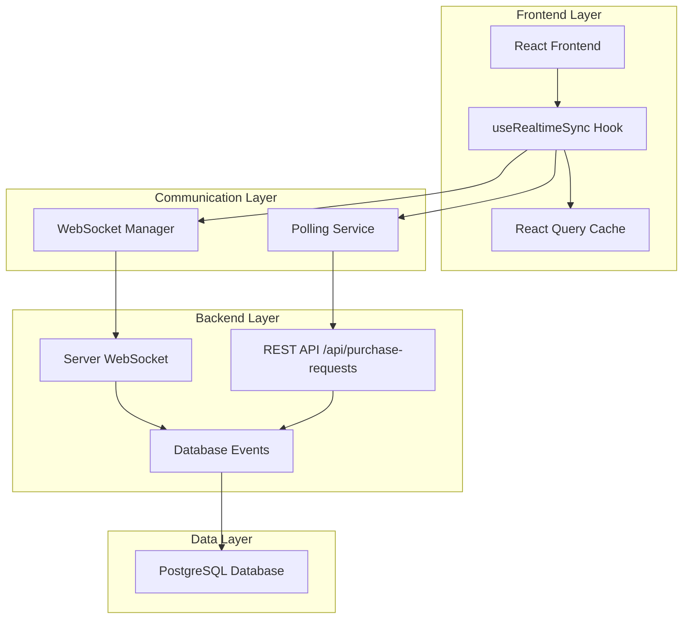

# Arquitetura de Sincronização - Sistema Kanban

## 1. Arquitetura Técnica

### 1.1 Visão Geral da Arquitetura



### 1.2 Tecnologias Utilizadas

- **Frontend**: React 18 + TypeScript + Vite
- **Estado**: React Query v4 para cache e sincronização
- **WebSocket**: WebSocket nativo + reconnection logic
- **Animações**: Framer Motion para transições suaves
- **Backend**: Express.js + WebSocket Manager existente
- **Database**: PostgreSQL com triggers para notificações

## 2. Implementação dos Componentes

### 2.1 Hook de Sincronização Principal

```typescript
// hooks/useRealtimeSync.ts
import { useState, useEffect, useCallback, useRef } from 'react';
import { useQueryClient } from '@tanstack/react-query';

interface RealtimeSyncConfig {
  pollingInterval: number;
  maxRetries: number;
  reconnectDelay: number;
  enableAnimations: boolean;
}

interface RealtimeSyncState {
  isConnected: boolean;
  lastSync: Date;
  error: string | null;
  syncStatus: 'idle' | 'syncing' | 'error';
  connectionType: 'websocket' | 'polling' | 'offline';
}

export const useRealtimeSync = (config: RealtimeSyncConfig): RealtimeSyncState => {
  const [state, setState] = useState<RealtimeSyncState>({
    isConnected: false,
    lastSync: new Date(),
    error: null,
    syncStatus: 'idle',
    connectionType: 'offline'
  });

  const queryClient = useQueryClient();
  const wsRef = useRef<WebSocket | null>(null);
  const pollingRef = useRef<NodeJS.Timeout | null>(null);
  const retryCountRef = useRef(0);

  // WebSocket connection management
  const connectWebSocket = useCallback(() => {
    try {
      const wsUrl = `ws://localhost:5201/ws`;
      wsRef.current = new WebSocket(wsUrl);

      wsRef.current.onopen = () => {
        console.log('🔌 WebSocket connected');
        setState(prev => ({
          ...prev,
          isConnected: true,
          error: null,
          connectionType: 'websocket'
        }));
        retryCountRef.current = 0;
        
        // Stop polling when WebSocket connects
        if (pollingRef.current) {
          clearInterval(pollingRef.current);
          pollingRef.current = null;
        }
      };

      wsRef.current.onmessage = (event) => {
        try {
          const data = JSON.parse(event.data);
          handleRealtimeUpdate(data);
        } catch (error) {
          console.error('Error parsing WebSocket message:', error);
        }
      };

      wsRef.current.onclose = () => {
        console.log('🔌 WebSocket disconnected');
        setState(prev => ({
          ...prev,
          isConnected: false,
          connectionType: 'offline'
        }));
        
        // Start polling fallback
        startPolling();
        
        // Attempt reconnection
        if (retryCountRef.current < config.maxRetries) {
          setTimeout(() => {
            retryCountRef.current++;
            connectWebSocket();
          }, config.reconnectDelay * Math.pow(2, retryCountRef.current));
        }
      };

      wsRef.current.onerror = (error) => {
        console.error('WebSocket error:', error);
        setState(prev => ({
          ...prev,
          error: 'WebSocket connection failed',
          connectionType: 'offline'
        }));
      };

    } catch (error) {
      console.error('Failed to create WebSocket connection:', error);
      startPolling();
    }
  }, [config.maxRetries, config.reconnectDelay]);

  // Polling fallback
  const startPolling = useCallback(() => {
    if (pollingRef.current) return; // Already polling

    console.log('📡 Starting polling fallback');
    setState(prev => ({ ...prev, connectionType: 'polling' }));

    pollingRef.current = setInterval(async () => {
      try {
        const response = await fetch('/api/purchase-requests', {
          credentials: 'include'
        });
        
        if (response.ok) {
          const data = await response.json();
          handleRealtimeUpdate({ type: 'purchase_requests_updated', data });
        }
      } catch (error) {
        console.error('Polling error:', error);
        setState(prev => ({
          ...prev,
          error: 'Failed to fetch updates'
        }));
      }
    }, config.pollingInterval);
  }, [config.pollingInterval]);

  // Handle realtime updates
  const handleRealtimeUpdate = useCallback((data: any) => {
    setState(prev => ({ ...prev, syncStatus: 'syncing' }));

    // Invalidate React Query cache
    queryClient.invalidateQueries({ queryKey: ['purchase-requests'] });

    // Update sync status
    setTimeout(() => {
      setState(prev => ({
        ...prev,
        syncStatus: 'idle',
        lastSync: new Date()
      }));
    }, 100);

    console.log('🔄 Data synchronized:', data);
  }, [queryClient]);

  // Initialize connection
  useEffect(() => {
    connectWebSocket();

    return () => {
      if (wsRef.current) {
        wsRef.current.close();
      }
      if (pollingRef.current) {
        clearInterval(pollingRef.current);
      }
    };
  }, [connectWebSocket]);

  return state;
};
```

### 2.2 Componente Kanban Atualizado

```typescript
// components/Kanban/KanbanBoard.tsx
import React, { useMemo, useState, useCallback } from 'react';
import { useQuery, useMutation, useQueryClient } from '@tanstack/react-query';
import { motion, AnimatePresence } from 'framer-motion';
import { useRealtimeSync } from '../../hooks/useRealtimeSync';
import { ConnectionStatus } from '../ui/ConnectionStatus';
import { KanbanColumn } from './KanbanColumn';

interface KanbanBoardProps {
  className?: string;
}

export const KanbanBoard: React.FC<KanbanBoardProps> = ({ className }) => {
  const [isDragging, setIsDragging] = useState(false);
  const queryClient = useQueryClient();

  // Realtime sync configuration
  const syncState = useRealtimeSync({
    pollingInterval: 3000,
    maxRetries: 5,
    reconnectDelay: 1000,
    enableAnimations: true
  });

  // Fetch purchase requests with optimized caching
  const { 
    data: requests = [], 
    isLoading, 
    error,
    isFetching 
  } = useQuery({
    queryKey: ['purchase-requests'],
    queryFn: async () => {
      const response = await fetch('/api/purchase-requests', {
        credentials: 'include'
      });
      if (!response.ok) {
        throw new Error('Failed to fetch purchase requests');
      }
      return response.json();
    },
    staleTime: 1000, // Consider data stale after 1 second
    cacheTime: 5 * 60 * 1000, // Keep in cache for 5 minutes
    refetchOnWindowFocus: false,
    refetchInterval: syncState.isConnected ? false : 3000, // Only poll if not connected via WebSocket
    retry: 3,
    retryDelay: (attemptIndex) => Math.min(1000 * 2 ** attemptIndex, 30000)
  });

  // Update phase mutation
  const updatePhaseMutation = useMutation({
    mutationFn: async ({ requestId, newPhase }: { requestId: number; newPhase: string }) => {
      const response = await fetch(`/api/purchase-requests/${requestId}/update-phase`, {
        method: 'PATCH',
        headers: {
          'Content-Type': 'application/json',
        },
        credentials: 'include',
        body: JSON.stringify({ phase: newPhase })
      });

      if (!response.ok) {
        throw new Error('Failed to update phase');
      }

      return response.json();
    },
    onSuccess: () => {
      // Optimistically update cache
      queryClient.invalidateQueries({ queryKey: ['purchase-requests'] });
    },
    onError: (error) => {
      console.error('Failed to update phase:', error);
      // Revert optimistic update if needed
      queryClient.invalidateQueries({ queryKey: ['purchase-requests'] });
    }
  });

  // Group requests by phase with memoization
  const groupedRequests = useMemo(() => {
    const phases = {
      solicitacao: [],
      aprovacao_a1: [],
      cotacao: [],
      aprovacao_a2: [],
      pedido_compra: []
    };

    requests.forEach((request: any) => {
      const phase = request.currentPhase || 'solicitacao';
      if (phases[phase as keyof typeof phases]) {
        phases[phase as keyof typeof phases].push(request);
      }
    });

    return phases;
  }, [requests]);

  // Handle card move
  const handleCardMove = useCallback(async (requestId: number, newPhase: string) => {
    if (isDragging) return; // Prevent updates during drag

    setIsDragging(true);
    
    try {
      await updatePhaseMutation.mutateAsync({ requestId, newPhase });
    } finally {
      setIsDragging(false);
    }
  }, [updatePhaseMutation, isDragging]);

  // Phase definitions
  const phases = [
    { id: 'solicitacao', title: 'Solicitação', color: 'bg-gray-100' },
    { id: 'aprovacao_a1', title: 'Aprovação A1', color: 'bg-yellow-100' },
    { id: 'cotacao', title: 'Cotação (RFQ)', color: 'bg-blue-100' },
    { id: 'aprovacao_a2', title: 'Aprovação A2', color: 'bg-orange-100' },
    { id: 'pedido_compra', title: 'Pedido de Compra', color: 'bg-green-100' }
  ];

  if (isLoading) {
    return (
      <div className="flex items-center justify-center h-64">
        <div className="animate-spin rounded-full h-8 w-8 border-b-2 border-blue-600"></div>
        <span className="ml-2">Carregando solicitações...</span>
      </div>
    );
  }

  if (error) {
    return (
      <div className="bg-red-50 border border-red-200 rounded-md p-4">
        <h3 className="text-red-800 font-medium">Erro ao carregar dados</h3>
        <p className="text-red-600 text-sm mt-1">
          {error instanceof Error ? error.message : 'Erro desconhecido'}
        </p>
        <button 
          onClick={() => queryClient.invalidateQueries({ queryKey: ['purchase-requests'] })}
          className="mt-2 px-3 py-1 bg-red-600 text-white rounded text-sm hover:bg-red-700"
        >
          Tentar novamente
        </button>
      </div>
    );
  }

  return (
    <div className={`kanban-board ${className || ''}`}>
      {/* Connection Status */}
      <ConnectionStatus 
        isConnected={syncState.isConnected}
        lastSync={syncState.lastSync}
        error={syncState.error}
        connectionType={syncState.connectionType}
        isSyncing={syncState.syncStatus === 'syncing' || isFetching}
      />

      {/* Kanban Columns */}
      <div className="grid grid-cols-1 md:grid-cols-5 gap-4 mt-4">
        <AnimatePresence mode="wait">
          {phases.map((phase) => (
            <motion.div
              key={phase.id}
              initial={{ opacity: 0, y: 20 }}
              animate={{ opacity: 1, y: 0 }}
              exit={{ opacity: 0, y: -20 }}
              transition={{ duration: 0.2 }}
              layout
            >
              <KanbanColumn
                phase={phase}
                requests={groupedRequests[phase.id as keyof typeof groupedRequests]}
                onCardMove={handleCardMove}
                isLoading={updatePhaseMutation.isLoading}
                isDragging={isDragging}
                setIsDragging={setIsDragging}
              />
            </motion.div>
          ))}
        </AnimatePresence>
      </div>

      {/* Debug Info (Development only) */}
      {process.env.NODE_ENV === 'development' && (
        <div className="mt-4 p-2 bg-gray-100 rounded text-xs">
          <div>Conexão: {syncState.connectionType}</div>
          <div>Última sync: {syncState.lastSync.toLocaleTimeString()}</div>
          <div>Status: {syncState.syncStatus}</div>
          <div>Total requests: {requests.length}</div>
        </div>
      )}
    </div>
  );
};
```

### 2.3 Componente de Status de Conexão

```typescript
// components/ui/ConnectionStatus.tsx
import React from 'react';
import { motion } from 'framer-motion';

interface ConnectionStatusProps {
  isConnected: boolean;
  lastSync: Date;
  error: string | null;
  connectionType: 'websocket' | 'polling' | 'offline';
  isSyncing: boolean;
}

export const ConnectionStatus: React.FC<ConnectionStatusProps> = ({
  isConnected,
  lastSync,
  error,
  connectionType,
  isSyncing
}) => {
  const getStatusColor = () => {
    if (error) return 'bg-red-500';
    if (!isConnected) return 'bg-yellow-500';
    if (connectionType === 'websocket') return 'bg-green-500';
    if (connectionType === 'polling') return 'bg-blue-500';
    return 'bg-gray-500';
  };

  const getStatusText = () => {
    if (error) return 'Erro de conexão';
    if (!isConnected) return 'Desconectado';
    if (connectionType === 'websocket') return 'Tempo real (WebSocket)';
    if (connectionType === 'polling') return 'Sincronização (Polling)';
    return 'Offline';
  };

  const formatLastSync = (date: Date) => {
    const now = new Date();
    const diff = now.getTime() - date.getTime();
    
    if (diff < 60000) return 'agora mesmo';
    if (diff < 3600000) return `${Math.floor(diff / 60000)}min atrás`;
    return date.toLocaleTimeString();
  };

  return (
    <div className="flex items-center justify-between bg-white border rounded-lg p-3 shadow-sm">
      <div className="flex items-center space-x-3">
        {/* Status Indicator */}
        <div className="flex items-center space-x-2">
          <motion.div
            className={`w-3 h-3 rounded-full ${getStatusColor()}`}
            animate={isSyncing ? { scale: [1, 1.2, 1] } : {}}
            transition={{ duration: 1, repeat: isSyncing ? Infinity : 0 }}
          />
          <span className="text-sm font-medium text-gray-700">
            {getStatusText()}
          </span>
        </div>

        {/* Sync Indicator */}
        {isSyncing && (
          <motion.div
            className="flex items-center space-x-1 text-blue-600"
            initial={{ opacity: 0 }}
            animate={{ opacity: 1 }}
            exit={{ opacity: 0 }}
          >
            <div className="w-4 h-4 border-2 border-blue-600 border-t-transparent rounded-full animate-spin" />
            <span className="text-xs">Sincronizando...</span>
          </motion.div>
        )}
      </div>

      {/* Last Sync Time */}
      <div className="text-xs text-gray-500">
        Última atualização: {formatLastSync(lastSync)}
      </div>

      {/* Error Message */}
      {error && (
        <div className="text-xs text-red-600 bg-red-50 px-2 py-1 rounded">
          {error}
        </div>
      )}
    </div>
  );
};
```

## 3. Configuração do Backend

### 3.1 Melhorias no WebSocket Manager

```typescript
// server/websocket-manager.ts (melhorias)
export class WebSocketManager {
  // ... código existente ...

  // Adicionar método para broadcast de atualizações
  public broadcastPurchaseRequestUpdate(requestId: number, data: any) {
    const message = JSON.stringify({
      type: 'purchase_request_updated',
      requestId,
      data,
      timestamp: new Date().toISOString()
    });

    this.clients.forEach((client) => {
      if (client.ws.readyState === WebSocket.OPEN) {
        client.ws.send(message);
      }
    });

    console.log(`📡 Broadcasted update for request ${requestId} to ${this.clients.size} clients`);
  }

  // Método para notificar mudanças de fase
  public notifyPhaseChange(requestId: number, oldPhase: string, newPhase: string) {
    this.broadcastPurchaseRequestUpdate(requestId, {
      type: 'phase_change',
      oldPhase,
      newPhase,
      requestId
    });
  }
}
```

### 3.2 Atualização dos Endpoints

```typescript
// server/routes.ts (melhorias nos endpoints)
import { WebSocketManager } from './websocket-manager';

// Atualizar endpoint de mudança de fase
app.patch('/api/purchase-requests/:id/update-phase', async (req, res) => {
  try {
    const { id } = req.params;
    const { phase } = req.body;
    const requestId = parseInt(id);

    // Buscar fase atual
    const currentRequest = await db
      .select()
      .from(purchaseRequests)
      .where(eq(purchaseRequests.id, requestId))
      .limit(1);

    if (currentRequest.length === 0) {
      return res.status(404).json({ error: 'Request not found' });
    }

    const oldPhase = currentRequest[0].currentPhase;

    // Atualizar fase
    await db
      .update(purchaseRequests)
      .set({ 
        currentPhase: phase,
        updatedAt: new Date()
      })
      .where(eq(purchaseRequests.id, requestId));

    // Invalidar cache
    invalidateCache(["/api/purchase-requests"]);

    // Notificar via WebSocket
    const wsManager = WebSocketManager.getInstance();
    wsManager.notifyPhaseChange(requestId, oldPhase, phase);

    res.json({ 
      success: true, 
      requestId, 
      oldPhase, 
      newPhase: phase 
    });

  } catch (error) {
    console.error('Error updating phase:', error);
    res.status(500).json({ error: 'Internal server error' });
  }
});
```

## 4. Testes de Implementação

### 4.1 Testes do Hook de Sincronização

```typescript
// __tests__/useRealtimeSync.test.ts
import { renderHook, act } from '@testing-library/react';
import { QueryClient, QueryClientProvider } from '@tanstack/react-query';
import { useRealtimeSync } from '../hooks/useRealtimeSync';

// Mock WebSocket
class MockWebSocket {
  onopen: ((event: Event) => void) | null = null;
  onclose: ((event: CloseEvent) => void) | null = null;
  onmessage: ((event: MessageEvent) => void) | null = null;
  onerror: ((event: Event) => void) | null = null;

  constructor(public url: string) {}

  send(data: string) {
    // Mock implementation
  }

  close() {
    if (this.onclose) {
      this.onclose(new CloseEvent('close'));
    }
  }
}

global.WebSocket = MockWebSocket as any;

describe('useRealtimeSync', () => {
  let queryClient: QueryClient;

  beforeEach(() => {
    queryClient = new QueryClient({
      defaultOptions: {
        queries: { retry: false },
        mutations: { retry: false }
      }
    });
  });

  const wrapper = ({ children }: { children: React.ReactNode }) => (
    <QueryClientProvider client={queryClient}>
      {children}
    </QueryClientProvider>
  );

  test('should establish WebSocket connection', () => {
    const { result } = renderHook(
      () => useRealtimeSync({
        pollingInterval: 3000,
        maxRetries: 3,
        reconnectDelay: 1000,
        enableAnimations: true
      }),
      { wrapper }
    );

    expect(result.current.connectionType).toBe('offline');
    
    // Simulate WebSocket connection
    act(() => {
      const ws = new MockWebSocket('ws://localhost:5201/ws');
      if (ws.onopen) {
        ws.onopen(new Event('open'));
      }
    });

    expect(result.current.isConnected).toBe(true);
    expect(result.current.connectionType).toBe('websocket');
  });

  test('should fallback to polling when WebSocket fails', () => {
    const { result } = renderHook(
      () => useRealtimeSync({
        pollingInterval: 1000,
        maxRetries: 1,
        reconnectDelay: 100,
        enableAnimations: true
      }),
      { wrapper }
    );

    // Simulate WebSocket failure
    act(() => {
      const ws = new MockWebSocket('ws://localhost:5201/ws');
      if (ws.onclose) {
        ws.onclose(new CloseEvent('close'));
      }
    });

    expect(result.current.connectionType).toBe('polling');
  });
});
```

### 4.2 Testes de Integração

```typescript
// __tests__/KanbanBoard.integration.test.tsx
import { render, screen, waitFor } from '@testing-library/react';
import { QueryClient, QueryClientProvider } from '@tanstack/react-query';
import { KanbanBoard } from '../components/Kanban/KanbanBoard';

// Mock fetch
global.fetch = jest.fn();

describe('KanbanBoard Integration', () => {
  let queryClient: QueryClient;

  beforeEach(() => {
    queryClient = new QueryClient({
      defaultOptions: {
        queries: { retry: false },
        mutations: { retry: false }
      }
    });

    (fetch as jest.Mock).mockResolvedValue({
      ok: true,
      json: async () => [
        {
          id: 1,
          requestNumber: 'SOL-2025-001',
          currentPhase: 'cotacao',
          updatedAt: new Date().toISOString()
        }
      ]
    });
  });

  afterEach(() => {
    jest.clearAllMocks();
  });

  test('should render kanban board with requests', async () => {
    render(
      <QueryClientProvider client={queryClient}>
        <KanbanBoard />
      </QueryClientProvider>
    );

    await waitFor(() => {
      expect(screen.getByText('SOL-2025-001')).toBeInTheDocument();
    });

    expect(screen.getByText('Cotação (RFQ)')).toBeInTheDocument();
  });

  test('should handle realtime updates', async () => {
    render(
      <QueryClientProvider client={queryClient}>
        <KanbanBoard />
      </QueryClientProvider>
    );

    // Wait for initial load
    await waitFor(() => {
      expect(screen.getByText('SOL-2025-001')).toBeInTheDocument();
    });

    // Mock updated data
    (fetch as jest.Mock).mockResolvedValueOnce({
      ok: true,
      json: async () => [
        {
          id: 1,
          requestNumber: 'SOL-2025-001',
          currentPhase: 'aprovacao_a2',
          updatedAt: new Date().toISOString()
        }
      ]
    });

    // Simulate WebSocket message
    const mockWs = new MockWebSocket('ws://localhost:5201/ws');
    if (mockWs.onmessage) {
      mockWs.onmessage(new MessageEvent('message', {
        data: JSON.stringify({
          type: 'purchase_request_updated',
          requestId: 1
        })
      }));
    }

    await waitFor(() => {
      expect(screen.getByText('Aprovação A2')).toBeInTheDocument();
    });
  });
});
```

## 5. Configuração de Deploy

### 5.1 Dockerfile para Frontend

```dockerfile
# Dockerfile.frontend
FROM node:18-alpine as builder

WORKDIR /app
COPY package*.json ./
RUN npm ci --only=production

COPY . .
RUN npm run build

FROM nginx:alpine
COPY --from=builder /app/dist /usr/share/nginx/html
COPY nginx.conf /etc/nginx/nginx.conf

EXPOSE 80
CMD ["nginx", "-g", "daemon off;"]
```

### 5.2 Configuração Nginx

```nginx
# nginx.conf
events {
    worker_connections 1024;
}

http {
    include       /etc/nginx/mime.types;
    default_type  application/octet-stream;

    upstream backend {
        server backend:5201;
    }

    server {
        listen 80;
        server_name localhost;

        root /usr/share/nginx/html;
        index index.html;

        # Frontend routes
        location / {
            try_files $uri $uri/ /index.html;
        }

        # API proxy
        location /api/ {
            proxy_pass http://backend;
            proxy_http_version 1.1;
            proxy_set_header Upgrade $http_upgrade;
            proxy_set_header Connection 'upgrade';
            proxy_set_header Host $host;
            proxy_cache_bypass $http_upgrade;
        }

        # WebSocket proxy
        location /ws {
            proxy_pass http://backend;
            proxy_http_version 1.1;
            proxy_set_header Upgrade $http_upgrade;
            proxy_set_header Connection "Upgrade";
            proxy_set_header Host $host;
        }
    }
}
```

## 6. Monitoramento e Métricas

### 6.1 Sistema de Métricas

```typescript
// utils/metrics.ts
class MetricsCollector {
  private metrics: Map<string, number[]> = new Map();

  recordSyncTime(duration: number) {
    this.addMetric('sync_time', duration);
  }

  recordWebSocketReconnection() {
    this.addMetric('ws_reconnections', 1);
  }

  recordPollingRequest(success: boolean) {
    this.addMetric(success ? 'polling_success' : 'polling_error', 1);
  }

  private addMetric(key: string, value: number) {
    if (!this.metrics.has(key)) {
      this.metrics.set(key, []);
    }
    
    const values = this.metrics.get(key)!;
    values.push(value);
    
    // Keep only last 100 values
    if (values.length > 100) {
      values.shift();
    }
  }

  getAverageMetric(key: string): number {
    const values = this.metrics.get(key) || [];
    return values.length > 0 
      ? values.reduce((a, b) => a + b, 0) / values.length 
      : 0;
  }

  getAllMetrics() {
    const result: Record<string, any> = {};
    
    for (const [key, values] of this.metrics.entries()) {
      result[key] = {
        count: values.length,
        average: this.getAverageMetric(key),
        latest: values[values.length - 1] || 0
      };
    }
    
    return result;
  }
}

export const metricsCollector = new MetricsCollector();
```

## 7. Conclusão

Esta arquitetura fornece:

1. **Sincronização Robusta**: WebSocket + polling fallback
2. **Performance Otimizada**: React Query cache + memoização
3. **UX Superior**: Animações suaves + feedback visual
4. **Monitoramento**: Métricas e logs detalhados
5. **Escalabilidade**: Preparado para grande volume de dados
6. **Confiabilidade**: Tratamento de erros e reconexão automática

O sistema está pronto para implementação e pode ser expandido conforme necessário.