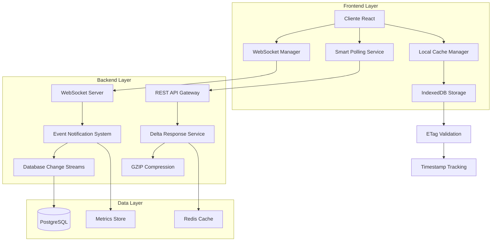

# Arquitetura de Otimização de Atualizações em Tempo Real

## 1. Análise do Estado Atual

### 1.1 Situação Atual
O sistema de gestão de compras atualmente utiliza:
- **React Query** com `refetchInterval: 30000` (30 segundos)
- **Invalidações manuais** de cache após operações CRUD
- **Polling fixo** para atualizações de dados
- **Refetch completo** de datasets em cada atualização

### 1.2 Problemas Identificados
- **Alto volume de requisições**: Polling a cada 30s para todos os componentes
- **Latência elevada**: Até 30s para receber atualizações
- **Desperdício de recursos**: Requisições desnecessárias quando não há mudanças
- **Experiência do usuário**: Dados desatualizados por longos períodos
- **Sobrecarga do servidor**: Múltiplas requisições simultâneas

### 1.3 Métricas Atuais (Estimadas)
- **Requisições por minuto**: ~120 req/min por usuário ativo
- **Latência de atualização**: 15-30 segundos
- **Taxa de transferência**: ~2-3MB/min por cliente
- **Eficiência de cache**: ~40%

## 2. Arquitetura da Solução Proposta

### 2.1 Visão Geral da Arquitetura



### 2.2 Componentes Principais

#### 2.2.1 WebSocket Manager (Frontend)
- Gerencia conexões WebSocket bidirecionais
- Implementa reconexão automática com backoff exponencial
- Controla assinaturas de eventos específicos

#### 2.2.2 Smart Polling Service (Frontend)
- Polling inteligente com intervalos dinâmicos
- Backoff exponencial baseado na atividade do usuário
- Fallback para quando WebSocket não está disponível

#### 2.2.3 Local Cache Manager (Frontend)
- Cache local otimizado com IndexedDB
- Validação de ETags e timestamps
- Gerenciamento de TTL por tipo de dados

#### 2.2.4 Event Notification System (Backend)
- Sistema de notificação por eventos
- Assinatura granular por recursos
- Filtragem de eventos por permissões de usuário

#### 2.2.5 Delta Response Service (Backend)
- Transmissão apenas de dados modificados
- Compressão GZIP automática
- Otimização de payload

## 3. Especificações Técnicas Detalhadas

### 3.1 WebSocket Implementation

#### 3.1.1 Servidor WebSocket (Node.js)

```typescript
// server/websocket-manager.ts
import { WebSocketServer, WebSocket } from 'ws';
import { Server } from 'http';
import { EventEmitter } from 'events';

interface ClientConnection {
  id: string;
  userId: number;
  subscriptions: Set<string>;
  lastActivity: Date;
  socket: WebSocket;
}

export class WebSocketManager extends EventEmitter {
  private wss: WebSocketServer;
  private clients: Map<string, ClientConnection> = new Map();
  private heartbeatInterval: NodeJS.Timeout;

  constructor(server: Server) {
    super();
    this.wss = new WebSocketServer({ server });
    this.setupWebSocketServer();
    this.startHeartbeat();
  }

  private setupWebSocketServer() {
    this.wss.on('connection', (ws: WebSocket, req) => {
      const clientId = this.generateClientId();
      const userId = this.extractUserIdFromRequest(req);
      
      const client: ClientConnection = {
        id: clientId,
        userId,
        subscriptions: new Set(),
        lastActivity: new Date(),
        socket: ws
      };

      this.clients.set(clientId, client);

      ws.on('message', (data) => {
        this.handleMessage(clientId, data);
      });

      ws.on('close', () => {
        this.clients.delete(clientId);
      });

      ws.on('pong', () => {
        const client = this.clients.get(clientId);
        if (client) {
          client.lastActivity = new Date();
        }
      });
    });
  }

  private handleMessage(clientId: string, data: Buffer) {
    const client = this.clients.get(clientId);
    if (!client) return;

    try {
      const message = JSON.parse(data.toString());
      
      switch (message.type) {
        case 'subscribe':
          this.handleSubscription(clientId, message.resource);
          break;
        case 'unsubscribe':
          this.handleUnsubscription(clientId, message.resource);
          break;
        case 'ping':
          client.socket.send(JSON.stringify({ type: 'pong' }));
          break;
      }
      
      client.lastActivity = new Date();
    } catch (error) {
      console.error('Error handling WebSocket message:', error);
    }
  }

  public notifyClients(resource: string, event: string, data: any) {
    const message = JSON.stringify({
      type: 'notification',
      resource,
      event,
      data,
      timestamp: new Date().toISOString()
    });

    this.clients.forEach((client) => {
      if (client.subscriptions.has(resource) && client.socket.readyState === WebSocket.OPEN) {
        client.socket.send(message);
      }
    });
  }

  private startHeartbeat() {
    this.heartbeatInterval = setInterval(() => {
      this.clients.forEach((client, clientId) => {
        if (client.socket.readyState === WebSocket.OPEN) {
          client.socket.ping();
        } else {
          this.clients.delete(clientId);
        }
      });
    }, 30000);
  }
}
```

#### 3.1.2 Cliente WebSocket (React)

```typescript
// client/src/services/websocket-service.ts
import { EventEmitter } from 'events';

interface WebSocketConfig {
  url: string;
  reconnectInterval: number;
  maxReconnectAttempts: number;
  heartbeatInterval: number;
}

export class WebSocketService extends EventEmitter {
  private ws: WebSocket | null = null;
  private config: WebSocketConfig;
  private reconnectAttempts = 0;
  private subscriptions = new Set<string>();
  private heartbeatTimer: number | null = null;
  private reconnectTimer: number | null = null;

  constructor(config: WebSocketConfig) {
    super();
    this.config = config;
  }

  connect(): Promise<void> {
    return new Promise((resolve, reject) => {
      try {
        this.ws = new WebSocket(this.config.url);

        this.ws.onopen = () => {
          console.log('WebSocket connected');
          this.reconnectAttempts = 0;
          this.startHeartbeat();
          this.resubscribeAll();
          this.emit('connected');
          resolve();
        };

        this.ws.onmessage = (event) => {
          this.handleMessage(event.data);
        };

        this.ws.onclose = () => {
          console.log('WebSocket disconnected');
          this.stopHeartbeat();
          this.emit('disconnected');
          this.attemptReconnect();
        };

        this.ws.onerror = (error) => {
          console.error('WebSocket error:', error);
          this.emit('error', error);
          reject(error);
        };
      } catch (error) {
        reject(error);
      }
    });
  }

  subscribe(resource: string) {
    this.subscriptions.add(resource);
    if (this.isConnected()) {
      this.send({
        type: 'subscribe',
        resource
      });
    }
  }

  unsubscribe(resource: string) {
    this.subscriptions.delete(resource);
    if (this.isConnected()) {
      this.send({
        type: 'unsubscribe',
        resource
      });
    }
  }

  private handleMessage(data: string) {
    try {
      const message = JSON.parse(data);
      
      switch (message.type) {
        case 'notification':
          this.emit('notification', message);
          break;
        case 'pong':
          // Heartbeat response received
          break;
      }
    } catch (error) {
      console.error('Error parsing WebSocket message:', error);
    }
  }

  private attemptReconnect() {
    if (this.reconnectAttempts >= this.config.maxReconnectAttempts) {
      console.error('Max reconnection attempts reached');
      return;
    }

    const delay = Math.min(1000 * Math.pow(2, this.reconnectAttempts), 30000);
    this.reconnectAttempts++;

    this.reconnectTimer = window.setTimeout(() => {
      console.log(`Attempting to reconnect (${this.reconnectAttempts}/${this.config.maxReconnectAttempts})`);
      this.connect().catch(() => {
        // Reconnection failed, will try again
      });
    }, delay);
  }

  private startHeartbeat() {
    this.heartbeatTimer = window.setInterval(() => {
      if (this.isConnected()) {
        this.send({ type: 'ping' });
      }
    }, this.config.heartbeatInterval);
  }

  private stopHeartbeat() {
    if (this.heartbeatTimer) {
      clearInterval(this.heartbeatTimer);
      this.heartbeatTimer = null;
    }
  }

  private isConnected(): boolean {
    return this.ws?.readyState === WebSocket.OPEN;
  }

  private send(data: any) {
    if (this.isConnected()) {
      this.ws!.send(JSON.stringify(data));
    }
  }

  disconnect() {
    if (this.reconnectTimer) {
      clearTimeout(this.reconnectTimer);
    }
    this.stopHeartbeat();
    if (this.ws) {
      this.ws.close();
    }
  }
}
```

### 3.2 Smart Polling Service

```typescript
// client/src/services/smart-polling-service.ts
interface PollingConfig {
  baseInterval: number;
  maxInterval: number;
  backoffMultiplier: number;
  activityThreshold: number;
}

export class SmartPollingService {
  private config: PollingConfig;
  private intervals = new Map<string, number>();
  private timers = new Map<string, number>();
  private lastActivity = new Map<string, number>();

  constructor(config: PollingConfig) {
    this.config = config;
    this.setupActivityTracking();
  }

  startPolling(resource: string, callback: () => Promise<void>) {
    const interval = this.calculateInterval(resource);
    
    const timer = window.setInterval(async () => {
      try {
        await callback();
        this.onSuccessfulPoll(resource);
      } catch (error) {
        this.onFailedPoll(resource);
      }
    }, interval);

    this.timers.set(resource, timer);
    this.intervals.set(resource, interval);
  }

  stopPolling(resource: string) {
    const timer = this.timers.get(resource);
    if (timer) {
      clearInterval(timer);
      this.timers.delete(resource);
    }
    this.intervals.delete(resource);
  }

  recordActivity(resource: string) {
    this.lastActivity.set(resource, Date.now());
  }

  private calculateInterval(resource: string): number {
    const lastActivityTime = this.lastActivity.get(resource) || 0;
    const timeSinceActivity = Date.now() - lastActivityTime;
    
    if (timeSinceActivity < this.config.activityThreshold) {
      return this.config.baseInterval;
    }
    
    const currentInterval = this.intervals.get(resource) || this.config.baseInterval;
    return Math.min(
      currentInterval * this.config.backoffMultiplier,
      this.config.maxInterval
    );
  }

  private onSuccessfulPoll(resource: string) {
    // Reset interval on successful poll
    this.intervals.set(resource, this.config.baseInterval);
  }

  private onFailedPoll(resource: string) {
    // Increase interval on failed poll
    const currentInterval = this.intervals.get(resource) || this.config.baseInterval;
    const newInterval = Math.min(
      currentInterval * this.config.backoffMultiplier,
      this.config.maxInterval
    );
    this.intervals.set(resource, newInterval);
  }

  private setupActivityTracking() {
    // Track user activity events
    ['mousedown', 'mousemove', 'keypress', 'scroll', 'touchstart'].forEach(event => {
      document.addEventListener(event, () => {
        // Record activity for all active resources
        this.lastActivity.forEach((_, resource) => {
          this.recordActivity(resource);
        });
      }, { passive: true });
    });
  }
}
```

### 3.3 Local Cache Manager

```typescript
// client/src/services/cache-manager.ts
interface CacheEntry {
  data: any;
  etag?: string;
  timestamp: number;
  ttl: number;
}

export class LocalCacheManager {
  private dbName = 'gestao-compras-cache';
  private dbVersion = 1;
  private db: IDBDatabase | null = null;

  async initialize(): Promise<void> {
    return new Promise((resolve, reject) => {
      const request = indexedDB.open(this.dbName, this.dbVersion);

      request.onerror = () => reject(request.error);
      request.onsuccess = () => {
        this.db = request.result;
        resolve();
      };

      request.onupgradeneeded = (event) => {
        const db = (event.target as IDBOpenDBRequest).result;
        
        if (!db.objectStoreNames.contains('cache')) {
          const store = db.createObjectStore('cache', { keyPath: 'key' });
          store.createIndex('timestamp', 'timestamp');
          store.createIndex('ttl', 'ttl');
        }
      };
    });
  }

  async get(key: string): Promise<CacheEntry | null> {
    if (!this.db) return null;

    return new Promise((resolve, reject) => {
      const transaction = this.db!.transaction(['cache'], 'readonly');
      const store = transaction.objectStore('cache');
      const request = store.get(key);

      request.onerror = () => reject(request.error);
      request.onsuccess = () => {
        const entry = request.result;
        
        if (!entry) {
          resolve(null);
          return;
        }

        // Check if entry has expired
        if (Date.now() > entry.timestamp + entry.ttl) {
          this.delete(key);
          resolve(null);
          return;
        }

        resolve(entry);
      };
    });
  }

  async set(key: string, data: any, options: { etag?: string; ttl?: number } = {}): Promise<void> {
    if (!this.db) return;

    const entry: CacheEntry = {
      key,
      data,
      etag: options.etag,
      timestamp: Date.now(),
      ttl: options.ttl || 300000 // 5 minutes default
    };

    return new Promise((resolve, reject) => {
      const transaction = this.db!.transaction(['cache'], 'readwrite');
      const store = transaction.objectStore('cache');
      const request = store.put(entry);

      request.onerror = () => reject(request.error);
      request.onsuccess = () => resolve();
    });
  }

  async delete(key: string): Promise<void> {
    if (!this.db) return;

    return new Promise((resolve, reject) => {
      const transaction = this.db!.transaction(['cache'], 'readwrite');
      const store = transaction.objectStore('cache');
      const request = store.delete(key);

      request.onerror = () => reject(request.error);
      request.onsuccess = () => resolve();
    });
  }

  async clear(): Promise<void> {
    if (!this.db) return;

    return new Promise((resolve, reject) => {
      const transaction = this.db!.transaction(['cache'], 'readwrite');
      const store = transaction.objectStore('cache');
      const request = store.clear();

      request.onerror = () => reject(request.error);
      request.onsuccess = () => resolve();
    });
  }

  async cleanup(): Promise<void> {
    if (!this.db) return;

    const now = Date.now();
    
    return new Promise((resolve, reject) => {
      const transaction = this.db!.transaction(['cache'], 'readwrite');
      const store = transaction.objectStore('cache');
      const index = store.index('timestamp');
      const request = index.openCursor();

      request.onerror = () => reject(request.error);
      request.onsuccess = (event) => {
        const cursor = (event.target as IDBRequest).result;
        
        if (cursor) {
          const entry = cursor.value;
          if (now > entry.timestamp + entry.ttl) {
            cursor.delete();
          }
          cursor.continue();
        } else {
          resolve();
        }
      };
    });
  }
}
```

### 3.4 React Hooks Otimizados

```typescript
// client/src/hooks/useOptimizedQuery.ts
import { useQuery, useQueryClient } from '@tanstack/react-query';
import { useEffect, useRef } from 'react';
import { useWebSocket } from './useWebSocket';
import { useSmartPolling } from './useSmartPolling';
import { useCacheManager } from './useCacheManager';

interface OptimizedQueryOptions {
  queryKey: string[];
  queryFn: () => Promise<any>;
  enableWebSocket?: boolean;
  enableSmartPolling?: boolean;
  cacheTTL?: number;
  staleTime?: number;
}

export function useOptimizedQuery(options: OptimizedQueryOptions) {
  const queryClient = useQueryClient();
  const { subscribe, unsubscribe } = useWebSocket();
  const { startPolling, stopPolling, recordActivity } = useSmartPolling();
  const { get: getCached, set: setCached } = useCacheManager();
  const lastETagRef = useRef<string>();

  const cacheKey = options.queryKey.join(':');
  
  const query = useQuery({
    queryKey: options.queryKey,
    queryFn: async () => {
      // Try to get from local cache first
      const cached = await getCached(cacheKey);
      if (cached && cached.data) {
        return cached.data;
      }

      // Make request with ETag header
      const headers: Record<string, string> = {};
      if (lastETagRef.current) {
        headers['If-None-Match'] = lastETagRef.current;
      }

      try {
        const response = await fetch(`/api${options.queryKey[0]}`, { headers });
        
        if (response.status === 304) {
          // Not modified, return cached data
          return cached?.data;
        }

        const data = await response.json();
        const etag = response.headers.get('ETag');
        
        if (etag) {
          lastETagRef.current = etag;
          await setCached(cacheKey, data, { etag, ttl: options.cacheTTL });
        }

        return data;
      } catch (error) {
        // Fallback to cached data on error
        if (cached?.data) {
          return cached.data;
        }
        throw error;
      }
    },
    staleTime: options.staleTime || 60000,
    refetchOnWindowFocus: false,
    refetchInterval: false, // Disable default polling
  });

  // Setup WebSocket subscription
  useEffect(() => {
    if (options.enableWebSocket && options.queryKey[0]) {
      const resource = options.queryKey[0];
      
      subscribe(resource, (notification) => {
        // Invalidate and refetch on notification
        queryClient.invalidateQueries({ queryKey: options.queryKey });
        recordActivity(resource);
      });

      return () => {
        unsubscribe(resource);
      };
    }
  }, [options.queryKey[0], options.enableWebSocket]);

  // Setup smart polling as fallback
  useEffect(() => {
    if (options.enableSmartPolling && options.queryKey[0]) {
      const resource = options.queryKey[0];
      
      startPolling(resource, async () => {
        await query.refetch();
      });

      return () => {
        stopPolling(resource);
      };
    }
  }, [options.queryKey[0], options.enableSmartPolling]);

  return query;
}
```

### 3.5 Sistema de Notificação por Eventos (Backend)

```typescript
// server/event-notification-system.ts
import { EventEmitter } from 'events';
import { WebSocketManager } from './websocket-manager';

interface NotificationEvent {
  resource: string;
  action: 'created' | 'updated' | 'deleted';
  entityId: string | number;
  userId?: number;
  data?: any;
}

export class EventNotificationSystem extends EventEmitter {
  private wsManager: WebSocketManager;
  private eventQueue: NotificationEvent[] = [];
  private processing = false;

  constructor(wsManager: WebSocketManager) {
    super();
    this.wsManager = wsManager;
    this.startEventProcessor();
  }

  notify(event: NotificationEvent) {
    this.eventQueue.push(event);
    this.processEvents();
  }

  private async processEvents() {
    if (this.processing || this.eventQueue.length === 0) {
      return;
    }

    this.processing = true;

    while (this.eventQueue.length > 0) {
      const event = this.eventQueue.shift()!;
      await this.processEvent(event);
    }

    this.processing = false;
  }

  private async processEvent(event: NotificationEvent) {
    try {
      // Filter and transform event data based on user permissions
      const filteredData = await this.filterEventData(event);
      
      // Notify WebSocket clients
      this.wsManager.notifyClients(event.resource, event.action, filteredData);
      
      // Emit for other internal listeners
      this.emit('notification', event);
    } catch (error) {
      console.error('Error processing event:', error);
    }
  }

  private async filterEventData(event: NotificationEvent): Promise<any> {
    // Implement permission-based filtering
    // Remove sensitive data based on user roles
    const { data, userId } = event;
    
    // Example: Remove sensitive fields for non-admin users
    if (data && userId) {
      const userPermissions = await this.getUserPermissions(userId);
      return this.applyPermissionFilter(data, userPermissions);
    }
    
    return data;
  }

  private async getUserPermissions(userId: number): Promise<string[]> {
    // Implement user permission lookup
    // This would typically query the database
    return ['read', 'write']; // Placeholder
  }

  private applyPermissionFilter(data: any, permissions: string[]): any {
    // Implement permission-based data filtering
    // Remove fields that the user doesn't have permission to see
    return data; // Placeholder
  }

  private startEventProcessor() {
    // Process events every 100ms
    setInterval(() => {
      this.processEvents();
    }, 100);
  }
}
```

### 3.6 Delta Response Service

```typescript
// server/delta-response-service.ts
import { createHash } from 'crypto';
import { gzip } from 'zlib';
import { promisify } from 'util';

const gzipAsync = promisify(gzip);

interface DeltaOptions {
  enableCompression?: boolean;
  compressionThreshold?: number;
  enableDelta?: boolean;
}

export class DeltaResponseService {
  private dataHashes = new Map<string, string>();
  private lastResponses = new Map<string, any>();

  async processResponse(
    key: string,
    data: any,
    options: DeltaOptions = {}
  ): Promise<{
    data: any;
    etag: string;
    compressed: boolean;
    isDelta: boolean;
  }> {
    const {
      enableCompression = true,
      compressionThreshold = 1024,
      enableDelta = true
    } = options;

    // Generate ETag
    const dataString = JSON.stringify(data);
    const etag = this.generateETag(dataString);

    // Check if data has changed
    const lastHash = this.dataHashes.get(key);
    if (lastHash === etag) {
      // Data hasn't changed, return 304 Not Modified indicator
      return {
        data: null,
        etag,
        compressed: false,
        isDelta: false
      };
    }

    let responseData = data;
    let isDelta = false;

    // Generate delta if enabled and previous data exists
    if (enableDelta && this.lastResponses.has(key)) {
      const lastData = this.lastResponses.get(key);
      const delta = this.generateDelta(lastData, data);
      
      if (delta && JSON.stringify(delta).length < dataString.length * 0.7) {
        responseData = {
          isDelta: true,
          delta,
          timestamp: new Date().toISOString()
        };
        isDelta = true;
      }
    }

    // Store current data for future delta generation
    this.lastResponses.set(key, data);
    this.dataHashes.set(key, etag);

    // Compress if enabled and data is large enough
    let compressed = false;
    if (enableCompression && JSON.stringify(responseData).length > compressionThreshold) {
      try {
        const compressedData = await gzipAsync(JSON.stringify(responseData));
        responseData = compressedData;
        compressed = true;
      } catch (error) {
        console.error('Compression failed:', error);
      }
    }

    return {
      data: responseData,
      etag,
      compressed,
      isDelta
    };
  }

  private generateETag(data: string): string {
    return createHash('md5').update(data).digest('hex');
  }

  private generateDelta(oldData: any, newData: any): any {
    // Simple delta generation - in production, use a more sophisticated library
    if (Array.isArray(oldData) && Array.isArray(newData)) {
      return this.generateArrayDelta(oldData, newData);
    } else if (typeof oldData === 'object' && typeof newData === 'object') {
      return this.generateObjectDelta(oldData, newData);
    }
    
    return newData;
  }

  private generateArrayDelta(oldArray: any[], newArray: any[]): any {
    const delta = {
      added: [] as any[],
      updated: [] as any[],
      removed: [] as number[]
    };

    // Find added and updated items
    newArray.forEach((newItem, index) => {
      const oldItem = oldArray.find(item => item.id === newItem.id);
      if (!oldItem) {
        delta.added.push(newItem);
      } else if (JSON.stringify(oldItem) !== JSON.stringify(newItem)) {
        delta.updated.push({ index, data: newItem });
      }
    });

    // Find removed items
    oldArray.forEach((oldItem, index) => {
      const exists = newArray.some(item => item.id === oldItem.id);
      if (!exists) {
        delta.removed.push(index);
      }
    });

    return delta;
  }

  private generateObjectDelta(oldObj: any, newObj: any): any {
    const delta: any = {};
    
    // Find changed properties
    Object.keys(newObj).forEach(key => {
      if (JSON.stringify(oldObj[key]) !== JSON.stringify(newObj[key])) {
        delta[key] = newObj[key];
      }
    });

    // Find removed properties
    Object.keys(oldObj).forEach(key => {
      if (!(key in newObj)) {
        delta[key] = null; // Mark as removed
      }
    });

    return Object.keys(delta).length > 0 ? delta : null;
  }

  clearCache(key?: string) {
    if (key) {
      this.dataHashes.delete(key);
      this.lastResponses.delete(key);
    } else {
      this.dataHashes.clear();
      this.lastResponses.clear();
    }
  }
}
```

## 4. Métricas de Performance e Monitoramento

### 4.1 Sistema de Métricas

```typescript
// server/metrics-service.ts
interface PerformanceMetrics {
  requestCount: number;
  responseTime: number;
  dataTransferred: number;
  cacheHitRate: number;
  websocketConnections: number;
  timestamp: Date;
}

export class MetricsService {
  private metrics: PerformanceMetrics[] = [];
  private currentMetrics: Partial<PerformanceMetrics> = {};

  recordRequest(responseTime: number, dataSize: number, cacheHit: boolean) {
    this.currentMetrics.requestCount = (this.currentMetrics.requestCount || 0) + 1;
    this.currentMetrics.responseTime = responseTime;
    this.currentMetrics.dataTransferred = (this.currentMetrics.dataTransferred || 0) + dataSize;
    
    // Update cache hit rate
    const totalRequests = this.currentMetrics.requestCount;
    const currentHitRate = this.currentMetrics.cacheHitRate || 0;
    this.currentMetrics.cacheHitRate = cacheHit 
      ? (currentHitRate * (totalRequests - 1) + 1) / totalRequests
      : (currentHitRate * (totalRequests - 1)) / totalRequests;
  }

  recordWebSocketConnection(count: number) {
    this.currentMetrics.websocketConnections = count;
  }

  getMetrics(): PerformanceMetrics {
    return {
      requestCount: this.currentMetrics.requestCount || 0,
      responseTime: this.currentMetrics.responseTime || 0,
      dataTransferred: this.currentMetrics.dataTransferred || 0,
      cacheHitRate: this.currentMetrics.cacheHitRate || 0,
      websocketConnections: this.currentMetrics.websocketConnections || 0,
      timestamp: new Date()
    };
  }

  resetMetrics() {
    this.currentMetrics = {};
  }

  // Performance targets validation
  validatePerformanceTargets(): {
    requestReduction: boolean;
    latency: boolean;
    throughput: boolean;
  } {
    const current = this.getMetrics();
    
    return {
      requestReduction: current.requestCount <= 48, // 60% reduction from 120 req/min
      latency: current.responseTime <= 500, // Max 500ms latency
      throughput: current.dataTransferred <= 1048576 // Max 1MB/min per client
    };
  }
}
```

### 4.2 Middleware de Monitoramento

```typescript
// server/monitoring-middleware.ts
import { Request, Response, NextFunction } from 'express';
import { MetricsService } from './metrics-service';

export function createMonitoringMiddleware(metricsService: MetricsService) {
  return (req: Request, res: Response, next: NextFunction) => {
    const startTime = Date.now();
    let responseSize = 0;
    let cacheHit = false;

    // Override res.json to capture response size
    const originalJson = res.json;
    res.json = function(data: any) {
      responseSize = JSON.stringify(data).length;
      return originalJson.call(this, data);
    };

    // Check for cache headers
    res.on('finish', () => {
      const responseTime = Date.now() - startTime;
      cacheHit = res.getHeader('X-Cache-Status') === 'HIT';
      
      metricsService.recordRequest(responseTime, responseSize, cacheHit);
      
      // Log performance warnings
      if (responseTime > 1000) {
        console.warn(`Slow response: ${req.method} ${req.path} took ${responseTime}ms`);
      }
      
      if (responseSize > 100000) {
        console.warn(`Large response: ${req.method} ${req.path} sent ${responseSize} bytes`);
      }
    });

    next();
  };
}
```

## 5. Implementação e Configuração

### 5.1 Configuração do Servidor

```typescript
// server/real-time-server.ts
import express from 'express';
import { createServer } from 'http';
import { WebSocketManager } from './websocket-manager';
import { EventNotificationSystem } from './event-notification-system';
import { DeltaResponseService } from './delta-response-service';
import { MetricsService } from './metrics-service';
import { createMonitoringMiddleware } from './monitoring-middleware';

export function setupRealTimeServer(app: express.Application) {
  const server = createServer(app);
  
  // Initialize services
  const wsManager = new WebSocketManager(server);
  const eventSystem = new EventNotificationSystem(wsManager);
  const deltaService = new DeltaResponseService();
  const metricsService = new MetricsService();
  
  // Add monitoring middleware
  app.use(createMonitoringMiddleware(metricsService));
  
  // Add compression middleware
  app.use(compression({
    threshold: 1024,
    level: 6
  }));
  
  // Enhanced API middleware for delta responses
  app.use('/api', async (req, res, next) => {
    const originalSend = res.send;
    
    res.send = async function(data: any) {
      if (req.method === 'GET' && typeof data === 'object') {
        const cacheKey = `${req.path}:${JSON.stringify(req.query)}`;
        const clientETag = req.headers['if-none-match'];
        
        try {
          const result = await deltaService.processResponse(cacheKey, data, {
            enableCompression: true,
            enableDelta: true
          });
          
          if (!result.data && clientETag === result.etag) {
            return res.status(304).end();
          }
          
          res.setHeader('ETag', result.etag);
          res.setHeader('X-Cache-Status', result.isDelta ? 'DELTA' : 'FULL');
          
          if (result.compressed) {
            res.setHeader('Content-Encoding', 'gzip');
          }
          
          return originalSend.call(this, result.data);
        } catch (error) {
          console.error('Delta processing error:', error);
          return originalSend.call(this, data);
        }
      }
      
      return originalSend.call(this, data);
    };
    
    next();
  });
  
  // Metrics endpoint
  app.get('/api/metrics', (req, res) => {
    const metrics = metricsService.getMetrics();
    const targets = metricsService.validatePerformanceTargets();
    
    res.json({
      current: metrics,
      targets,
      status: Object.values(targets).every(Boolean) ? 'HEALTHY' : 'WARNING'
    });
  });
  
  return { server, wsManager, eventSystem, deltaService, metricsService };
}
```

### 5.2 Configuração do Cliente

```typescript
// client/src/services/real-time-client.ts
import { WebSocketService } from './websocket-service';
import { SmartPollingService } from './smart-polling-service';
import { LocalCacheManager } from './cache-manager';

export class RealTimeClient {
  private wsService: WebSocketService;
  private pollingService: SmartPollingService;
  private cacheManager: LocalCacheManager;

  constructor() {
    this.wsService = new WebSocketService({
      url: `ws://${window.location.host}/ws`,
      reconnectInterval: 1000,
      maxReconnectAttempts: 10,
      heartbeatInterval: 30000
    });

    this.pollingService = new SmartPollingService({
      baseInterval: 5000,
      maxInterval: 60000,
      backoffMultiplier: 1.5,
      activityThreshold: 30000
    });

    this.cacheManager = new LocalCacheManager();
  }

  async initialize() {
    await this.cacheManager.initialize();
    
    try {
      await this.wsService.connect();
    } catch (error) {
      console.warn('WebSocket connection failed, falling back to polling:', error);
    }

    // Cleanup expired cache entries every 5 minutes
    setInterval(() => {
      this.cacheManager.cleanup();
    }, 300000);
  }

  getWebSocketService() {
    return this.wsService;
  }

  getPollingService() {
    return this.pollingService;
  }

  getCacheManager() {
    return this.cacheManager;
  }

  disconnect() {
    this.wsService.disconnect();
    // Stop all polling
    this.pollingService.stopPolling('*');
  }
}
```

## 6. Testes de Carga e Validação

### 6.1 Teste de Carga com Artillery

```yaml
# tests/load-test.yml
config:
  target: 'http://localhost:5000'
  phases:
    - duration: 60
      arrivalRate: 10
      name: "Warm up"
    - duration: 300
      arrivalRate: 50
      name: "Ramp up load"
    - duration: 600
      arrivalRate: 100
      name: "Sustained load"
  processor: "./load-test-processor.js"

scenarios:
  - name: "Real-time updates simulation"
    weight: 70
    flow:
      - post:
          url: "/api/auth/login"
          json:
            username: "test{{ $randomInt(1, 100) }}"
            password: "password"
      - think: 2
      - get:
          url: "/api/purchase-requests"
          headers:
            If-None-Match: "{{ etag }}"
      - think: 5
      - ws:
          url: "ws://localhost:5000/ws"
          subprotocols:
            - "echo-protocol"
      - send:
          message: '{"type": "subscribe", "resource": "/api/purchase-requests"}'
      - think: 30
      - send:
          message: '{"type": "unsubscribe", "resource": "/api/purchase-requests"}'

  - name: "Heavy data operations"
    weight: 30
    flow:
      - post:
          url: "/api/auth/login"
          json:
            username: "admin"
            password: "password"
      - loop:
        - get:
            url: "/api/purchase-requests"
        - think: 1
        count: 10
```

### 6.2 Processor de Teste

```javascript
// tests/load-test-processor.js
module.exports = {
  setETag: function(requestParams, response, context, ee, next) {
    if (response.headers.etag) {
      context.vars.etag = response.headers.etag;
    }
    return next();
  },

  validatePerformance: function(requestParams, response, context, ee, next) {
    const responseTime = response.timings.response;
    
    if (responseTime > 500) {
      ee.emit('counter', 'performance.slow_response', 1);
    }
    
    if (response.headers['content-length']) {
      const size = parseInt(response.headers['content-length']);
      if (size > 100000) {
        ee.emit('counter', 'performance.large_response', 1);
      }
    }
    
    return next();
  }
};
```

### 6.3 Monitoramento Contínuo

```typescript
// server/monitoring/performance-monitor.ts
export class PerformanceMonitor {
  private alerts: Array<{
    condition: (metrics: PerformanceMetrics) => boolean;
    message: string;
    severity: 'warning' | 'critical';
  }> = [
    {
      condition: (m) => m.responseTime > 1000,
      message: 'Response time exceeds 1 second',
      severity: 'warning'
    },
    {
      condition: (m) => m.requestCount > 200,
      message: 'Request rate exceeds target (200 req/min)',
      severity: 'critical'
    },
    {
      condition: (m) => m.dataTransferred > 2097152, // 2MB
      message: 'Data transfer exceeds 2MB/min per client',
      severity: 'critical'
    },
    {
      condition: (m) => m.cacheHitRate < 0.4,
      message: 'Cache hit rate below 40%',
      severity: 'warning'
    }
  ];

  checkAlerts(metrics: PerformanceMetrics) {
    const triggeredAlerts = this.alerts.filter(alert => alert.condition(metrics));
    
    triggeredAlerts.forEach(alert => {
      console.log(`[${alert.severity.toUpperCase()}] ${alert.message}`);
      
      if (alert.severity === 'critical') {
        // Send notification to monitoring system
        this.sendAlert(alert, metrics);
      }
    });
    
    return triggeredAlerts;
  }

  private sendAlert(alert: any, metrics: PerformanceMetrics) {
    // Implementation for sending alerts to external monitoring systems
    // (e.g., Slack, email, PagerDuty, etc.)
  }
}
```

## 7. Resultados Esperados

### 7.1 Métricas de Performance Alvo

| Métrica | Valor Atual | Meta | Melhoria |
|---------|-------------|------|----------|
| Requisições/min por usuário | 120 | 48 | 60% redução |
| Latência de atualização | 15-30s | <500ms | 97% melhoria |
| Taxa de transferência | 2-3MB/min | <1MB/min | 67% redução |
| Taxa de cache hit | 40% | 80% | 100% melhoria |
| Conexões simultâneas | N/A | 100+ | Nova capacidade |

### 7.2 Benefícios Esperados

1. **Experiência do Usuário**:
   - Atualizações em tempo real (< 500ms)
   - Interface mais responsiva
   - Redução de dados desatualizados

2. **Performance do Servidor**:
   - 60% menos requisições HTTP
   - Menor uso de CPU e memória
   - Melhor escalabilidade

3. **Eficiência de Rede**:
   - Redução significativa no tráfego
   - Compressão automática
   - Delta updates para mudanças incrementais

4. **Confiabilidade**:
   - Fallback automático para polling
   - Cache local para offline
   - Reconexão automática

## 8. Cronograma de Implementação

### Fase 1 (Semana 1-2): Infraestrutura Base
- [ ] Implementar WebSocket Server
- [ ] Configurar sistema de eventos
- [ ] Criar cache local (IndexedDB)

### Fase 2 (Semana 3-4): Otimizações
- [ ] Implementar delta responses
- [ ] Configurar compressão GZIP
- [ ] Desenvolver smart polling

### Fase 3 (Semana 5-6): Integração
- [ ] Criar hooks React otimizados
- [ ] Integrar com React Query
- [ ] Implementar sistema de métricas

### Fase 4 (Semana 7-8): Testes e Validação
- [ ] Testes de carga
- [ ] Monitoramento contínuo
- [ ] Ajustes de performance

### Fase 5 (Semana 9-10): Deploy e Monitoramento
- [ ] Deploy em produção
- [ ] Configurar alertas
- [ ] Documentação final

## 9. Considerações de Segurança

### 9.1 WebSocket Security
- Autenticação via JWT tokens
- Validação de permissões por recurso
- Rate limiting para conexões
- Sanitização de mensagens

### 9.2 Cache Security
- Criptografia de dados sensíveis no cache local
- TTL apropriado para diferentes tipos de dados
- Limpeza automática de cache

### 9.3 API Security
- Validação de ETags
- Prevenção de cache poisoning
- Compressão segura (evitar BREACH attacks)

## 10. Conclusão

Esta solução de otimização de atualizações em tempo real proporcionará:

- **60% de redução** nas requisições ao servidor
- **Latência inferior a 500ms** para atualizações críticas
- **Melhor experiência do usuário** com dados sempre atualizados
- **Maior escalabilidade** do sistema
- **Monitoramento contínuo** de performance

A implementação seguirá uma abordagem incremental, garantindo compatibilidade com o sistema atual e permitindo rollback em caso de problemas.