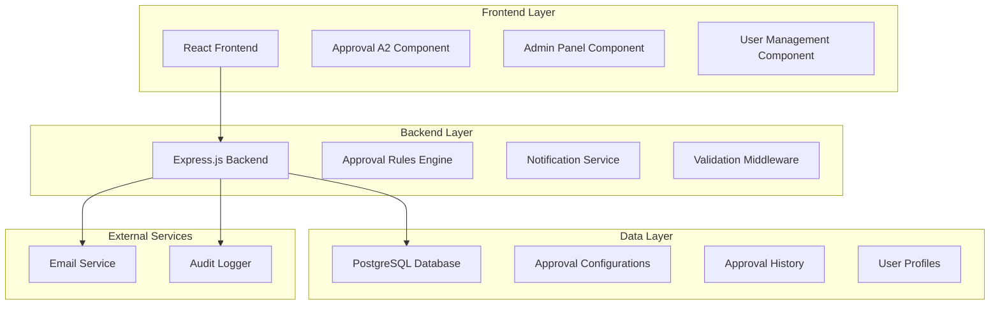
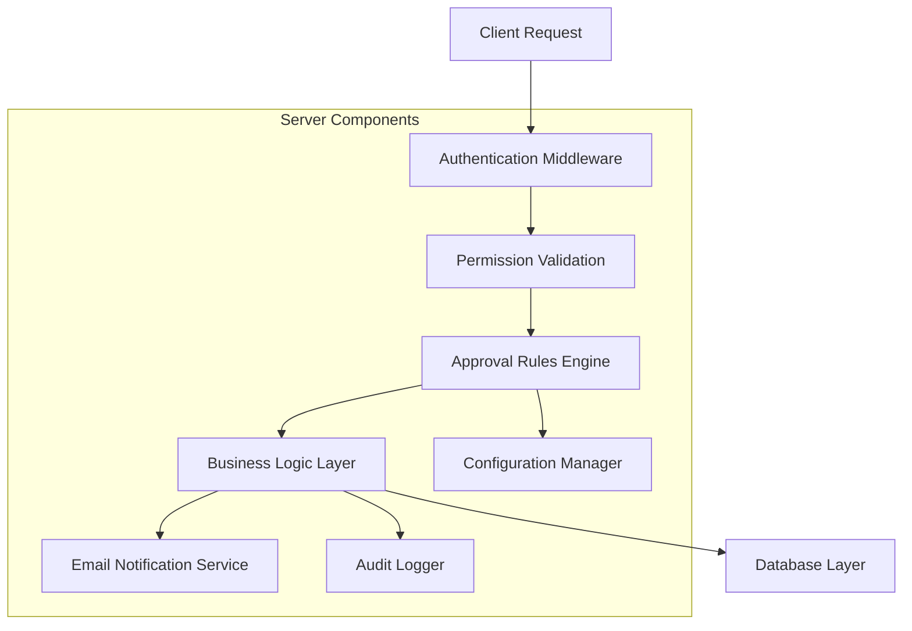
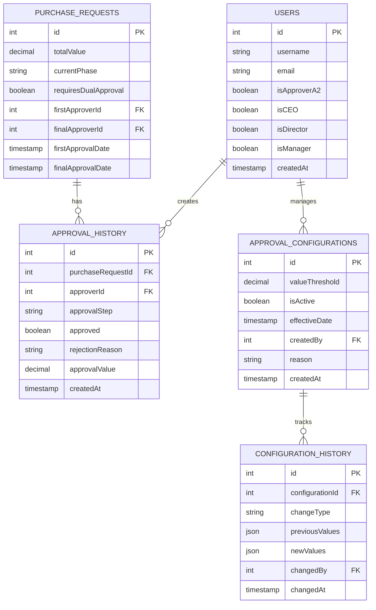

# Arquitetura Técnica - Sistema de Aprovação A2 Baseada em Valor

## 1. Arquitetura do Sistema



## 2. Descrição das Tecnologias

- **Frontend**: React@18 + TypeScript + TailwindCSS + Vite + React Query
- **Backend**: Express.js@4 + TypeScript + Drizzle ORM
- **Database**: PostgreSQL (via Supabase)
- **Email**: Nodemailer + SMTP
- **Validação**: Zod + React Hook Form

## 3. Definições de Rotas

| Rota | Propósito |
|------|-----------|
| /approval-a2/:id | Página de aprovação A2 com detecção automática de regras |
| /admin/approval-rules | Painel administrativo para configuração de limites de valor |
| /admin/approval-history | Histórico de alterações nas configurações |
| /dashboard/approvals | Dashboard com métricas e status de aprovações |
| /users/profile | Cadastro de usuários com campos CEO/Diretor |

## 4. Definições de API

### 4.1 APIs Principais

**Verificação de Regras de Aprovação**
```
GET /api/purchase-requests/:id/approval-rules
```

Request: N/A

Response:
| Campo | Tipo | Descrição |
|-------|------|-----------|
| requiresDualApproval | boolean | Se requer dupla aprovação |
| valueThreshold | number | Limite de valor configurado |
| totalValue | number | Valor total da cotação |
| approvalType | string | "simple" ou "dual" |

Exemplo:
```json
{
  "requiresDualApproval": true,
  "valueThreshold": 2500.00,
  "totalValue": 3500.00,
  "approvalType": "dual"
}
```

**Aprovação A2 com Regras**
```
POST /api/purchase-requests/:id/approve-a2-with-rules
```

Request:
| Campo | Tipo | Obrigatório | Descrição |
|-------|------|-------------|-----------|
| approved | boolean | true | Status da aprovação |
| rejectionReason | string | false | Motivo da reprovação |
| approvalStep | string | true | "first" ou "final" |
| isCEO | boolean | true | Se o aprovador é CEO |

Response:
| Campo | Tipo | Descrição |
|-------|------|-----------|
| success | boolean | Status da operação |
| nextStep | string | Próximo passo do processo |
| pendingApprovers | array | Lista de aprovadores pendentes |

**Configuração de Regras Administrativas**
```
POST /api/admin/approval-rules
```

Request:
| Campo | Tipo | Obrigatório | Descrição |
|-------|------|-------------|-----------|
| valueThreshold | number | true | Novo limite de valor |
| effectiveDate | string | true | Data de vigência |
| reason | string | true | Justificativa da alteração |

Response:
| Campo | Tipo | Descrição |
|-------|------|-----------|
| configId | number | ID da nova configuração |
| previousThreshold | number | Valor anterior |
| auditLogId | number | ID do log de auditoria |

## 5. Arquitetura do Servidor



## 6. Modelo de Dados

### 6.1 Diagrama de Entidades



## 7. Implementação do Componente PurchaseCard

### 7.1 Lógica de Detecção de Tipo de Aprovação

```typescript
// Hook para detectar tipo de aprovação baseado no valor
const useApprovalType = (totalValue: number) => {
  const { data: approvalRules } = useQuery({
    queryKey: ['/api/admin/approval-rules/current'],
    queryFn: () => apiRequest('/api/admin/approval-rules/current')
  });

  const valueThreshold = approvalRules?.valueThreshold || 2500;
  const requiresDualApproval = totalValue > valueThreshold;

  return {
    approvalType: requiresDualApproval ? 'dual' : 'simple',
    valueThreshold,
    requiresDualApproval
  };
};

// Componente para renderizar badge de aprovação
const ApprovalTypeBadge = ({ approvalType, totalValue }) => {
  const badgeConfig = {
    simple: {
      text: 'APROVAÇÃO SIMPLES',
      icon: User,
      className: 'bg-green-100 text-green-800 border-green-200'
    },
    dual: {
      text: 'DUPLA APROVAÇÃO', 
      icon: Users,
      className: 'bg-orange-100 text-orange-800 border-orange-200'
    }
  };

  const config = badgeConfig[approvalType];
  const Icon = config.icon;

  return (
    <Badge className={`absolute top-2 right-2 ${config.className}`}>
      <Icon className="w-3 h-3 mr-1" />
      {config.text}
    </Badge>
  );
};
```

### 7.2 Timeline de Aprovação para Dupla Aprovação

```typescript
// Componente Timeline para dupla aprovação
const ApprovalTimeline = ({ steps, currentStep }) => {
  return (
    <div className="flex items-center justify-center space-x-2 py-2">
      {steps.map((step, index) => (
        <div key={step.id} className="flex items-center">
          <div className={`flex items-center justify-center w-8 h-8 rounded-full border-2 ${
            step.completed 
              ? 'bg-green-100 border-green-500 text-green-700'
              : step.current
              ? 'bg-orange-100 border-orange-500 text-orange-700'
              : 'bg-gray-100 border-gray-300 text-gray-500'
          }`}>
            {step.completed ? (
              <Check className="w-4 h-4" />
            ) : step.type === 'ceo' ? (
              <Crown className="w-4 h-4" />
            ) : (
              <User className="w-4 h-4" />
            )}
          </div>
          
          <div className="ml-1 text-xs font-medium">
            {step.label}
          </div>
          
          {index < steps.length - 1 && (
            <div className={`w-8 h-0.5 mx-2 ${
              step.completed ? 'bg-green-300' : 'bg-gray-300'
            }`} />
          )}
        </div>
      ))}
    </div>
  );
};
```

### 7.3 Integração no PurchaseCard

```typescript
// Modificações no componente PurchaseCard para fase A2
const PurchaseCard = ({ request, phase }) => {
  const { approvalType, requiresDualApproval } = useApprovalType(request.totalValue);
  
  // Buscar dados de aprovação se estiver na fase A2
  const { data: approvalData } = useQuery({
    queryKey: [`/api/purchase-requests/${request.id}/approval-status`],
    enabled: phase === 'aprovacao_a2'
  });

  // Configurar steps para timeline
  const approvalSteps = useMemo(() => {
    if (approvalType === 'simple') return [];
    
    return [
      {
        id: 'a2',
        label: 'A2',
        type: 'approver',
        completed: approvalData?.firstApprovalCompleted || false,
        current: !approvalData?.firstApprovalCompleted
      },
      {
        id: 'ceo', 
        label: 'CEO',
        type: 'ceo',
        completed: approvalData?.ceoApprovalCompleted || false,
        current: approvalData?.firstApprovalCompleted && !approvalData?.ceoApprovalCompleted
      }
    ];
  }, [approvalType, approvalData]);

  // Determinar status atual
  const currentStatus = useMemo(() => {
    if (phase !== 'aprovacao_a2') return '';
    
    if (approvalType === 'simple') {
      return 'Aguardando Aprovação A2';
    }
    
    if (!approvalData?.firstApprovalCompleted) {
      return 'Aguardando 1ª Aprovação (A2)';
    }
    
    if (!approvalData?.ceoApprovalCompleted) {
      return 'Aguardando 2ª Aprovação (CEO)';
    }
    
    return 'Aprovações Concluídas';
  }, [phase, approvalType, approvalData]);

  return (
    <Card className={`relative ${
      phase === 'aprovacao_a2' 
        ? approvalType === 'dual' 
          ? 'border-orange-200' 
          : 'border-green-200'
        : ''
    }`}>
      {/* Badge de tipo de aprovação apenas na fase A2 */}
      {phase === 'aprovacao_a2' && (
        <ApprovalTypeBadge 
          approvalType={approvalType}
          totalValue={request.totalValue}
        />
      )}
      
      {/* Valor destacado na fase A2 */}
      {phase === 'aprovacao_a2' && (
        <div className={`text-center py-2 ${
          approvalType === 'dual' ? 'text-orange-600' : 'text-green-600'
        }`}>
          <span className={`${
            approvalType === 'dual' ? 'text-2xl font-bold' : 'text-xl font-semibold'
          }`}>
            {formatCurrency(request.totalValue)}
          </span>
        </div>
      )}
      
      {/* Status atual */}
      {phase === 'aprovacao_a2' && (
        <div className="text-center text-sm text-gray-600 pb-2">
          {currentStatus}
        </div>
      )}
      
      {/* Timeline para dupla aprovação */}
      {phase === 'aprovacao_a2' && approvalType === 'dual' && (
        <ApprovalTimeline 
          steps={approvalSteps}
          currentStep={approvalData?.currentStep}
        />
      )}
      
      {/* Resto do conteúdo do card... */}
      {/* ... conteúdo existente ... */}
    </Card>
  );
};
```

### 6.2 Definições DDL

**Tabela de Configurações de Aprovação**
```sql
-- Criar tabela de configurações
CREATE TABLE approval_configurations (
    id SERIAL PRIMARY KEY,
    value_threshold DECIMAL(15,2) NOT NULL DEFAULT 2500.00,
    is_active BOOLEAN DEFAULT true,
    effective_date TIMESTAMP WITH TIME ZONE DEFAULT NOW(),
    created_by INTEGER REFERENCES users(id),
    reason TEXT NOT NULL,
    created_at TIMESTAMP WITH TIME ZONE DEFAULT NOW(),
    updated_at TIMESTAMP WITH TIME ZONE DEFAULT NOW()
);

-- Criar índices
CREATE INDEX idx_approval_config_active ON approval_configurations(is_active, effective_date);
CREATE INDEX idx_approval_config_threshold ON approval_configurations(value_threshold);

-- Inserir configuração padrão
INSERT INTO approval_configurations (value_threshold, reason, created_by)
VALUES (2500.00, 'Configuração inicial do sistema', 1);
```

**Atualização da Tabela de Usuários**
```sql
-- Adicionar campos CEO e Diretor
ALTER TABLE users 
ADD COLUMN is_ceo BOOLEAN DEFAULT false,
ADD COLUMN is_director BOOLEAN DEFAULT false;

-- Criar índices para performance
CREATE INDEX idx_users_ceo ON users(is_ceo) WHERE is_ceo = true;
CREATE INDEX idx_users_director ON users(is_director) WHERE is_director = true;
CREATE INDEX idx_users_approver_a2 ON users(is_approver_a2) WHERE is_approver_a2 = true;

-- Constraint para evitar conflitos de perfis
ALTER TABLE users ADD CONSTRAINT check_user_roles 
CHECK (
    NOT (is_ceo = true AND is_director = true AND is_manager = true)
);
```

**Tabela de Histórico de Aprovações Estendida**
```sql
-- Atualizar tabela de histórico de aprovações
ALTER TABLE approval_history 
ADD COLUMN approval_step VARCHAR(20) DEFAULT 'single',
ADD COLUMN approval_value DECIMAL(15,2),
ADD COLUMN requires_dual_approval BOOLEAN DEFAULT false,
ADD COLUMN ip_address INET,
ADD COLUMN user_agent TEXT;

-- Criar índices para auditoria
CREATE INDEX idx_approval_history_step ON approval_history(approval_step);
CREATE INDEX idx_approval_history_value ON approval_history(approval_value);
CREATE INDEX idx_approval_history_dual ON approval_history(requires_dual_approval);
```

**Tabela de Histórico de Configurações**
```sql
-- Criar tabela para auditoria de configurações
CREATE TABLE configuration_history (
    id SERIAL PRIMARY KEY,
    configuration_id INTEGER REFERENCES approval_configurations(id),
    change_type VARCHAR(50) NOT NULL, -- 'create', 'update', 'deactivate'
    previous_values JSONB,
    new_values JSONB NOT NULL,
    changed_by INTEGER REFERENCES users(id),
    ip_address INET,
    user_agent TEXT,
    changed_at TIMESTAMP WITH TIME ZONE DEFAULT NOW()
);

-- Criar índices
CREATE INDEX idx_config_history_config_id ON configuration_history(configuration_id);
CREATE INDEX idx_config_history_changed_by ON configuration_history(changed_by);
CREATE INDEX idx_config_history_change_type ON configuration_history(change_type);
CREATE INDEX idx_config_history_changed_at ON configuration_history(changed_at DESC);
```

**Atualização da Tabela de Solicitações de Compra**
```sql
-- Adicionar campos para controle de dupla aprovação
ALTER TABLE purchase_requests 
ADD COLUMN requires_dual_approval BOOLEAN DEFAULT false,
ADD COLUMN first_approver_a2_id INTEGER REFERENCES users(id),
ADD COLUMN final_approver_id INTEGER REFERENCES users(id),
ADD COLUMN first_approval_date TIMESTAMP WITH TIME ZONE,
ADD COLUMN final_approval_date TIMESTAMP WITH TIME ZONE,
ADD COLUMN approval_configuration_id INTEGER REFERENCES approval_configurations(id);

-- Criar índices
CREATE INDEX idx_purchase_requests_dual_approval ON purchase_requests(requires_dual_approval);
CREATE INDEX idx_purchase_requests_first_approver ON purchase_requests(first_approver_a2_id);
CREATE INDEX idx_purchase_requests_final_approver ON purchase_requests(final_approver_id);
```

**Dados Iniciais**
```sql
-- Inserir configuração padrão
INSERT INTO approval_configurations (value_threshold, reason, created_by)
VALUES (2500.00, 'Configuração inicial - limite padrão para dupla aprovação', 1);

-- Atualizar usuários existentes (exemplo)
UPDATE users SET is_ceo = true WHERE username = 'admin' AND is_admin = true;

-- Criar trigger para auditoria automática
CREATE OR REPLACE FUNCTION audit_configuration_changes()
RETURNS TRIGGER AS $$
BEGIN
    INSERT INTO configuration_history (
        configuration_id, 
        change_type, 
        previous_values, 
        new_values, 
        changed_by
    ) VALUES (
        COALESCE(NEW.id, OLD.id),
        CASE 
            WHEN TG_OP = 'INSERT' THEN 'create'
            WHEN TG_OP = 'UPDATE' THEN 'update'
            WHEN TG_OP = 'DELETE' THEN 'deactivate'
        END,
        CASE WHEN TG_OP != 'INSERT' THEN row_to_json(OLD) ELSE NULL END,
        CASE WHEN TG_OP != 'DELETE' THEN row_to_json(NEW) ELSE NULL END,
        COALESCE(NEW.created_by, OLD.created_by)
    );
    RETURN COALESCE(NEW, OLD);
END;
$$ LANGUAGE plpgsql;

-- Aplicar trigger
CREATE TRIGGER trigger_audit_approval_configurations
    AFTER INSERT OR UPDATE OR DELETE ON approval_configurations
    FOR EACH ROW EXECUTE FUNCTION audit_configuration_changes();
```