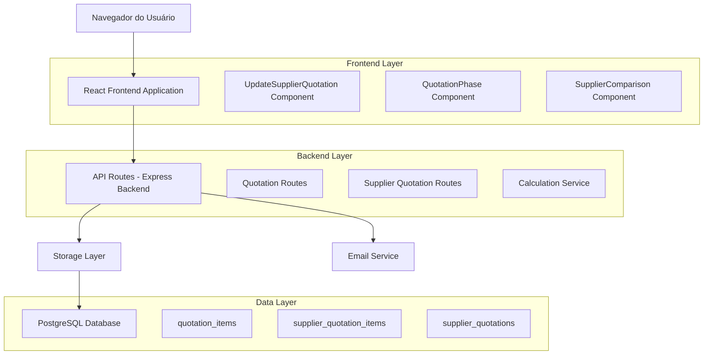
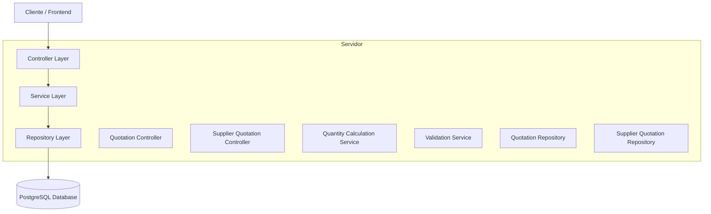
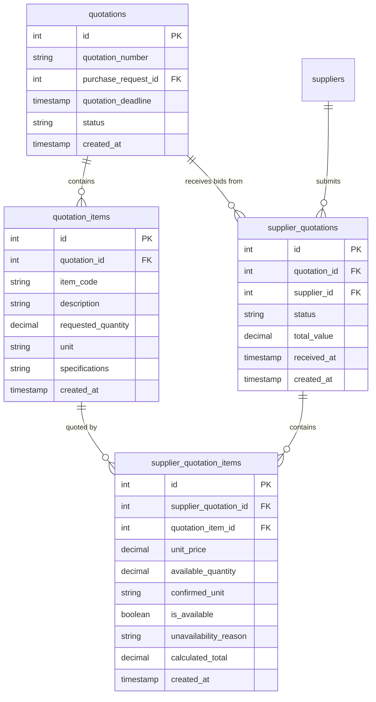

# Arquitetura Técnica - Gerenciamento de Quantidades Disponíveis na RFQ

## 1. Diagrama de Arquitetura



## 2. Descrição das Tecnologias

- Frontend: React@18 + TypeScript + TailwindCSS + Vite
- Backend: Express@4 + TypeScript
- Database: PostgreSQL (via Drizzle ORM)
- Validação: Zod
- UI Components: Shadcn/ui + Lucide React
- Gerenciamento de Estado: TanStack Query

## 3. Definições de Rotas

| Rota | Propósito |
|------|-----------|
| /quotation/:id | Tela principal de gerenciamento de cotações com quantidades |
| /quotation/:id/supplier/:supplierId/update | Modal de atualização de quantidades disponíveis |
| /quotation/:id/comparison | Tela de comparação de fornecedores com análise de quantidades |
| /approval-a2/:id | Tela de aprovação A2 com visualização de quantidades confirmadas |

## 4. Definições de API

### 4.1 APIs Principais

**Atualização de Quantidades Disponíveis**
```
PUT /api/supplier-quotations/:id/update-quantities
```

Request:
| Nome do Parâmetro | Tipo | Obrigatório | Descrição |
|-------------------|------|-------------|-----------|
| items | array | true | Array de itens com quantidades atualizadas |
| items[].quotationItemId | number | true | ID do item da cotação |
| items[].availableQuantity | string | false | Quantidade disponível informada pelo fornecedor |
| items[].confirmedUnit | string | false | Unidade de medida confirmada |
| items[].isAvailable | boolean | true | Se o item está disponível |
| items[].unavailabilityReason | string | false | Motivo da indisponibilidade (obrigatório se isAvailable = false) |
| items[].unitPrice | string | false | Preço unitário (obrigatório se isAvailable = true) |

Response:
| Nome do Parâmetro | Tipo | Descrição |
|-------------------|------|-----------|
| success | boolean | Status da operação |
| updatedItems | array | Itens atualizados com cálculos |
| totalValue | string | Valor total recalculado |
| quantityAdjustments | array | Resumo dos ajustes de quantidade |

Exemplo Request:
```json
{
  "items": [
    {
      "quotationItemId": 1,
      "availableQuantity": "80",
      "confirmedUnit": "UN",
      "isAvailable": true,
      "unitPrice": "15.50"
    },
    {
      "quotationItemId": 2,
      "availableQuantity": "0",
      "confirmedUnit": "KG",
      "isAvailable": false,
      "unavailabilityReason": "Produto descontinuado"
    }
  ]
}
```

**Comparação de Quantidades entre Fornecedores**
```
GET /api/quotations/:id/quantity-comparison
```

Response:
| Nome do Parâmetro | Tipo | Descrição |
|-------------------|------|-----------|
| items | array | Itens com comparação de quantidades |
| items[].description | string | Descrição do item |
| items[].requestedQuantity | string | Quantidade originalmente solicitada |
| items[].suppliers | array | Array com dados de cada fornecedor |
| items[].suppliers[].supplierId | number | ID do fornecedor |
| items[].suppliers[].supplierName | string | Nome do fornecedor |
| items[].suppliers[].availableQuantity | string | Quantidade disponível |
| items[].suppliers[].fulfillmentPercentage | number | Percentual de atendimento |
| items[].suppliers[].unitPrice | string | Preço unitário |

## 5. Diagrama de Arquitetura do Servidor



## 6. Modelo de Dados

### 6.1 Definição do Modelo de Dados



### 6.2 Linguagem de Definição de Dados (DDL)

**Alterações na Tabela supplier_quotation_items**
```sql
-- Adicionar campos para gerenciamento de quantidades disponíveis
ALTER TABLE supplier_quotation_items 
ADD COLUMN available_quantity DECIMAL(10, 3),
ADD COLUMN confirmed_unit VARCHAR(20),
ADD COLUMN quantity_adjustment_reason TEXT,
ADD COLUMN fulfillment_percentage DECIMAL(5, 2) GENERATED ALWAYS AS (
  CASE 
    WHEN is_available = false THEN 0
    ELSE (available_quantity / (
      SELECT qi.quantity 
      FROM quotation_items qi 
      WHERE qi.id = quotation_item_id
    )) * 100
  END
) STORED;

-- Índices para performance
CREATE INDEX idx_supplier_quotation_items_availability 
ON supplier_quotation_items(is_available, available_quantity);

CREATE INDEX idx_supplier_quotation_items_fulfillment 
ON supplier_quotation_items(fulfillment_percentage DESC);

-- Trigger para recalcular valores quando quantidade disponível muda
CREATE OR REPLACE FUNCTION recalculate_supplier_quotation_totals()
RETURNS TRIGGER AS $$
BEGIN
  -- Recalcular total_price baseado na quantidade disponível
  IF NEW.is_available = true AND NEW.available_quantity IS NOT NULL THEN
    NEW.total_price = NEW.unit_price * NEW.available_quantity;
  ELSE
    NEW.total_price = 0;
  END IF;
  
  -- Atualizar total_value da cotação do fornecedor
  UPDATE supplier_quotations 
  SET total_value = (
    SELECT COALESCE(SUM(total_price), 0)
    FROM supplier_quotation_items 
    WHERE supplier_quotation_id = NEW.supplier_quotation_id
      AND is_available = true
  )
  WHERE id = NEW.supplier_quotation_id;
  
  RETURN NEW;
END;
$$ LANGUAGE plpgsql;

CREATE TRIGGER trigger_recalculate_totals
  BEFORE UPDATE OF available_quantity, unit_price, is_available
  ON supplier_quotation_items
  FOR EACH ROW
  EXECUTE FUNCTION recalculate_supplier_quotation_totals();
```

**Tabela de Histórico de Alterações de Quantidades**
```sql
-- Criar tabela para auditoria de alterações de quantidades
CREATE TABLE quantity_adjustment_history (
  id SERIAL PRIMARY KEY,
  supplier_quotation_item_id INTEGER REFERENCES supplier_quotation_items(id),
  previous_quantity DECIMAL(10, 3),
  new_quantity DECIMAL(10, 3),
  previous_unit VARCHAR(20),
  new_unit VARCHAR(20),
  adjustment_reason TEXT,
  adjusted_by INTEGER REFERENCES users(id),
  adjusted_at TIMESTAMP DEFAULT NOW()
);

-- Índices para consultas de histórico
CREATE INDEX idx_quantity_history_item 
ON quantity_adjustment_history(supplier_quotation_item_id);

CREATE INDEX idx_quantity_history_date 
ON quantity_adjustment_history(adjusted_at DESC);

-- Dados iniciais para teste
INSERT INTO quantity_adjustment_history (
  supplier_quotation_item_id, 
  previous_quantity, 
  new_quantity, 
  adjustment_reason, 
  adjusted_by
) VALUES 
(1, 100.000, 80.000, 'Fornecedor informou disponibilidade parcial', 1),
(2, 50.000, 0.000, 'Produto descontinuado pelo fornecedor', 1);
```