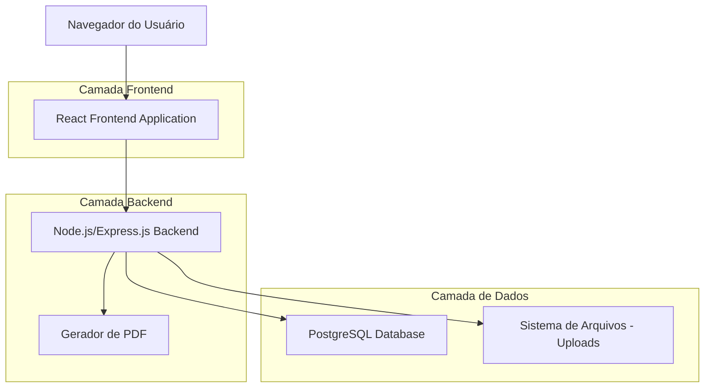
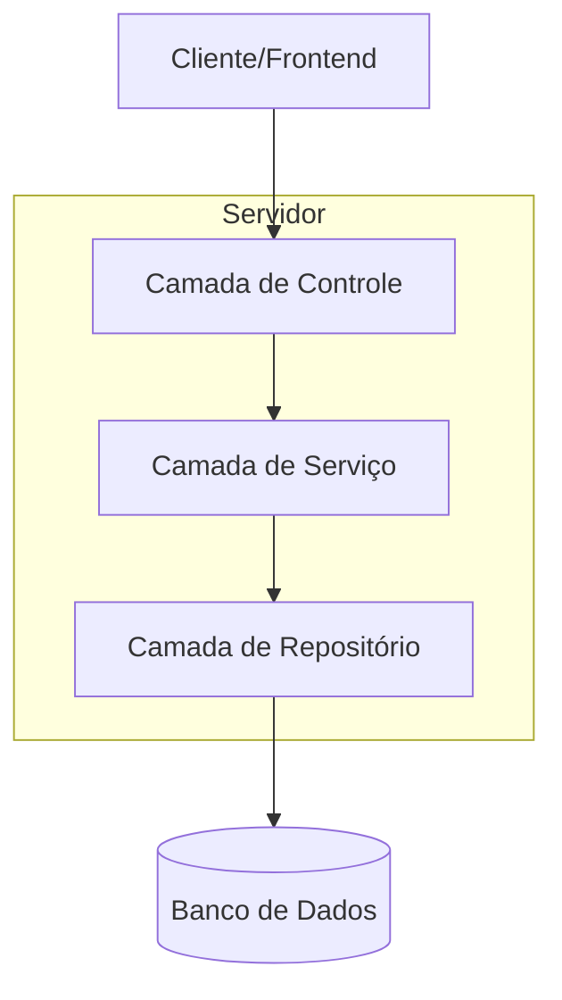
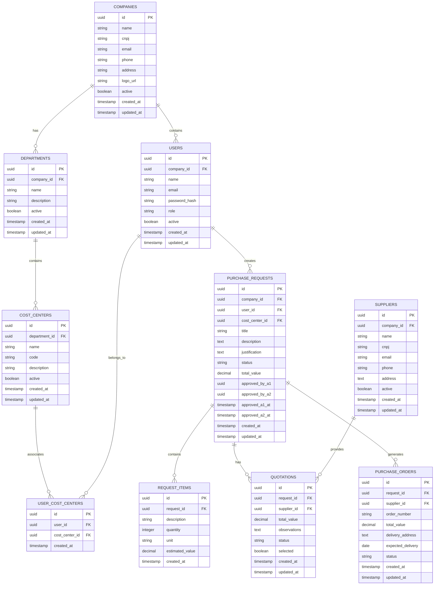

# 🏗️ Documento de Arquitetura Técnica - Sistema de Gestão de Compras

## 1. Arquitetura do Sistema



## 2. Descrição das Tecnologias

- **Frontend**: React@18 + TypeScript + Tailwind CSS + Vite + React Router + React Hook Form
- **Backend**: Node.js + Express.js + TypeScript + Drizzle ORM + Multer + PDFKit
- **Banco de Dados**: PostgreSQL com Drizzle ORM
- **Autenticação**: JWT + bcrypt para hash de senhas
- **Upload de Arquivos**: Multer com armazenamento local
- **Geração de PDF**: PDFKit para pedidos de compra

## 3. Definições de Rotas

| Rota | Propósito |
|------|----------|
| / | Página inicial com redirecionamento para login ou kanban |
| /login | Página de autenticação de usuários |
| /kanban | Dashboard principal com workflow das 8 fases |
| /solicitacao/nova | Formulário de criação de nova solicitação |
| /solicitacao/:id | Detalhes e edição de solicitação específica |
| /aprovacao-a1 | Lista de solicitações pendentes de aprovação A1 |
| /aprovacao-a2 | Lista de solicitações pendentes de aprovação A2 |
| /cotacao | Gestão de cotações e RFQ |
| /fornecedores | Cadastro e gestão de fornecedores |
| /recebimento | Controle de recebimento de pedidos |
| /dashboard | Métricas e relatórios gerenciais |
| /admin/usuarios | Gestão de usuários do sistema |
| /admin/empresas | Cadastro e gestão de empresas |
| /admin/departamentos | Gestão de departamentos e centros de custo |
| /perfil | Configurações do perfil do usuário |

## 4. Definições de API

### 4.1 APIs Principais

**Autenticação**
```
POST /api/auth/login
```

Request:
| Parâmetro | Tipo | Obrigatório | Descrição |
|-----------|------|-------------|----------|
| email | string | true | Email do usuário |
| password | string | true | Senha do usuário |

Response:
| Parâmetro | Tipo | Descrição |
|-----------|------|----------|
| success | boolean | Status da autenticação |
| token | string | JWT token para autenticação |
| user | object | Dados do usuário autenticado |

**Gestão de Solicitações**
```
GET /api/solicitacoes
POST /api/solicitacoes
PUT /api/solicitacoes/:id
DELETE /api/solicitacoes/:id
```

**Aprovações A1**
```
GET /api/aprovacoes-a1
POST /api/aprovacoes-a1/:id/aprovar
POST /api/aprovacoes-a1/:id/reprovar
```

**Aprovações A2**
```
GET /api/aprovacoes-a2
POST /api/aprovacoes-a2/:id/aprovar
POST /api/aprovacoes-a2/:id/reprovar
POST /api/aprovacoes-a2/:id/arquivar
```

**Gestão de Fornecedores**
```
GET /api/fornecedores
POST /api/fornecedores
PUT /api/fornecedores/:id
DELETE /api/fornecedores/:id
```

**Upload de Arquivos**
```
POST /api/upload
```

**Geração de PDF**
```
GET /api/pedidos/:id/pdf
```

## 5. Arquitetura do Servidor



## 6. Modelo de Dados

### 6.1 Definição do Modelo de Dados



### 6.2 Linguagem de Definição de Dados

**Tabela de Empresas (companies)**
```sql
-- Criar tabela
CREATE TABLE companies (
    id UUID PRIMARY KEY DEFAULT gen_random_uuid(),
    name VARCHAR(255) NOT NULL,
    cnpj VARCHAR(18) UNIQUE NOT NULL,
    email VARCHAR(255) NOT NULL,
    phone VARCHAR(20),
    address TEXT,
    logo_url VARCHAR(500),
    active BOOLEAN DEFAULT true,
    created_at TIMESTAMP WITH TIME ZONE DEFAULT NOW(),
    updated_at TIMESTAMP WITH TIME ZONE DEFAULT NOW()
);

-- Criar índices
CREATE INDEX idx_companies_cnpj ON companies(cnpj);
CREATE INDEX idx_companies_active ON companies(active);
```

**Tabela de Usuários (users)**
```sql
-- Criar tabela
CREATE TABLE users (
    id UUID PRIMARY KEY DEFAULT gen_random_uuid(),
    company_id UUID NOT NULL REFERENCES companies(id) ON DELETE CASCADE,
    name VARCHAR(255) NOT NULL,
    email VARCHAR(255) NOT NULL,
    password_hash VARCHAR(255) NOT NULL,
    role VARCHAR(50) NOT NULL CHECK (role IN ('admin', 'manager', 'buyer', 'approver_a1', 'approver_a2', 'receiver', 'requester')),
    active BOOLEAN DEFAULT true,
    created_at TIMESTAMP WITH TIME ZONE DEFAULT NOW(),
    updated_at TIMESTAMP WITH TIME ZONE DEFAULT NOW(),
    UNIQUE(company_id, email)
);

-- Criar índices
CREATE INDEX idx_users_company_id ON users(company_id);
CREATE INDEX idx_users_email ON users(email);
CREATE INDEX idx_users_role ON users(role);
CREATE INDEX idx_users_active ON users(active);
```

**Tabela de Solicitações de Compra (purchase_requests)**
```sql
-- Criar tabela
CREATE TABLE purchase_requests (
    id UUID PRIMARY KEY DEFAULT gen_random_uuid(),
    company_id UUID NOT NULL REFERENCES companies(id) ON DELETE CASCADE,
    user_id UUID NOT NULL REFERENCES users(id) ON DELETE CASCADE,
    cost_center_id UUID NOT NULL REFERENCES cost_centers(id) ON DELETE CASCADE,
    title VARCHAR(255) NOT NULL,
    description TEXT NOT NULL,
    justification TEXT NOT NULL,
    status VARCHAR(50) NOT NULL DEFAULT 'solicitacao' CHECK (status IN ('solicitacao', 'aprovacao_a1', 'cotacao', 'aprovacao_a2', 'pedido_compra', 'recebimento', 'conclusao', 'arquivado')),
    total_value DECIMAL(15,2) DEFAULT 0,
    approved_by_a1 UUID REFERENCES users(id),
    approved_by_a2 UUID REFERENCES users(id),
    approved_a1_at TIMESTAMP WITH TIME ZONE,
    approved_a2_at TIMESTAMP WITH TIME ZONE,
    created_at TIMESTAMP WITH TIME ZONE DEFAULT NOW(),
    updated_at TIMESTAMP WITH TIME ZONE DEFAULT NOW()
);

-- Criar índices
CREATE INDEX idx_purchase_requests_company_id ON purchase_requests(company_id);
CREATE INDEX idx_purchase_requests_user_id ON purchase_requests(user_id);
CREATE INDEX idx_purchase_requests_status ON purchase_requests(status);
CREATE INDEX idx_purchase_requests_created_at ON purchase_requests(created_at DESC);
```

**Dados Iniciais**
```sql
-- Inserir empresa padrão
INSERT INTO companies (name, cnpj, email, phone, address) VALUES 
('Empresa Exemplo Ltda', '12.345.678/0001-90', 'contato@exemplo.com', '(11) 99999-9999', 'Rua Exemplo, 123 - São Paulo/SP');

-- Inserir usuário administrador padrão
INSERT INTO users (company_id, name, email, password_hash, role) VALUES 
((SELECT id FROM companies WHERE cnpj = '12.345.678/0001-90'), 'Administrador', 'admin@exemplo.com', '$2b$10$hashedpassword', 'admin');
```