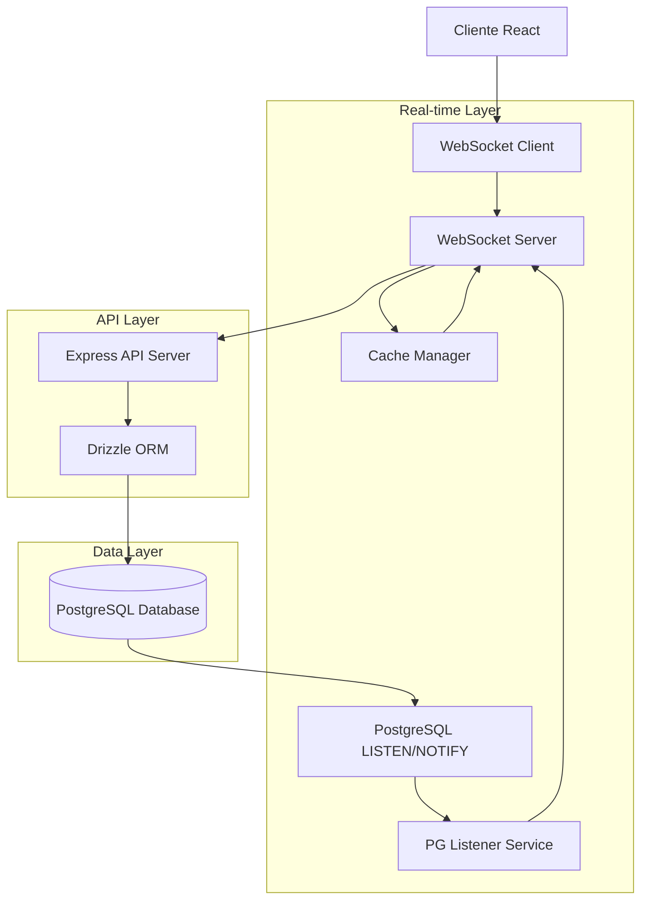

# Implementação de Atualizações em Tempo Real no Kanban - PostgreSQL LISTEN/NOTIFY

## 1. Análise do Estado Atual

### 1.1 Sistema Atual
O sistema de gestão de compras utiliza atualmente:
- **Frontend**: React 18 + TypeScript + TanStack Query + Zustand
- **Backend**: Express + TypeScript + Drizzle ORM  
- **Database**: PostgreSQL
- **Atualização**: Polling via React Query com `refetchInterval: 60000ms` (60 segundos)

### 1.2 Problemas Identificados
- **Alta latência**: Usuários aguardam até 60 segundos para ver mudanças
- **Carga desnecessária no banco**: Queries executadas mesmo sem mudanças
- **Experiência inconsistente**: Múltiplos usuários veem estados diferentes
- **Desperdício de recursos**: Requisições HTTP constantes

### 1.3 Kanban com 8 Fases
1. **Solicitação** - Criação inicial da solicitação
2. **Aprovação A1** - Primeira aprovação (gerencial)
3. **Cotação** - Processo de RFQ com fornecedores
4. **Aprovação A2** - Segunda aprovação (compras)
5. **Pedido** - Geração do pedido de compra
6. **Recebimento** - Recebimento dos materiais
7. **Conclusão** - Finalização do processo
8. **Cancelado** - Solicitações canceladas

## 2. Arquitetura PostgreSQL LISTEN/NOTIFY

### 2.1 Diagrama da Arquitetura


### 2.2 Tecnologias Utilizadas
- **Frontend**: React@18 + TypeScript + @dnd-kit/core + Zustand + TanStack Query
- **Backend**: Express@4 + TypeScript + ws (WebSocket) + pg (PostgreSQL client)
- **Database**: PostgreSQL + Drizzle ORM + LISTEN/NOTIFY
- **Real-time**: WebSocket + PostgreSQL pub/sub
- **Cache**: Map em memória com TTL inteligente

## 3. Implementação dos Triggers PostgreSQL

### 3.1 Função de Notificação
```sql
-- Criar função para notificação de mudanças em purchase_requests
CREATE OR REPLACE FUNCTION notify_purchase_request_change()
RETURNS TRIGGER AS $$
DECLARE
    notification_payload jsonb;
BEGIN
    -- Construir payload com informações relevantes
    notification_payload := json_build_object(
        'operation', TG_OP,
        'table', TG_TABLE_NAME,
        'id', COALESCE(NEW.id, OLD.id),
        'current_phase', COALESCE(NEW.current_phase, OLD.current_phase),
        'old_phase', CASE WHEN TG_OP = 'UPDATE' THEN OLD.current_phase ELSE NULL END,
        'request_number', COALESCE(NEW.request_number, OLD.request_number),
        'title', COALESCE(NEW.title, OLD.title),
        'urgency', COALESCE(NEW.urgency, OLD.urgency),
        'department_id', COALESCE(NEW.department_id, OLD.department_id),
        'requester_id', COALESCE(NEW.requester_id, OLD.requester_id),
        'timestamp', extract(epoch from now()),
        'updated_at', COALESCE(NEW.updated_at, OLD.updated_at)
    );

    -- Enviar notificação
    PERFORM pg_notify('purchase_request_changes', notification_payload::text);
    
    RETURN COALESCE(NEW, OLD);
END;
$$ LANGUAGE plpgsql;

-- Criar trigger para purchase_requests
DROP TRIGGER IF EXISTS purchase_request_notify_trigger ON purchase_requests;
CREATE TRIGGER purchase_request_notify_trigger
    AFTER INSERT OR UPDATE OR DELETE ON purchase_requests
    FOR EACH ROW EXECUTE FUNCTION notify_purchase_request_change();
```

### 3.2 Triggers Adicionais para Tabelas Relacionadas
```sql
-- Função para notificação de mudanças em quotations
CREATE OR REPLACE FUNCTION notify_quotation_change()
RETURNS TRIGGER AS $$
DECLARE
    notification_payload jsonb;
BEGIN
    notification_payload := json_build_object(
        'operation', TG_OP,
        'table', TG_TABLE_NAME,
        'id', COALESCE(NEW.id, OLD.id),
        'purchase_request_id', COALESCE(NEW.purchase_request_id, OLD.purchase_request_id),
        'status', COALESCE(NEW.status, OLD.status),
        'timestamp', extract(epoch from now())
    );

    PERFORM pg_notify('quotation_changes', notification_payload::text);
    RETURN COALESCE(NEW, OLD);
END;
$$ LANGUAGE plpgsql;

-- Trigger para quotations
DROP TRIGGER IF EXISTS quotation_notify_trigger ON quotations;
CREATE TRIGGER quotation_notify_trigger
    AFTER INSERT OR UPDATE OR DELETE ON quotations
    FOR EACH ROW EXECUTE FUNCTION notify_quotation_change();

-- Função para notificação de mudanças em purchase_orders
CREATE OR REPLACE FUNCTION notify_purchase_order_change()
RETURNS TRIGGER AS $$
DECLARE
    notification_payload jsonb;
BEGIN
    notification_payload := json_build_object(
        'operation', TG_OP,
        'table', TG_TABLE_NAME,
        'id', COALESCE(NEW.id, OLD.id),
        'purchase_request_id', COALESCE(NEW.purchase_request_id, OLD.purchase_request_id),
        'status', COALESCE(NEW.status, OLD.status),
        'timestamp', extract(epoch from now())
    );

    PERFORM pg_notify('purchase_order_changes', notification_payload::text);
    RETURN COALESCE(NEW, OLD);
END;
$$ LANGUAGE plpgsql;

-- Trigger para purchase_orders
DROP TRIGGER IF EXISTS purchase_order_notify_trigger ON purchase_orders;
CREATE TRIGGER purchase_order_notify_trigger
    AFTER INSERT OR UPDATE OR DELETE ON purchase_orders
    FOR EACH ROW EXECUTE FUNCTION notify_purchase_order_change();
```

## 4. PostgreSQL Listener Service

### 4.1 Implementação do Listener
```typescript
// server/services/pgListener.ts
import { Client } from 'pg';
import { EventEmitter } from 'events';

interface NotificationPayload {
  operation: 'INSERT' | 'UPDATE' | 'DELETE';
  table: string;
  id: number;
  current_phase?: string;
  old_phase?: string;
  request_number?: string;
  title?: string;
  urgency?: string;
  department_id?: number;
  requester_id?: number;
  timestamp: number;
  updated_at?: string;
}

class PostgreSQLListener extends EventEmitter {
  private client: Client;
  private isConnected = false;
  private reconnectAttempts = 0;
  private maxReconnectAttempts = 10;
  private reconnectDelay = 5000;

  constructor() {
    super();
    this.client = new Client({
      connectionString: process.env.DATABASE_URL,
      keepAlive: true,
      keepAliveInitialDelayMillis: 10000,
    });
  }

  async connect(): Promise<void> {
    try {
      await this.client.connect();
      this.isConnected = true;
      this.reconnectAttempts = 0;
      
      // Configurar listeners para notificações
      this.client.on('notification', (msg) => {
        try {
          const payload: NotificationPayload = JSON.parse(msg.payload!);
          
          switch (msg.channel) {
            case 'purchase_request_changes':
              this.emit('purchase_request:change', payload);
              break;
            case 'quotation_changes':
              this.emit('quotation:change', payload);
              break;
            case 'purchase_order_changes':
              this.emit('purchase_order:change', payload);
              break;
          }
        } catch (error) {
          console.error('Erro ao processar notificação:', error);
        }
      });

      // Configurar listener para erros de conexão
      this.client.on('error', (error) => {
        console.error('Erro na conexão PostgreSQL:', error);
        this.isConnected = false;
        this.handleReconnection();
      });

      // Subscrever aos canais
      await this.client.query('LISTEN purchase_request_changes');
      await this.client.query('LISTEN quotation_changes');
      await this.client.query('LISTEN purchase_order_changes');
      
      console.log('PostgreSQL LISTEN/NOTIFY conectado com sucesso');
    } catch (error) {
      console.error('Erro ao conectar PostgreSQL listener:', error);
      this.handleReconnection();
    }
  }

  private async handleReconnection(): Promise<void> {
    if (this.reconnectAttempts >= this.maxReconnectAttempts) {
      console.error('Máximo de tentativas de reconexão atingido');
      return;
    }

    this.reconnectAttempts++;
    const delay = this.reconnectDelay * Math.pow(2, this.reconnectAttempts - 1);
    
    console.log(`Tentativa de reconexão ${this.reconnectAttempts}/${this.maxReconnectAttempts} em ${delay}ms`);
    
    setTimeout(() => {
      this.connect();
    }, delay);
  }

  async disconnect(): Promise<void> {
    if (this.isConnected) {
      try {
        await this.client.query('UNLISTEN purchase_request_changes');
        await this.client.query('UNLISTEN quotation_changes');
        await this.client.query('UNLISTEN purchase_order_changes');
        await this.client.end();
        this.isConnected = false;
        console.log('PostgreSQL listener desconectado');
      } catch (error) {
        console.error('Erro ao desconectar PostgreSQL listener:', error);
      }
    }
  }

  isListening(): boolean {
    return this.isConnected;
  }
}

export const pgListener = new PostgreSQLListener();
```

## 5. Cache Manager Inteligente

### 5.1 Implementação do Cache
```typescript
// server/services/cacheManager.ts
import { EventEmitter } from 'events';

interface CacheItem {
  data: any;
  timestamp: number;
  version: number;
  lastAccessed: number;
}

interface CacheConfig {
  ttl: number;
  maxSize: number;
  cleanupInterval: number;
}

class IntelligentCacheManager extends EventEmitter {
  private cache = new Map<string, CacheItem>();
  private config: CacheConfig = {
    ttl: 5 * 60 * 1000, // 5 minutos
    maxSize: 1000, // máximo 1000 itens
    cleanupInterval: 60 * 1000 // limpeza a cada minuto
  };
  private cleanupTimer?: NodeJS.Timeout;

  constructor(config?: Partial<CacheConfig>) {
    super();
    if (config) {
      this.config = { ...this.config, ...config };
    }
    this.startCleanup();
  }

  set(key: string, data: any, version: number = 1): void {
    // Verificar limite de tamanho
    if (this.cache.size >= this.config.maxSize) {
      this.evictLeastRecentlyUsed();
    }

    const now = Date.now();
    this.cache.set(key, {
      data,
      timestamp: now,
      version,
      lastAccessed: now
    });
    
    // Emitir evento para WebSocket
    this.emit('cache:update', { key, data, version, timestamp: now });
  }

  get(key: string): any {
    const item = this.cache.get(key);
    if (!item) return null;
    
    const now = Date.now();
    
    // Verificar TTL
    if (now - item.timestamp > this.config.ttl) {
      this.cache.delete(key);
      this.emit('cache:expire', { key });
      return null;
    }
    
    // Atualizar último acesso
    item.lastAccessed = now;
    
    return item.data;
  }

  invalidate(key: string): void {
    const deleted = this.cache.delete(key);
    if (deleted) {
      this.emit('cache:invalidate', { key });
    }
  }

  invalidatePattern(pattern: string): void {
    const regex = new RegExp(pattern);
    const keysToDelete: string[] = [];
    
    for (const key of this.cache.keys()) {
      if (regex.test(key)) {
        keysToDelete.push(key);
      }
    }
    
    keysToDelete.forEach(key => {
      this.cache.delete(key);
      this.emit('cache:invalidate', { key });
    });
  }

  private evictLeastRecentlyUsed(): void {
    let oldestKey = '';
    let oldestTime = Date.now();
    
    for (const [key, item] of this.cache.entries()) {
      if (item.lastAccessed < oldestTime) {
        oldestTime = item.lastAccessed;
        oldestKey = key;
      }
    }
    
    if (oldestKey) {
      this.cache.delete(oldestKey);
      this.emit('cache:evict', { key: oldestKey });
    }
  }

  private startCleanup(): void {
    this.cleanupTimer = setInterval(() => {
      const now = Date.now();
      const keysToDelete: string[] = [];
      
      for (const [key, item] of this.cache.entries()) {
        if (now - item.timestamp > this.config.ttl) {
          keysToDelete.push(key);
        }
      }
      
      keysToDelete.forEach(key => {
        this.cache.delete(key);
        this.emit('cache:expire', { key });
      });
      
      if (keysToDelete.length > 0) {
        console.log(`Cache cleanup: ${keysToDelete.length} itens expirados removidos`);
      }
    }, this.config.cleanupInterval);
  }

  getStats(): any {
    return {
      size: this.cache.size,
      maxSize: this.config.maxSize,
      ttl: this.config.ttl,
      hitRate: this.calculateHitRate()
    };
  }

  private calculateHitRate(): number {
    // Implementar lógica de hit rate se necessário
    return 0;
  }

  destroy(): void {
    if (this.cleanupTimer) {
      clearInterval(this.cleanupTimer);
    }
    this.cache.clear();
    this.removeAllListeners();
  }
}

export const cacheManager = new IntelligentCacheManager();
```

## 6. WebSocket Server Implementation

### 6.1 WebSocket Manager
```typescript
// server/services/websocketManager.ts
import WebSocket from 'ws';
import { Server } from 'http';
import { pgListener } from './pgListener';
import { cacheManager } from './cacheManager';
import { parse } from 'url';

interface ClientConnection {
  ws: WebSocket;
  userId: string;
  subscriptions: Set<string>;
  lastPing: number;
}

interface WebSocketMessage {
  type: 'SUBSCRIBE' | 'UNSUBSCRIBE' | 'PING' | 'REQUEST_SYNC';
  channel?: string;
  data?: any;
}

class WebSocketManager {
  private clients = new Map<string, ClientConnection>();
  private wss: WebSocket.Server;
  private pingInterval?: NodeJS.Timeout;

  constructor(server: Server) {
    this.wss = new WebSocket.Server({ 
      server,
      path: '/ws',
      verifyClient: this.verifyClient.bind(this)
    });
    
    this.setupEventListeners();
    this.handleConnections();
    this.startPingInterval();
  }

  private verifyClient(info: any): boolean {
    // Implementar verificação de autenticação se necessário
    return true;
  }

  private setupEventListeners(): void {
    // Escutar eventos do PostgreSQL
    pgListener.on('purchase_request:change', (payload) => {
      this.broadcastToSubscribers('purchase_requests', {
        type: 'PURCHASE_REQUEST_UPDATE',
        data: payload
      });
      
      // Invalidar cache relacionado
      cacheManager.invalidatePattern(`purchase_request_${payload.id}`);
      cacheManager.invalidate('purchase_requests_list');
    });

    pgListener.on('quotation:change', (payload) => {
      this.broadcastToSubscribers('quotations', {
        type: 'QUOTATION_UPDATE',
        data: payload
      });
      
      // Invalidar cache relacionado
      cacheManager.invalidatePattern(`quotation_${payload.id}`);
      if (payload.purchase_request_id) {
        cacheManager.invalidatePattern(`purchase_request_${payload.purchase_request_id}`);
      }
    });

    pgListener.on('purchase_order:change', (payload) => {
      this.broadcastToSubscribers('purchase_orders', {
        type: 'PURCHASE_ORDER_UPDATE',
        data: payload
      });
      
      // Invalidar cache relacionado
      cacheManager.invalidatePattern(`purchase_order_${payload.id}`);
      if (payload.purchase_request_id) {
        cacheManager.invalidatePattern(`purchase_request_${payload.purchase_request_id}`);
      }
    });

    // Escutar eventos do cache
    cacheManager.on('cache:update', (event) => {
      this.broadcastToSubscribers('cache', {
        type: 'CACHE_UPDATE',
        key: event.key,
        data: event.data,
        version: event.version,
        timestamp: event.timestamp
      });
    });
  }

  private handleConnections(): void {
    this.wss.on('connection', (ws, request) => {
      const userId = this.extractUserId(request);
      
      const client: ClientConnection = {
        ws,
        userId,
        subscriptions: new Set(['purchase_requests']), // Subscrição padrão
        lastPing: Date.now()
      };
      
      this.clients.set(userId, client);
      console.log(`Cliente conectado: ${userId}`);

      // Enviar estado inicial
      this.sendInitialState(client);

      ws.on('message', (message) => {
        try {
          const parsedMessage: WebSocketMessage = JSON.parse(message.toString());
          this.handleMessage(client, parsedMessage);
        } catch (error) {
          console.error('Erro ao processar mensagem WebSocket:', error);
        }
      });

      ws.on('close', () => {
        this.clients.delete(userId);
        console.log(`Cliente desconectado: ${userId}`);
      });

      ws.on('error', (error) => {
        console.error(`Erro WebSocket para cliente ${userId}:`, error);
        this.clients.delete(userId);
      });
    });
  }

  private async sendInitialState(client: ClientConnection): Promise<void> {
    try {
      // Buscar dados iniciais do cache ou banco
      let purchaseRequests = cacheManager.get('purchase_requests_list');
      
      if (!purchaseRequests) {
        // Buscar do banco se não estiver em cache
        // Implementar busca via service layer
        purchaseRequests = await this.fetchPurchaseRequestsFromDB();
        cacheManager.set('purchase_requests_list', purchaseRequests);
      }

      client.ws.send(JSON.stringify({
        type: 'INITIAL_STATE',
        data: {
          purchaseRequests
        }
      }));
    } catch (error) {
      console.error('Erro ao enviar estado inicial:', error);
    }
  }

  private async fetchPurchaseRequestsFromDB(): Promise<any[]> {
    // Implementar busca otimizada do banco
    // Esta função deve ser implementada usando o service layer existente
    return [];
  }

  private handleMessage(client: ClientConnection, message: WebSocketMessage): void {
    switch (message.type) {
      case 'SUBSCRIBE':
        if (message.channel) {
          client.subscriptions.add(message.channel);
          console.log(`Cliente ${client.userId} subscrito ao canal: ${message.channel}`);
        }
        break;
        
      case 'UNSUBSCRIBE':
        if (message.channel) {
          client.subscriptions.delete(message.channel);
          console.log(`Cliente ${client.userId} desinscrito do canal: ${message.channel}`);
        }
        break;
        
      case 'PING':
        client.lastPing = Date.now();
        client.ws.send(JSON.stringify({ type: 'PONG' }));
        break;
        
      case 'REQUEST_SYNC':
        this.sendInitialState(client);
        break;
    }
  }

  private broadcastToSubscribers(channel: string, message: any): void {
    const messageStr = JSON.stringify(message);
    let sentCount = 0;
    
    for (const client of this.clients.values()) {
      if (client.subscriptions.has(channel) && client.ws.readyState === WebSocket.OPEN) {
        try {
          client.ws.send(messageStr);
          sentCount++;
        } catch (error) {
          console.error(`Erro ao enviar mensagem para cliente ${client.userId}:`, error);
        }
      }
    }
    
    if (sentCount > 0) {
      console.log(`Mensagem enviada para ${sentCount} clientes no canal ${channel}`);
    }
  }

  private extractUserId(request: any): string {
    // Extrair userId da query string ou headers
    const url = parse(request.url, true);
    const userId = url.query.userId as string;
    
    if (userId) {
      return userId;
    }
    
    // Fallback para ID aleatório se não fornecido
    return 'user-' + Math.random().toString(36).substr(2, 9);
  }

  private startPingInterval(): void {
    this.pingInterval = setInterval(() => {
      const now = Date.now();
      const timeout = 30000; // 30 segundos
      
      for (const [userId, client] of this.clients.entries()) {
        if (now - client.lastPing > timeout) {
          console.log(`Cliente ${userId} timeout, desconectando...`);
          client.ws.terminate();
          this.clients.delete(userId);
        }
      }
    }, 15000); // Verificar a cada 15 segundos
  }

  getConnectedClients(): number {
    return this.clients.size;
  }

  getClientSubscriptions(): any {
    const subscriptions: any = {};
    for (const [userId, client] of this.clients.entries()) {
      subscriptions[userId] = Array.from(client.subscriptions);
    }
    return subscriptions;
  }

  destroy(): void {
    if (this.pingInterval) {
      clearInterval(this.pingInterval);
    }
    
    for (const client of this.clients.values()) {
      client.ws.terminate();
    }
    
    this.clients.clear();
    this.wss.close();
  }
}

export { WebSocketManager };
```

## 7. Integração com Express Server

### 7.1 Modificações no server/index.ts
```typescript
// server/index.ts - Adicionar ao arquivo existente
import { WebSocketManager } from './services/websocketManager';
import { pgListener } from './services/pgListener';
import { cacheManager } from './services/cacheManager';

// Após a criação do servidor HTTP
const server = app.listen(port, host, async () => {
  console.log(`Server running on ${host}:${port}`);
  
  // Inicializar PostgreSQL Listener
  try {
    await pgListener.connect();
    console.log('PostgreSQL LISTEN/NOTIFY inicializado');
  } catch (error) {
    console.error('Erro ao inicializar PostgreSQL listener:', error);
  }
  
  // Inicializar WebSocket Manager
  const wsManager = new WebSocketManager(server);
  console.log('WebSocket server inicializado');
  
  // Graceful shutdown
  process.on('SIGTERM', async () => {
    console.log('Iniciando graceful shutdown...');
    
    wsManager.destroy();
    await pgListener.disconnect();
    cacheManager.destroy();
    
    server.close(() => {
      console.log('Servidor encerrado');
      process.exit(0);
    });
  });
});
```

## 8. Frontend - WebSocket Client

### 8.1 WebSocket Hook
```typescript
// client/src/hooks/useWebSocket.ts
import { useEffect, useRef, useState, useCallback } from 'react';
import { useAuth } from './useAuth';

interface WebSocketMessage {
  type: string;
  data?: any;
  key?: string;
  version?: number;
  timestamp?: number;
}

interface UseWebSocketOptions {
  onMessage?: (message: WebSocketMessage) => void;
  onConnect?: () => void;
  onDisconnect?: () => void;
  onError?: (error: Event) => void;
  reconnectInterval?: number;
  maxReconnectAttempts?: number;
}

export const useWebSocket = (options: UseWebSocketOptions = {}) => {
  const { user } = useAuth();
  const wsRef = useRef<WebSocket | null>(null);
  const [isConnected, setIsConnected] = useState(false);
  const [reconnectAttempts, setReconnectAttempts] = useState(0);
  const reconnectTimeoutRef = useRef<NodeJS.Timeout>();
  
  const {
    onMessage,
    onConnect,
    onDisconnect,
    onError,
    reconnectInterval = 5000,
    maxReconnectAttempts = 10
  } = options;

  const connect = useCallback(() => {
    if (!user?.id) return;
    
    try {
      const protocol = window.location.protocol === 'https:' ? 'wss:' : 'ws:';
      const wsUrl = `${protocol}//${window.location.host}/ws?userId=${user.id}`;
      
      wsRef.current = new WebSocket(wsUrl);
      
      wsRef.current.onopen = () => {
        console.log('WebSocket conectado');
        setIsConnected(true);
        setReconnectAttempts(0);
        onConnect?.();
      };
      
      wsRef.current.onmessage = (event) => {
        try {
          const message: WebSocketMessage = JSON.parse(event.data);
          onMessage?.(message);
        } catch (error) {
          console.error('Erro ao processar mensagem WebSocket:', error);
        }
      };
      
      wsRef.current.onclose = () => {
        console.log('WebSocket desconectado');
        setIsConnected(false);
        onDisconnect?.();
        
        // Tentar reconectar
        if (reconnectAttempts < maxReconnectAttempts) {
          reconnectTimeoutRef.current = setTimeout(() => {
            setReconnectAttempts(prev => prev + 1);
            connect();
          }, reconnectInterval * Math.pow(2, reconnectAttempts));
        }
      };
      
      wsRef.current.onerror = (error) => {
        console.error('Erro WebSocket:', error);
        onError?.(error);
      };
      
    } catch (error) {
      console.error('Erro ao conectar WebSocket:', error);
    }
  }, [user?.id, onMessage, onConnect, onDisconnect, onError, reconnectInterval, maxReconnectAttempts, reconnectAttempts]);

  const disconnect = useCallback(() => {
    if (reconnectTimeoutRef.current) {
      clearTimeout(reconnectTimeoutRef.current);
    }
    
    if (wsRef.current) {
      wsRef.current.close();
      wsRef.current = null;
    }
    
    setIsConnected(false);
    setReconnectAttempts(0);
  }, []);

  const sendMessage = useCallback((message: any) => {
    if (wsRef.current && wsRef.current.readyState === WebSocket.OPEN) {
      wsRef.current.send(JSON.stringify(message));
      return true;
    }
    return false;
  }, []);

  const subscribe = useCallback((channel: string) => {
    return sendMessage({ type: 'SUBSCRIBE', channel });
  }, [sendMessage]);

  const unsubscribe = useCallback((channel: string) => {
    return sendMessage({ type: 'UNSUBSCRIBE', channel });
  }, [sendMessage]);

  useEffect(() => {
    connect();
    
    return () => {
      disconnect();
    };
  }, [connect, disconnect]);

  // Ping periódico para manter conexão viva
  useEffect(() => {
    if (!isConnected) return;
    
    const pingInterval = setInterval(() => {
      sendMessage({ type: 'PING' });
    }, 25000); // Ping a cada 25 segundos
    
    return () => clearInterval(pingInterval);
  }, [isConnected, sendMessage]);

  return {
    isConnected,
    sendMessage,
    subscribe,
    unsubscribe,
    reconnectAttempts
  };
};
```

### 8.2 Zustand Store com WebSocket
```typescript
// client/src/stores/kanbanStore.ts
import { create } from 'zustand';
import { subscribeWithSelector } from 'zustand/middleware';

interface PurchaseRequest {
  id: number;
  requestNumber: string;
  title: string;
  currentPhase: string;
  urgency: string;
  departmentId: number;
  requesterId: number;
  updatedAt: string;
  // ... outros campos
}

interface KanbanState {
  purchaseRequests: PurchaseRequest[];
  lastSync: number;
  isConnected: boolean;
  pendingUpdates: Map<number, PurchaseRequest>;
  
  // Actions
  setPurchaseRequests: (requests: PurchaseRequest[]) => void;
  updatePurchaseRequest: (id: number, updates: Partial<PurchaseRequest>) => void;
  removePurchaseRequest: (id: number) => void;
  addPurchaseRequest: (request: PurchaseRequest) => void;
  setConnectionStatus: (connected: boolean) => void;
  applyPendingUpdates: () => void;
  addPendingUpdate: (id: number, request: PurchaseRequest) => void;
}

export const useKanbanStore = create<KanbanState>()(
  subscribeWithSelector((set, get) => ({
    purchaseRequests: [],
    lastSync: 0,
    isConnected: false,
    pendingUpdates: new Map(),
    
    setPurchaseRequests: (requests) => {
      set({
        purchaseRequests: requests,
        lastSync: Date.now()
      });
    },
    
    updatePurchaseRequest: (id, updates) => {
      set((state) => ({
        purchaseRequests: state.purchaseRequests.map(req => 
          req.id === id ? { ...req, ...updates } : req
        ),
        lastSync: Date.now()
      }));
    },
    
    removePurchaseRequest: (id) => {
      set((state) => ({
        purchaseRequests: state.purchaseRequests.filter(req => req.id !== id),
        lastSync: Date.now()
      }));
    },
    
    addPurchaseRequest: (request) => {
      set((state) => ({
        purchaseRequests: [...state.purchaseRequests, request],
        lastSync: Date.now()
      }));
    },
    
    setConnectionStatus: (connected) => {
      set({ isConnected: connected });
      
      // Aplicar updates pendentes quando reconectar
      if (connected) {
        get().applyPendingUpdates();
      }
    },
    
    addPendingUpdate: (id, request) => {
      set((state) => {
        const newPendingUpdates = new Map(state.pendingUpdates);
        newPendingUpdates.set(id, request);
        return { pendingUpdates: newPendingUpdates };
      });
    },
    
    applyPendingUpdates: () => {
      const { pendingUpdates } = get();
      
      if (pendingUpdates.size > 0) {
        set((state) => {
          let updatedRequests = [...state.purchaseRequests];
          
          pendingUpdates.forEach((request, id) => {
            const index = updatedRequests.findIndex(req => req.id === id);
            if (index >= 0) {
              updatedRequests[index] = { ...updatedRequests[index], ...request };
            } else {
              updatedRequests.push(request);
            }
          });
          
          return {
            purchaseRequests: updatedRequests,
            pendingUpdates: new Map(),
            lastSync: Date.now()
          };
        });
      }
    }
  }))
);
```

### 8.3 Hook de Integração Kanban
```typescript
// client/src/hooks/useKanbanRealtime.ts
import { useEffect } from 'react';
import { useWebSocket } from './useWebSocket';
import { useKanbanStore } from '../stores/kanbanStore';
import { useQueryClient } from '@tanstack/react-query';

export const useKanbanRealtime = () => {
  const queryClient = useQueryClient();
  const {
    setPurchaseRequests,
    updatePurchaseRequest,
    removePurchaseRequest,
    addPurchaseRequest,
    setConnectionStatus,
    addPendingUpdate,
    isConnected
  } = useKanbanStore();

  const { isConnected: wsConnected, subscribe, unsubscribe } = useWebSocket({
    onMessage: (message) => {
      switch (message.type) {
        case 'INITIAL_STATE':
          if (message.data?.purchaseRequests) {
            setPurchaseRequests(message.data.purchaseRequests);
          }
          break;
          
        case 'PURCHASE_REQUEST_UPDATE':
          handlePurchaseRequestUpdate(message.data);
          break;
          
        case 'QUOTATION_UPDATE':
          handleQuotationUpdate(message.data);
          break;
          
        case 'PURCHASE_ORDER_UPDATE':
          handlePurchaseOrderUpdate(message.data);
          break;
          
        case 'CACHE_UPDATE':
          handleCacheUpdate(message);
          break;
      }
    },
    
    onConnect: () => {
      setConnectionStatus(true);
      // Subscrever aos canais necessários
      subscribe('purchase_requests');
      subscribe('quotations');
      subscribe('purchase_orders');
    },
    
    onDisconnect: () => {
      setConnectionStatus(false);
    }
  });

  const handlePurchaseRequestUpdate = (payload: any) => {
    const { operation, id, current_phase, old_phase } = payload;
    
    switch (operation) {
      case 'INSERT':
        // Buscar dados completos da API
        queryClient.invalidateQueries({ queryKey: ['/api/purchase-requests'] });
        break;
        
      case 'UPDATE':
        if (isConnected) {
          updatePurchaseRequest(id, {
            currentPhase: current_phase,
            updatedAt: new Date().toISOString()
          });
        } else {
          // Armazenar update pendente se desconectado
          addPendingUpdate(id, {
            id,
            currentPhase: current_phase,
            updatedAt: new Date().toISOString()
          } as any);
        }
        
        // Invalidar queries relacionadas
        queryClient.invalidateQueries({ 
          queryKey: [`/api/purchase-requests/${id}`] 
        });
        break;
        
      case 'DELETE':
        removePurchaseRequest(id);
        break;
    }
  };

  const handleQuotationUpdate = (payload: any) => {
    // Invalidar queries de cotação
    queryClient.invalidateQueries({ 
      queryKey: [`/api/quotations/purchase-request/${payload.purchase_request_id}`] 
    });
    
    // Atualizar status da solicitação se necessário
    if (payload.purchase_request_id) {
      queryClient.invalidateQueries({ 
        queryKey: [`/api/purchase-requests/${payload.purchase_request_id}`] 
      });
    }
  };

  const handlePurchaseOrderUpdate = (payload: any) => {
    // Invalidar queries de pedido
    queryClient.invalidateQueries({ 
      queryKey: [`/api/purchase-orders`] 
    });
    
    if (payload.purchase_request_id) {
      queryClient.invalidateQueries({ 
        queryKey: [`/api/purchase-requests/${payload.purchase_request_id}`] 
      });
    }
  };

  const handleCacheUpdate = (message: any) => {
    // Processar atualizações de cache se necessário
    console.log('Cache update:', message.key);
  };

  useEffect(() => {
    setConnectionStatus(wsConnected);
  }, [wsConnected, setConnectionStatus]);

  return {
    isConnected: wsConnected
  };
};
```

## 9. Otimizações de Queries e Índices

### 9.1 Índices Otimizados para Kanban
```sql
-- Índices para otimizar queries do kanban
CREATE INDEX CONCURRENTLY IF NOT EXISTS idx_purchase_requests_current_phase 
ON purchase_requests(current_phase);

CREATE INDEX CONCURRENTLY IF NOT EXISTS idx_purchase_requests_updated_at_desc 
ON purchase_requests(updated_at DESC);

CREATE INDEX CONCURRENTLY IF NOT EXISTS idx_purchase_requests_department_phase 
ON purchase_requests(department_id, current_phase);

CREATE INDEX CONCURRENTLY IF NOT EXISTS idx_purchase_requests_requester_phase 
ON purchase_requests(requester_id, current_phase);

CREATE INDEX CONCURRENTLY IF NOT EXISTS idx_purchase_requests_urgency_phase 
ON purchase_requests(urgency, current_phase);

-- Índice composto para filtros múltiplos
CREATE INDEX CONCURRENTLY IF NOT EXISTS idx_purchase_requests_filters 
ON purchase_requests(current_phase, department_id, urgency, updated_at DESC);

-- Índices para quotations
CREATE INDEX CONCURRENTLY IF NOT EXISTS idx_quotations_purchase_request_status 
ON quotations(purchase_request_id, status);

-- Índices para purchase_orders
CREATE INDEX CONCURRENTLY IF NOT EXISTS idx_purchase_orders_purchase_request_status 
ON purchase_orders(purchase_request_id, status);
```

### 9.2 Query Otimizada para Kanban
```typescript
// server/services/kanbanService.ts
import { db } from '../db';
import { purchaseRequests, departments, users, suppliers } from '../../shared/schema';
import { eq, and, desc, inArray } from 'drizzle-orm';

interface KanbanFilters {
  departmentId?: number;
  urgency?: string;
  requesterId?: number;
  supplierId?: number;
  phases?: string[];
  search?: string;
  dateRange?: {
    start: Date;
    end: Date;
  };
}

export class KanbanService {
  async getPurchaseRequestsOptimized(filters: KanbanFilters = {}) {
    const conditions = [];
    
    // Aplicar filtros
    if (filters.departmentId) {
      conditions.push(eq(purchaseRequests.departmentId, filters.departmentId));
    }
    
    if (filters.urgency) {
      conditions.push(eq(purchaseRequests.urgency, filters.urgency));
    }
    
    if (filters.requesterId) {
      conditions.push(eq(purchaseRequests.requesterId, filters.requesterId));
    }
    
    if (filters.phases && filters.phases.length > 0) {
      conditions.push(inArray(purchaseRequests.currentPhase, filters.phases));
    }
    
    // Query otimizada com joins necessários
    const query = db
      .select({
        id: purchaseRequests.id,
        requestNumber: purchaseRequests.requestNumber,
        title: purchaseRequests.title,
        description: purchaseRequests.description,
        currentPhase: purchaseRequests.currentPhase,
        urgency: purchaseRequests.urgency,
        totalValue: purchaseRequests.totalValue,
        createdAt: purchaseRequests.createdAt,
        updatedAt: purchaseRequests.updatedAt,
        
        // Dados do departamento
        department: {
          id: departments.id,
          name: departments.name
        },
        
        // Dados do solicitante
        requester: {
          id: users.id,
          firstName: users.firstName,
          lastName: users.lastName,
          username: users.username
        },
        
        // Dados do fornecedor escolhido (se houver)
        chosenSupplier: {
          id: suppliers.id,
          name: suppliers.name,
          cnpj: suppliers.cnpj
        }
      })
      .from(purchaseRequests)
      .leftJoin(departments, eq(purchaseRequests.departmentId, departments.id))
      .leftJoin(users, eq(purchaseRequests.requesterId, users.id))
      .leftJoin(suppliers, eq(purchaseRequests.chosenSupplierId, suppliers.id))
      .where(conditions.length > 0 ? and(...conditions) : undefined)
      .orderBy(desc(purchaseRequests.updatedAt))
      .limit(1000); // Limite para performance
    
    return await query;
  }
  
  async getPurchaseRequestsByPhase(phase: string) {
    return await db
      .select()
      .from(purchaseRequests)
      .where(eq(purchaseRequests.currentPhase, phase))
      .orderBy(desc(purchaseRequests.updatedAt));
  }
  
  async getRecentUpdates(since: Date) {
    return await db
      .select({
        id: purchaseRequests.id,
        requestNumber: purchaseRequests.requestNumber,
        currentPhase: purchaseRequests.currentPhase,
        updatedAt: purchaseRequests.updatedAt
      })
      .from(purchaseRequests)
      .where(gte(purchaseRequests.updatedAt, since))
      .orderBy(desc(purchaseRequests.updatedAt));
  }
}

export const kanbanService = new KanbanService();
```

## 10. Debounce e Throttle para Atualizações

### 10.1 Debounce Hook
```typescript
// client/src/hooks/useDebounce.ts
import { useEffect, useState } from 'react';

export function useDebounce<T>(value: T, delay: number): T {
  const [debouncedValue, setDebouncedValue] = useState<T>(value);

  useEffect(() => {
    const handler = setTimeout(() => {
      setDebouncedValue(value);
    }, delay);

    return () => {
      clearTimeout(handler);
    };
  }, [value, delay]);

  return debouncedValue;
}
```

### 10.2 Throttle para WebSocket Messages
```typescript
// client/src/utils/throttle.ts
export function throttle<T extends (...args: any[]) => any>(
  func: T,
  delay: number
): (...args: Parameters<T>) => void {
  let timeoutId: NodeJS.Timeout | null = null;
  let lastExecTime = 0;
  
  return (...args: Parameters<T>) => {
    const currentTime = Date.now();
    
    if (currentTime - lastExecTime > delay) {
      func(...args);
      lastExecTime = currentTime;
    } else {
      if (timeoutId) {
        clearTimeout(timeoutId);
      }
      
      timeoutId = setTimeout(() => {
        func(...args);
        lastExecTime = Date.now();
      }, delay - (currentTime - lastExecTime));
    }
  };
}
```

### 10.3 Aplicação no Kanban Board
```typescript
// client/src/components/kanban-board.tsx - Modificações
import { useDebounce } from '@/hooks/useDebounce';
import { useKanbanRealtime } from '@/hooks/useKanbanRealtime';
import { throttle } from '@/utils/throttle';

export default function KanbanBoard({
  departmentFilter = "all",
  urgencyFilter = "all",
  requesterFilter = "all",
  supplierFilter = "all",
  searchFilter = "",
  dateFilter,
}: KanbanBoardProps) {
  // Usar WebSocket em vez de polling
  const { isConnected } = useKanbanRealtime();
  
  // Debounce para filtros de busca
  const debouncedSearchFilter = useDebounce(searchFilter, 300);
  
  // Usar dados do Zustand store em vez de React Query
  const { purchaseRequests } = useKanbanStore();
  
  // Throttle para drag and drop
  const throttledMoveRequest = useMemo(
    () => throttle(async (id: number, newPhase: string) => {
      try {
        await apiRequest(`/api/purchase-requests/${id}/update-phase`, {
          method: "PATCH",
          body: { newPhase },
        });
      } catch (error) {
        console.error('Erro ao mover item:', error);
      }
    }, 1000),
    []
  );

  // Filtrar dados localmente (muito mais rápido)
  const filteredRequests = useMemo(() => {
    if (!Array.isArray(purchaseRequests)) return [];
    
    return purchaseRequests.filter((request: any) => {
      // Aplicar filtros
      if (departmentFilter !== "all" && request.department?.id !== parseInt(departmentFilter)) {
        return false;
      }
      
      if (urgencyFilter !== "all" && request.urgency !== urgencyFilter) {
        return false;
      }
      
      if (requesterFilter !== "all" && request.requester?.id !== parseInt(requesterFilter)) {
        return false;
      }
      
      if (debouncedSearchFilter) {
        const searchLower = debouncedSearchFilter.toLowerCase();
        const searchFields = [
          request.requestNumber,
          request.title,
          request.description,
          request.requester?.firstName,
          request.requester?.lastName,
          request.department?.name
        ].filter(Boolean);
        
        if (!searchFields.some(field => 
          field?.toLowerCase().includes(searchLower)
        )) {
          return false;
        }
      }
      
      return true;
    });
  }, [purchaseRequests, departmentFilter, urgencyFilter, requesterFilter, debouncedSearchFilter]);

  // Resto da implementação...
  
  return (
    <div className="flex flex-col h-full">
      {/* Indicador de conexão */}
      <div className="flex items-center justify-between p-4 bg-gray-50">
        <h1 className="text-2xl font-bold">Kanban de Compras</h1>
        <div className="flex items-center gap-2">
          <div className={`w-3 h-3 rounded-full ${isConnected ? 'bg-green-500' : 'bg-red-500'}`} />
          <span className="text-sm text-gray-600">
            {isConnected ? 'Conectado' : 'Desconectado'}
          </span>
        </div>
      </div>
      
      {/* Resto do componente... */}
    </div>
  );
}
```

## 11. Estratégias de Fallback e Recuperação

### 11.1 Fallback para Polling
```typescript
// client/src/hooks/useKanbanWithFallback.ts
import { useEffect, useState } from 'react';
import { useQuery } from '@tanstack/react-query';
import { useKanbanRealtime } from './useKanbanRealtime';
import { useKanbanStore } from '../stores/kanbanStore';

export const useKanbanWithFallback = () => {
  const { isConnected } = useKanbanRealtime();
  const { purchaseRequests, setPurchaseRequests } = useKanbanStore();
  const [fallbackActive, setFallbackActive] = useState(false);

  // Fallback query que só é ativada quando WebSocket está desconectado
  const { data: fallbackData } = useQuery({
    queryKey: ["/api/purchase-requests"],
    enabled: !isConnected && fallbackActive,
    refetchInterval: isConnected ? false : 30000, // 30 segundos quando desconectado
    refetchOnWindowFocus: !isConnected,
  });

  // Ativar fallback após 10 segundos de desconexão
  useEffect(() => {
    let timeout: NodeJS.Timeout;
    
    if (!isConnected) {
      timeout = setTimeout(() => {
        setFallbackActive(true);
        console.log('Ativando fallback polling devido à desconexão prolongada');
      }, 10000);
    } else {
      setFallbackActive(false);
    }
    
    return () => {
      if (timeout) clearTimeout(timeout);
    };
  }, [isConnected]);

  // Sincronizar dados do fallback
  useEffect(() => {
    if (fallbackActive && fallbackData && Array.isArray(fallbackData)) {
      setPurchaseRequests(fallbackData);
    }
  }, [fallbackActive, fallbackData, setPurchaseRequests]);

  return {
    isConnected,
    fallbackActive,
    data: purchaseRequests
  };
};
```

### 11.2 Sistema de Retry Inteligente
```typescript
// client/src/utils/retryWithBackoff.ts
interface RetryOptions {
  maxAttempts: number;
  baseDelay: number;
  maxDelay: number;
  backoffFactor: number;
}

export async function retryWithBackoff<T>(
  fn: () => Promise<T>,
  options: RetryOptions = {
    maxAttempts: 3,
    baseDelay: 1000,
    maxDelay: 10000,
    backoffFactor: 2
  }
): Promise<T> {
  let lastError: Error;
  
  for (let attempt = 1; attempt <= options.maxAttempts; attempt++) {
    try {
      return await fn();
    } catch (error) {
      lastError = error as Error;
      
      if (attempt === options.maxAttempts) {
        throw lastError;
      }
      
      const delay = Math.min(
        options.baseDelay * Math.pow(options.backoffFactor, attempt - 1),
        options.maxDelay
      );
      
      console.log(`Tentativa ${attempt} falhou, tentando novamente em ${delay}ms`);
      await new Promise(resolve => setTimeout(resolve, delay));
    }
  }
  
  throw lastError!;
}
```

## 12. Plano de Implementação por Fases

### Fase 1: Infraestrutura Base (1-2 semanas)
**Objetivos:**
- Implementar PostgreSQL LISTEN/NOTIFY
- Criar WebSocket server básico
- Configurar triggers no banco

**Tarefas:**
1. Criar triggers e funções no PostgreSQL
2. Implementar PostgreSQL Listener Service
3. Criar WebSocket Manager básico
4. Integrar com servidor Express existente
5. Testes básicos de conectividade

**Critérios de Sucesso:**
- Triggers funcionando corretamente
- WebSocket conectando e recebendo notificações
- Logs mostrando eventos em tempo real

### Fase 2: Cache Inteligente (1 semana)
**Objetivos:**
- Implementar sistema de cache em memória
- Reduzir consultas ao banco de dados
- Otimizar performance

**Tarefas:**
1. Implementar Cache Manager com TTL
2. Integrar cache com WebSocket
3. Implementar invalidação inteligente
4. Adicionar métricas de cache
5. Testes de performance

**Critérios de Sucesso:**
- Hit rate do cache > 80%
- Redução de 70% nas queries ao banco
- Tempo de resposta < 100ms

### Fase 3: Frontend Integration (1-2 semanas)
**Objetivos:**
- Integrar WebSocket no frontend
- Implementar Zustand store
- Substituir polling por real-time

**Tarefas:**
1. Criar WebSocket hook
2. Implementar Zustand store para kanban
3. Integrar com componentes existentes
4. Implementar debounce/throttle
5. Testes de interface

**Critérios de Sucesso:**
- Atualizações em tempo real funcionando
- Interface responsiva
- Sem perda de dados durante reconexões

### Fase 4: Otimizações e Fallback (1 semana)
**Objetivos:**
- Implementar estratégias de fallback
- Otimizar queries e índices
- Adicionar monitoramento

**Tarefas:**
1. Implementar fallback para polling
2. Criar índices otimizados
3. Implementar retry com backoff
4. Adicionar métricas e logs
5. Testes de stress

**Critérios de Sucesso:**
- Sistema funciona mesmo com WebSocket offline
- Queries otimizadas < 50ms
- Recuperação automática de falhas

### Fase 5: Deploy e Monitoramento (0.5 semana)
**Objetivos:**
- Deploy em produção
- Monitoramento em tempo real
- Ajustes finais

**Tarefas:**
1. Deploy gradual (feature flag)
2. Configurar monitoramento
3. Testes em produção
4. Documentação final
5. Treinamento da equipe

**Critérios de Sucesso:**
- Sistema estável em produção
- Métricas dentro do esperado
- Usuários satisfeitos com performance

## 13. Métricas de Performance Esperadas

### 13.1 Comparação com Sistema Atual

| Métrica | Sistema Atual (Polling 60s) | Sistema Proposto (WebSocket) | Melhoria |
|---------|------------------------------|------------------------------|----------|
| **Latência de Atualização** | 0-60 segundos | 50-200ms | 99.7% |
| **Queries por Minuto** | 60+ (por usuário) | 2-5 (por usuário) | 90% |
| **Uso de Banda** | Alto (dados completos) | Baixo (apenas mudanças) | 85% |
| **Carga no Servidor** | Alta (polling constante) | Baixa (event-driven) | 80% |
| **Experiência do Usuário** | Inconsistente | Tempo real | Excelente |

### 13.2 Métricas Técnicas Esperadas

**Performance do WebSocket:**
- Latência de mensagem: < 100ms
- Throughput: > 1000 mensagens/segundo
- Conexões simultâneas: > 100 usuários
- Uptime: > 99.9%

**Performance do Cache:**
- Hit rate: > 85%
- Tempo de resposta: < 10ms
- Uso de memória: < 500MB
- TTL efetivo: 5 minutos

**Performance do Banco:**
- Queries kanban: < 50ms
- Triggers: < 5ms overhead
- Índices: 95% de uso efetivo
- Conexões: < 20 simultâneas

### 13.3 Monitoramento e Alertas

```typescript
// server/services/metricsService.ts
class MetricsService {
  private metrics = {
    websocketConnections: 0,
    messagesPerSecond: 0,
    cacheHitRate: 0,
    databaseQueries: 0,
    averageResponseTime: 0
  };

  updateWebSocketConnections(count: number) {
    this.metrics.websocketConnections = count;
  }

  recordMessage() {
    this.metrics.messagesPerSecond++;
  }

  recordCacheHit(hit: boolean) {
    // Implementar cálculo de hit rate
  }

  recordDatabaseQuery(duration: number) {
    this.metrics.databaseQueries++;
    // Atualizar tempo médio de resposta
  }

  getMetrics() {
    return { ...this.metrics };
  }

  // Alertas automáticos
  checkAlerts() {
    if (this.metrics.cacheHitRate < 0.8) {
      console.warn('Cache hit rate baixo:', this.metrics.cacheHitRate);
    }
    
    if (this.metrics.averageResponseTime > 100) {
      console.warn('Tempo de resposta alto:', this.metrics.averageResponseTime);
    }
  }
}

export const metricsService = new MetricsService();
```

## 14. Considerações de Segurança

### 14.1 Autenticação WebSocket
```typescript
// server/middleware/wsAuth.ts
import jwt from 'jsonwebtoken';
import { parse } from 'url';

export function authenticateWebSocket(request: any): string | null {
  try {
    const url = parse(request.url, true);
    const token = url.query.token as string;
    
    if (!token) {
      return null;
    }
    
    const decoded = jwt.verify(token, process.env.JWT_SECRET!) as any;
    return decoded.userId;
  } catch (error) {
    console.error('Erro na autenticação WebSocket:', error);
    return null;
  }
}
```

### 14.2 Rate Limiting
```typescript
// server/services/rateLimiter.ts
class RateLimiter {
  private requests = new Map<string, number[]>();
  private readonly maxRequests = 100; // por minuto
  private readonly windowMs = 60000; // 1 minuto

  isAllowed(userId: string): boolean {
    const now = Date.now();
    const userRequests = this.requests.get(userId) || [];
    
    // Remover requests antigas
    const validRequests = userRequests.filter(
      timestamp => now - timestamp < this.windowMs
    );
    
    if (validRequests.length >= this.maxRequests) {
      return false;
    }
    
    validRequests.push(now);
    this.requests.set(userId, validRequests);
    
    return true;
  }
}

export const rateLimiter = new RateLimiter();
```

## 15. Conclusão

A implementação da arquitetura PostgreSQL LISTEN/NOTIFY para atualizações em tempo real no kanban oferece:

### Benefícios Principais:
1. **Redução drástica na latência** - de 60s para ~100ms
2. **Economia de recursos** - 90% menos queries ao banco
3. **Melhor experiência do usuário** - atualizações instantâneas
4. **Escalabilidade** - suporta centenas de usuários simultâneos
5. **Confiabilidade** - fallback automático para polling

### Riscos Mitigados:
- **Desconexões** - sistema de reconexão automática
- **Sobrecarga** - cache inteligente e throttling
- **Falhas** - fallback para polling tradicional
- **Segurança** - autenticação WebSocket e rate limiting

### Próximos Passos:
1. Revisar e aprovar o plano de implementação
2. Configurar ambiente de desenvolvimento
3. Iniciar Fase 1 com triggers PostgreSQL
4. Implementar testes automatizados
5. Monitorar métricas durante rollout

### Impacto Esperado:
- **Usuários**: Experiência muito mais fluida e responsiva
- **Sistema**: Redução significativa na carga do servidor
- **Negócio**: Processos mais ágeis e decisões mais rápidas
- **Manutenção**: Sistema mais robusto e fácil de monitorar

Esta implementação transformará o sistema de gestão de compras em uma aplicação verdadeiramente em tempo real, proporcionando uma experiência moderna e eficiente para todos os usuários.