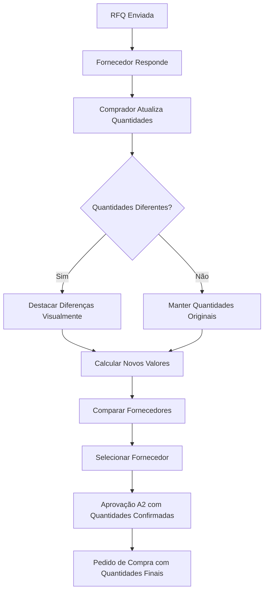

# PRD - Gerenciamento de Quantidades Disponíveis na Tela de Cotação (RFQ)

## 1. Visão Geral do Produto

Sistema aprimorado para gerenciar quantidades disponíveis na fase de cotação (RFQ), permitindo que fornecedores informem quantidades diferentes das solicitadas inicialmente e que o sistema processe essas informações de forma granular durante todo o fluxo de aprovação.

O sistema resolve o problema de rigidez nas quantidades cotadas, oferecendo flexibilidade para que fornecedores informem disponibilidade parcial ou total, mantendo a rastreabilidade e consistência dos dados em todas as etapas do processo de compras.

## 2. Funcionalidades Principais

### 2.1 Papéis de Usuário

| Papel | Método de Registro | Permissões Principais |
|-------|-------------------|----------------------|
| Comprador | Atribuição por administrador | Pode gerenciar RFQs, atualizar quantidades disponíveis, confirmar cotações |
| Aprovador A2 | Atribuição por administrador | Pode visualizar quantidades confirmadas, aprovar com base nas quantidades ajustadas |
| Fornecedor | Convite por e-mail | Pode informar quantidades disponíveis através de uploads ou comunicação direta |

### 2.2 Módulos de Funcionalidade

O sistema de gerenciamento de quantidades disponíveis consiste nas seguintes páginas principais:

1. **Tela de Cotação (RFQ)**: visualização de cotações ativas, status de respostas dos fornecedores, gerenciamento de quantidades disponíveis
2. **Modal de Atualização de Cotação**: edição detalhada de quantidades disponíveis por item, ajuste de unidades de medida, cálculos automáticos
3. **Tela de Comparação de Fornecedores**: comparação visual entre quantidades solicitadas e confirmadas, seleção de fornecedor baseada em disponibilidade
4. **Tela de Aprovação A2**: visualização das quantidades confirmadas, aprovação baseada nos valores ajustados

### 2.3 Detalhes das Páginas

| Nome da Página | Nome do Módulo | Descrição da Funcionalidade |
|----------------|----------------|----------------------------|
| Tela de Cotação (RFQ) | Gerenciamento de Quantidades | Exibir quantidade solicitada vs. quantidade disponível para cada item. Destacar visualmente diferenças. Permitir navegação para edição detalhada |
| Modal de Atualização | Editor de Quantidades Disponíveis | Permitir edição da quantidade disponível informada pelo fornecedor. Manter campo de quantidade original como referência. Permitir edição de unidade de medida. Calcular automaticamente valores totais baseados nas quantidades ajustadas |
| Modal de Atualização | Validação de Disponibilidade | Validar se quantidade disponível não excede quantidade solicitada (com aviso, não bloqueio). Permitir marcação de itens como indisponíveis. Exigir justificativa para indisponibilidade |
| Comparação de Fornecedores | Análise Comparativa de Quantidades | Exibir tabela comparativa mostrando: quantidade solicitada, quantidade disponível por fornecedor, percentual de atendimento. Destacar fornecedores com melhor disponibilidade |
| Aprovação A2 | Revisão de Quantidades Confirmadas | Exibir claramente quantidades originais vs. confirmadas. Mostrar impacto financeiro das alterações. Permitir aprovação baseada nas quantidades ajustadas |

## 3. Fluxo Principal

### Fluxo do Comprador
1. Acessa tela de cotação com RFQ ativa
2. Visualiza respostas dos fornecedores com quantidades informadas
3. Para cada fornecedor, acessa modal de atualização
4. Ajusta quantidades disponíveis conforme informado pelo fornecedor
5. Edita unidades de medida se necessário
6. Marca itens como indisponíveis quando aplicável
7. Confirma alterações e visualiza cálculos automáticos
8. Compara fornecedores baseado em disponibilidade e preços
9. Seleciona fornecedor considerando quantidades confirmadas

### Fluxo do Aprovador A2
1. Recebe solicitação com quantidades confirmadas pelo comprador
2. Visualiza comparativo entre quantidades originais e confirmadas
3. Analisa impacto financeiro das alterações
4. Aprova ou rejeita baseado nas quantidades ajustadas

## 4. Design da Interface

### 4.1 Estilo de Design

- **Cores Primárias**: Azul (#2563eb) para ações principais, Verde (#16a34a) para confirmações
- **Cores Secundárias**: Laranja (#ea580c) para alertas de diferenças, Vermelho (#dc2626) para indisponibilidades
- **Estilo de Botões**: Arredondados com sombra sutil
- **Fontes**: Inter, tamanhos 12px-16px para dados, 18px-24px para títulos
- **Layout**: Cards com bordas arredondadas, tabelas responsivas
- **Ícones**: Lucide icons para consistência visual

### 4.2 Visão Geral do Design das Páginas

| Nome da Página | Nome do Módulo | Elementos da UI |
|----------------|----------------|-----------------|
| Tela de Cotação | Lista de Itens com Quantidades | Tabela responsiva com colunas: Descrição, Qtd. Solicitada, Qtd. Disponível, Status. Cores diferenciadas para destacar diferenças. Badges para status de disponibilidade |
| Modal de Atualização | Editor de Quantidades | Formulário com campos lado a lado: Qtd. Original (readonly), Qtd. Disponível (editável), Unidade (select editável). Cálculo automático de valores. Checkbox para "Item Indisponível" |
| Modal de Atualização | Resumo Financeiro | Card com resumo: Valor Original, Valor Ajustado, Diferença (positiva/negativa). Cores verde/vermelho para indicar economia/acréscimo |
| Comparação de Fornecedores | Tabela Comparativa | Grid responsivo com fornecedores em colunas, itens em linhas. Células coloridas baseadas em % de atendimento. Totalizadores por fornecedor |

### 4.3 Responsividade

O sistema é desktop-first com adaptação mobile. Em dispositivos móveis, tabelas se transformam em cards empilhados. Modais ocupam tela completa em mobile. Touch interactions otimizadas para edição de quantidades.