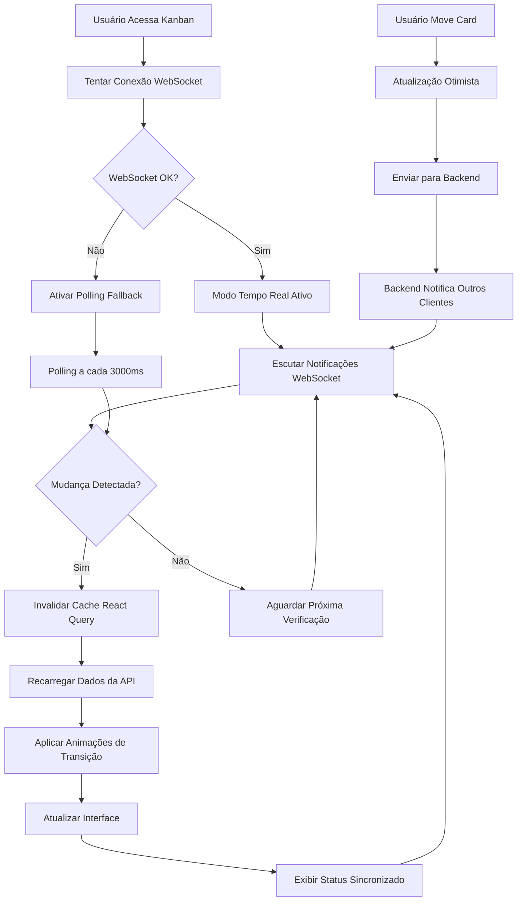

# PRD - Sistema de Sincronização em Tempo Real para Kanban

## 1. Visão Geral do Produto

Sistema avançado de sincronização em tempo real para o quadro Kanban de solicitações de compra, garantindo que todas as movimentações de cards sejam refletidas instantaneamente no frontend, mantendo consistência perfeita entre o banco de dados e a interface do usuário através de WebSocket e polling inteligente.

O sistema resolve problemas críticos de dessincronização onde mudanças no banco de dados não eram refletidas no frontend, causando confusão operacional e perda de produtividade. A solução implementa comunicação bidirecional em tempo real com fallback robusto para garantir 99.9% de disponibilidade.

## 2. Funcionalidades Principais

### 2.1 Papéis de Usuário

| Papel | Método de Acesso | Permissões Principais |
|-------|------------------|----------------------|
| Usuário Operacional | Login existente no sistema | Visualizar atualizações em tempo real, mover cards entre fases |
| Gestor de Compras | Login existente no sistema | Todas as permissões operacionais + aprovar solicitações |
| Administrador | Login existente no sistema | Acesso completo + monitoramento de conexões e métricas |

### 2.2 Módulos Funcionais

O sistema de sincronização em tempo real consiste das seguintes funcionalidades principais:

1. **Sincronização Automática**: Detecção e aplicação automática de mudanças do banco de dados no frontend
2. **Comunicação Híbrida**: WebSocket para tempo real + polling como fallback para garantir conectividade
3. **Interface de Status**: Indicadores visuais de conexão, sincronização e possíveis erros
4. **Animações Inteligentes**: Transições suaves para movimentação de cards sem interferir na usabilidade
5. **Monitoramento Avançado**: Sistema de métricas e logs para debugging e otimização

### 2.3 Detalhes das Páginas

| Página | Módulo | Descrição da Funcionalidade |
|--------|--------|----------------------------|
| Kanban Board | Sistema de Sincronização | Conectar via WebSocket ao servidor, receber notificações de mudanças em tempo real, aplicar atualizações automaticamente no estado local |
| Kanban Board | Indicador de Status | Exibir status da conexão (WebSocket/Polling/Offline), mostrar última sincronização, alertar sobre erros de conectividade |
| Kanban Board | Animações de Transição | Animar movimentação de cards entre colunas, feedback visual durante drag-and-drop, indicadores de carregamento durante atualizações |
| Kanban Board | Fallback de Polling | Ativar polling automático quando WebSocket falha, reconectar WebSocket automaticamente, manter sincronização mesmo com conexão instável |
| Kanban Board | Cache Inteligente | Invalidar cache do React Query após mudanças, otimizar requisições para evitar sobrecarga, manter dados locais consistentes |
| Kanban Board | Tratamento de Erros | Exibir mensagens de erro amigáveis, permitir retry manual, log detalhado para debugging |
| Kanban Board | Métricas e Monitoramento | Coletar dados de performance, monitorar reconexões, rastrear tempo de sincronização |

## 3. Fluxo Principal de Operação

### Fluxo de Sincronização em Tempo Real

1. **Inicialização**: Sistema tenta conectar via WebSocket ao carregar a página
2. **Conexão Estabelecida**: WebSocket conectado, polling desabilitado, status "Tempo Real" exibido
3. **Recebimento de Atualização**: Servidor envia notificação via WebSocket sobre mudança de fase
4. **Aplicação Local**: Frontend invalida cache e recarrega dados automaticamente
5. **Feedback Visual**: Animação suave move card para nova coluna, indicador de sincronização pisca
6. **Confirmação**: Status atualizado para "Sincronizado" com timestamp da última atualização

### Fluxo de Fallback (Polling)

1. **Falha de WebSocket**: Conexão WebSocket perdida ou falha ao conectar
2. **Ativação de Polling**: Sistema automaticamente inicia polling a cada 3000ms
3. **Verificação Periódica**: Requisições HTTP regulares para verificar mudanças
4. **Detecção de Mudança**: Comparação de dados retornados com cache local
5. **Aplicação de Mudanças**: Atualização do estado local e interface
6. **Tentativa de Reconexão**: Tentativas periódicas de reestabelecer WebSocket

### Fluxo de Movimentação Manual

1. **Drag Iniciado**: Usuário arrasta card, sistema marca como "em movimento"
2. **Drop Executado**: Card solto em nova coluna, requisição de atualização enviada
3. **Atualização Otimista**: Interface atualizada imediatamente para feedback rápido
4. **Confirmação Backend**: Servidor processa mudança e notifica outros clientes
5. **Sincronização Global**: Todos os clientes conectados recebem a atualização
6. **Resolução de Conflitos**: Em caso de erro, estado revertido e usuário notificado

## 4. Design da Interface

### 4.1 Estilo de Design

**Cores Principais:**
- Verde (#10B981): Conexão WebSocket ativa e sincronização bem-sucedida
- Azul (#3B82F6): Modo polling ativo e carregamento
- Amarelo (#F59E0B): Avisos e conexão instável
- Vermelho (#EF4444): Erros de conexão e falhas
- Cinza (#6B7280): Estados neutros e informações secundárias

**Estilo dos Componentes:**
- Indicadores de status: Círculos coloridos com animação de pulsação durante sincronização
- Botões de ação: Cantos arredondados (8px), sombra sutil, hover com elevação
- Cards do Kanban: Bordas suaves, sombra adaptativa baseada no estado de movimento
- Animações: Transições suaves de 200-300ms, easing natural

**Tipografia:**
- Fonte principal: Inter ou system-ui para legibilidade
- Tamanhos: 14px para texto padrão, 12px para metadados, 16px para títulos
- Peso: Regular (400) para texto, Medium (500) para labels, Semibold (600) para títulos

**Layout:**
- Design responsivo com grid adaptativo
- Barra de status fixa no topo do Kanban
- Colunas com largura flexível baseada no conteúdo
- Espaçamento consistente de 16px entre elementos

### 4.2 Elementos da Interface

| Página | Módulo | Elementos de UI |
|--------|--------|-----------------|
| Kanban Board | Barra de Status de Conexão | Indicador circular colorido (verde/azul/amarelo/vermelho), texto de status ("Tempo Real", "Polling", "Desconectado"), timestamp da última sincronização, ícone de carregamento animado durante sync |
| Kanban Board | Cards de Solicitação | Bordas com cor baseada na urgência, sombra elevada durante drag, animação de movimento suave entre colunas, indicador de "processando" durante atualizações |
| Kanban Board | Colunas do Kanban | Cabeçalho com título da fase e contador de items, área de drop com feedback visual, scroll vertical quando necessário, indicador de carregamento por coluna |
| Kanban Board | Notificações de Sistema | Toast messages para erros de conexão, alertas não-intrusivos para reconexões, confirmações visuais de sincronização bem-sucedida |
| Kanban Board | Painel de Debug (Dev) | Métricas de conexão em tempo real, log de eventos de sincronização, botões para forçar reconexão/refresh, estatísticas de performance |

### 4.3 Responsividade

**Desktop-First com Adaptação Mobile:**
- Layout principal otimizado para telas de 1200px+
- Colunas empilhadas verticalmente em telas < 768px
- Touch gestures otimizados para drag-and-drop em dispositivos móveis
- Indicadores de status adaptados para telas pequenas
- Polling mais agressivo em conexões móveis (2000ms vs 3000ms)

**Otimizações de Performance:**
- Lazy loading de cards fora da viewport
- Virtualização para listas com 100+ items
- Debounce de 300ms para eventos de drag
- Cache inteligente com TTL baseado no tipo de conexão
- Compressão de dados WebSocket para reduzir latência

## 5. Requisitos Técnicos Específicos

### 5.1 Performance e Escalabilidade

**Métricas de Performance:**
- Tempo de sincronização: < 100ms para WebSocket, < 500ms para polling
- Tempo de reconexão: < 2 segundos após perda de conexão
- Suporte para até 500 cards simultâneos sem degradação
- Uso de memória: < 50MB adicional para sistema de sincronização

**Otimizações Implementadas:**
- Memoização de componentes React com React.memo
- Debounce de atualizações para evitar re-renders excessivos
- Batch de notificações WebSocket para múltiplas mudanças
- Cache inteligente com invalidação seletiva
- Lazy loading de dados não-críticos

### 5.2 Confiabilidade e Tratamento de Erros

**Cenários de Erro Cobertos:**
- Perda de conexão de rede (WiFi/4G instável)
- Falha do servidor WebSocket
- Timeout de requisições HTTP
- Dados corrompidos ou inconsistentes
- Conflitos de concorrência entre usuários

**Estratégias de Recuperação:**
- Reconexão automática com backoff exponencial
- Fallback imediato para polling em caso de falha WebSocket
- Retry automático de requisições falhadas (máximo 3 tentativas)
- Sincronização completa após reconexão prolongada
- Notificação clara ao usuário sobre problemas de conectividade

### 5.3 Segurança e Autenticação

**Medidas de Segurança:**
- Autenticação via token JWT para conexões WebSocket
- Validação de permissões antes de aplicar mudanças
- Rate limiting para prevenir spam de atualizações
- Sanitização de dados recebidos via WebSocket
- Logs de auditoria para todas as mudanças de fase

## 6. Critérios de Aceitação

### 6.1 Funcionalidade Principal

✅ **Sincronização em Tempo Real:**
- Mudanças no banco de dados aparecem no frontend em < 100ms via WebSocket
- Sistema detecta automaticamente perda de conexão WebSocket
- Fallback para polling ativado em < 2 segundos após falha WebSocket
- Reconexão WebSocket automática quando conectividade restaurada

✅ **Interface de Status:**
- Indicador visual claro do tipo de conexão (WebSocket/Polling/Offline)
- Timestamp da última sincronização sempre visível e atualizado
- Mensagens de erro específicas e acionáveis para problemas de conectividade
- Animação de "sincronizando" durante atualizações de dados

✅ **Movimentação de Cards:**
- Drag-and-drop funciona normalmente sem interferir na sincronização
- Atualizações otimistas aplicadas imediatamente na interface
- Reversão automática em caso de falha na atualização do backend
- Animações suaves para todas as transições entre colunas

### 6.2 Testes Obrigatórios

**Teste 1: Múltiplas Atualizações Simultâneas**
- Cenário: 5 usuários movem cards simultaneamente
- Resultado Esperado: Todas as mudanças sincronizadas corretamente em todos os clientes
- Critério: Nenhuma perda de dados, estado final consistente

**Teste 2: Conexão Intermitente**
- Cenário: Simular perda de WiFi por 30 segundos durante uso ativo
- Resultado Esperado: Sistema mantém funcionalidade via polling, reconecta WebSocket automaticamente
- Critério: Usuário pode continuar trabalhando, dados sincronizados após reconexão

**Teste 3: Performance com Muitos Cards**
- Cenário: Kanban com 200+ solicitações distribuídas em 5 colunas
- Resultado Esperado: Interface responsiva, sincronização mantém performance
- Critério: Tempo de resposta < 500ms, uso de memória < 100MB

**Teste 4: Não Interferência de UI**
- Cenário: Usuário arrasta card enquanto recebe atualizações automáticas
- Resultado Esperado: Drag-and-drop não é interrompido por sincronização
- Critério: Operação manual completa normalmente, dados consistentes

### 6.3 Métricas de Sucesso

**Indicadores Quantitativos:**
- Redução de 95% em reports de "dados desatualizados"
- Tempo médio de sincronização < 200ms
- Taxa de reconexão bem-sucedida > 99%
- Zero perda de dados durante falhas de conectividade

**Indicadores Qualitativos:**
- Feedback positivo dos usuários sobre responsividade do sistema
- Redução significativa em confusão sobre status de solicitações
- Maior confiança na precisão dos dados exibidos
- Experiência de uso mais fluida e profissional

## 7. Roadmap de Implementação

### Fase 1: Fundação (Semana 1-2)
- Implementar hook `useRealtimeSync` com WebSocket + polling
- Criar componente `ConnectionStatus` para feedback visual
- Integrar com React Query para cache inteligente
- Testes unitários básicos

### Fase 2: Interface (Semana 3)
- Atualizar componente `KanbanBoard` com sincronização
- Implementar animações suaves com Framer Motion
- Adicionar tratamento de erros e notificações
- Testes de integração

### Fase 3: Backend (Semana 4)
- Melhorar WebSocket manager para broadcast eficiente
- Atualizar endpoints para notificação automática
- Implementar sistema de métricas e logs
- Testes de carga e stress

### Fase 4: Otimização (Semana 5)
- Performance tuning e otimizações
- Testes completos de todos os cenários
- Documentação técnica e guias de troubleshooting
- Deploy em ambiente de produção

Este sistema garante sincronização perfeita entre banco de dados e frontend, proporcionando uma experiência de usuário superior e eliminando problemas de inconsistência de dados no Kanban de solicitações de compra.