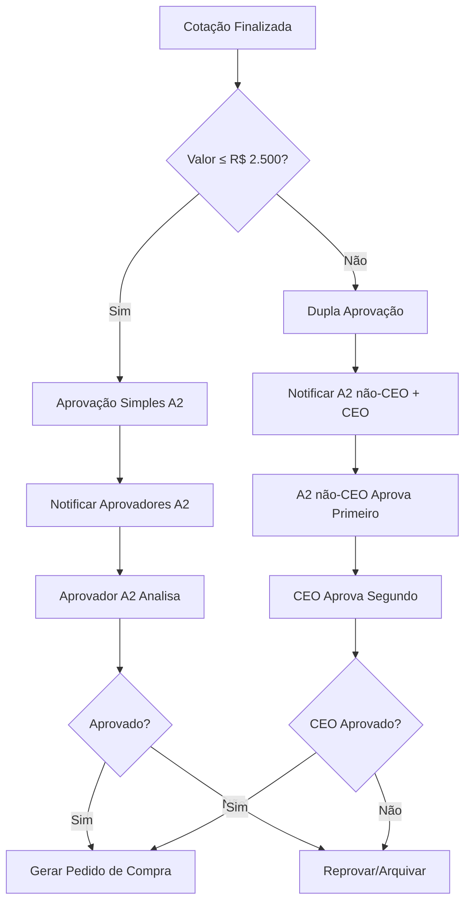

# Sistema de Aprovação A2 Baseada em Valor - Documento de Requisitos

## 1. Visão Geral do Produto

O sistema de aprovação A2 baseada em valor implementa regras automáticas de aprovação sequencial baseadas no valor total das cotações, garantindo maior controle e governança sobre compras de alto valor através de dupla aprovação (Aprovador A2 + CEO) para valores superiores a R$ 2.500,00.

Este sistema resolve o problema de falta de controle adequado sobre compras de alto valor, permitindo que administradores configurem limites flexíveis e mantenham auditoria completa de todas as aprovações realizadas.

## 2. Funcionalidades Principais

### 2.1 Perfis de Usuário

| Perfil | Método de Configuração | Permissões Principais |
|--------|------------------------|----------------------|
| Aprovador A2 | Checkbox no cadastro de usuários | Pode aprovar cotações ≤ R$ 2.500,00 individualmente |
| CEO | Checkbox "É CEO" no cadastro | Aprovação obrigatória para cotações > R$ 2.500,00 |
| Diretor | Checkbox "É Diretor" no cadastro | Herda todas as permissões de Gerente + acesso a relatórios |
| Administrador | Configuração existente | Gerencia regras de valor e configurações do sistema |

### 2.2 Módulos do Sistema

O sistema de aprovação A2 baseada em valor consiste nas seguintes páginas principais:

1. **Página de Aprovação A2**: Interface principal para aprovação de cotações com detecção automática de regras
2. **Painel Administrativo**: Configuração de limites de valor e regras de aprovação
3. **Dashboard de Aprovações**: Visualização do status e histórico de aprovações
4. **Cadastro de Usuários**: Campos adicionais para CEO/Diretor com validações

### 2.3 Detalhes das Páginas

| Página | Módulo | Descrição da Funcionalidade |
|--------|--------|----------------------------|
| Aprovação A2 | Detecção Automática de Regras | Identifica automaticamente se cotação requer aprovação simples ou dupla baseada no valor |
| Aprovação A2 | Interface de Status | Exibe aprovações concluídas, pendentes e próximos passos do processo |
| Aprovação A2 | Sistema de Notificações | Envia emails automáticos para aprovadores quando dupla aprovação é necessária |
| Painel Admin | Configuração de Limites | Permite ajustar valor limite padrão (R$ 2.500,00) e criar faixas personalizadas |
| Painel Admin | Histórico de Alterações | Registra todas as modificações nos parâmetros com data/hora e usuário responsável |
| Dashboard | Rastreamento de Aprovações | Mostra histórico completo com data/hora, usuário aprovador e justificativas |
| Cadastro Usuários | Campos CEO/Diretor | Checkboxes com validação para evitar conflitos de perfis simultâneos |
| Cadastro Usuários | Validações de Integridade | Impede configurações inconsistentes e garante hierarquia correta de permissões |

## 3. Fluxo Principal do Processo

### Fluxo de Aprovação Baseada em Valor

**Para Cotações ≤ R$ 2.500,00:**
1. Sistema detecta valor da cotação automaticamente
2. Notifica apenas Aprovadores A2 disponíveis
3. Aprovador A2 analisa e aprova/reprova
4. Processo segue para geração de pedido de compra

**Para Cotações > R$ 2.500,00:**
1. Sistema detecta necessidade de dupla aprovação
2. Notifica Aprovadores A2 (não-CEO) e CEO simultaneamente
3. Aprovador A2 (não-CEO) realiza primeira aprovação
4. Sistema notifica CEO para segunda aprovação
5. CEO realiza aprovação final
6. Processo segue para geração de pedido de compra

### Fluxo Administrativo

**Configuração de Regras:**
1. Administrador acessa painel de configurações
2. Define/altera limites de valor
3. Sistema valida configurações
4. Registra alteração no histórico de auditoria



## 4. Design da Interface do Usuário

### 4.1 Estilo de Design

- **Cores Primárias**: Azul (#3B82F6) para aprovações, Verde (#10B981) para status aprovado
- **Cores Secundárias**: Laranja (#F59E0B) para pendências, Vermelho (#EF4444) para reprovações
- **Estilo de Botões**: Rounded com ícones, estados hover e disabled bem definidos
- **Tipografia**: Inter, tamanhos 14px (corpo), 16px (títulos), 12px (labels)
- **Layout**: Card-based com sidebar de navegação, design responsivo mobile-first
- **Ícones**: Lucide React com estilo outline, cores consistentes com o tema

### 4.2 Visualização dos Cards no Kanban - Fase Aprovação A2

#### 4.2.1 Badges de Tipo de Aprovação

**Aprovação Simples (≤ R$ 2.500,00):**
- Badge verde com texto "APROVAÇÃO SIMPLES"
- Ícone de usuário único (User)
- Cor de fundo: `bg-green-100 text-green-800`
- Posicionamento: Canto superior direito do card

**Dupla Aprovação (> R$ 2.500,00):**
- Badge laranja com texto "DUPLA APROVAÇÃO"
- Ícone de dois usuários (Users)
- Cor de fundo: `bg-orange-100 text-orange-800`
- Posicionamento: Canto superior direito do card

#### 4.2.2 Indicadores de Valor e Status

**Valor Total:**
- Exibido em destaque no centro do card
- Fonte maior e negrito para valores > R$ 2.500,00
- Formatação monetária brasileira (R$ 0.000,00)
- Cor diferenciada: verde para aprovação simples, laranja para dupla

**Status Atual:**
- Texto descritivo abaixo do valor
- Exemplos: "Aguardando Aprovação A2", "Aguardando CEO", "1ª Aprovação Concluída"
- Cor cinza para pendente, verde para concluído

#### 4.2.3 Timeline Visual para Dupla Aprovação

**Aprovação Simples:**
- Ícone único de usuário com checkbox
- Sem timeline adicional

**Dupla Aprovação:**
- Timeline horizontal com 2 etapas
- Etapa 1: "A2" com ícone de usuário
- Etapa 2: "CEO" com ícone de coroa
- Checkmarks verdes para etapas concluídas
- Círculos vazios para etapas pendentes
- Linha conectora entre as etapas

#### 4.2.4 Informações de Aprovadores

**Aprovadores Confirmados:**
- Lista de nomes com checkmarks verdes
- Avatar ou iniciais do aprovador
- Data/hora da aprovação

**Próximo Aprovador:**
- Nome destacado em negrito
- Ícone de relógio indicando pendência
- Badge "PENDENTE" em amarelo

### 4.3 Especificações Técnicas dos Cards

#### 4.3.1 Estrutura do Card A2

```jsx
// Estrutura visual do card na fase Aprovação A2
<Card className={`relative ${approvalType === 'dual' ? 'border-orange-200' : 'border-green-200'}`}>
  {/* Badge de Tipo de Aprovação */}
  <Badge className={`absolute top-2 right-2 ${badgeStyles}`}>
    {approvalType === 'dual' ? (
      <>
        <Users className="w-3 h-3 mr-1" />
        DUPLA APROVAÇÃO
      </>
    ) : (
      <>
        <User className="w-3 h-3 mr-1" />
        APROVAÇÃO SIMPLES
      </>
    )}
  </Badge>
  
  {/* Valor Total Destacado */}
  <div className={`text-center py-2 ${valueStyles}`}>
    <span className="text-2xl font-bold">{formatCurrency(totalValue)}</span>
  </div>
  
  {/* Status Atual */}
  <div className="text-center text-sm text-gray-600">
    {currentStatus}
  </div>
  
  {/* Timeline para Dupla Aprovação */}
  {approvalType === 'dual' && (
    <ApprovalTimeline 
      steps={approvalSteps}
      currentStep={currentStep}
    />
  )}
  
  {/* Lista de Aprovadores */}
  <ApproversList 
    completed={completedApprovers}
    pending={pendingApprovers}
  />
</Card>
```

#### 4.3.2 Estados Visuais

**Card Aprovação Simples:**
- Borda verde sutil
- Badge verde no canto superior direito
- Ícone de usuário único
- Valor em fonte normal

**Card Dupla Aprovação:**
- Borda laranja sutil
- Badge laranja no canto superior direito
- Timeline horizontal com 2 etapas
- Valor em fonte maior e destacada
- Animação sutil de pulsação se urgente

### 4.4 Visão Geral do Design das Páginas

| Página | Módulo | Elementos de UI |
|--------|--------|-----------------|
| Kanban Board | Cards A2 Simples | Badge verde "APROVAÇÃO SIMPLES", valor destacado, ícone usuário único |
| Kanban Board | Cards A2 Dupla | Badge laranja "DUPLA APROVAÇÃO", timeline 2 etapas, ícones A2+CEO |
| Kanban Board | Status de Progresso | Checkmarks verdes para concluído, círculos vazios para pendente |
| Aprovação A2 | Detecção de Regras | Badge colorido indicando tipo de aprovação (Simples/Dupla), valor destacado |
| Aprovação A2 | Status de Aprovações | Timeline vertical com checkmarks, ícones de usuário, timestamps |
| Aprovação A2 | Formulário de Aprovação | Radio buttons para aprovar/reprovar, textarea para justificativas |
| Painel Admin | Configuração de Limites | Input numérico com formatação de moeda, slider para valores |
| Painel Admin | Histórico de Alterações | Tabela com filtros, paginação, export para CSV |
| Dashboard | Métricas de Aprovação | Cards com estatísticas, gráficos de barras, indicadores KPI |

### 4.5 Responsividade

O sistema é projetado mobile-first com adaptação para desktop, otimizado para touch em tablets e smartphones, com navegação simplificada em telas menores.

**Adaptações Mobile:**
- Badges menores em telas pequenas
- Timeline vertical em vez de horizontal
- Informações condensadas
- Touch targets maiores para aprovação

## 5. Requisitos Técnicos Específicos

### 5.1 Validações de Negócio

- Usuário não pode ser simultaneamente CEO, Diretor e Gerente
- CEO e Diretores herdam automaticamente permissões de Gerente
- Valor limite mínimo de R$ 100,00 e máximo de R$ 100.000,00
- Histórico de aprovações deve ser imutável após criação

### 5.2 Notificações por Email

- Template específico para aprovação simples vs dupla aprovação
- Notificações em tempo real via webhook
- Retry automático em caso de falha de envio
- Personalização baseada no perfil do usuário

### 5.3 Auditoria e Compliance

- Log completo de todas as ações com timestamp UTC
- Rastreamento de IP e user-agent para auditoria
- Backup automático do histórico de configurações
- Relatórios de compliance exportáveis em PDF/Excel