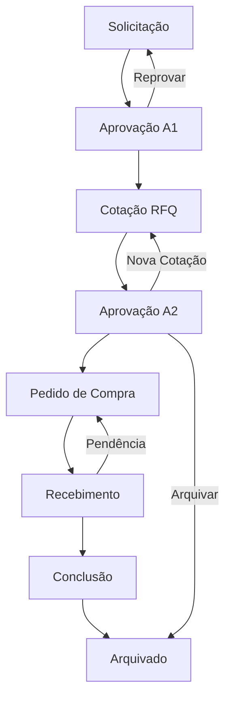

# 📖 Documento de Requisitos do Produto - Sistema de Gestão de Compras

## 1. Visão Geral do Produto

O Sistema de Gestão de Compras é uma aplicação web completa desenvolvida para automatizar e controlar processos de aquisição empresarial através de um workflow Kanban estruturado em 8 fases. O sistema atende empresas que necessitam de controle rigoroso, rastreabilidade completa e conformidade com políticas internas de compras.

O produto resolve problemas críticos de gestão de compras como falta de controle, processos manuais demorados, ausência de rastreabilidade e dificuldades de aprovação. É utilizado por solicitantes, aprovadores, compradores, recebedores e gestores, proporcionando eficiência operacional, redução de custos e conformidade regulatória.

O sistema tem como meta se tornar a plataforma líder em gestão de compras para médias empresas, com foco em usabilidade, automação e integração.

## 2. Funcionalidades Principais

### 2.1 Perfis de Usuário

| Perfil | Método de Registro | Permissões Principais |
|--------|-------------------|----------------------|
| Solicitante | Cadastro por administrador | Criar solicitações, acompanhar status |
| Aprovador A1 | Cadastro com associação a centros de custo | Aprovar solicitações dos centros associados |
| Aprovador A2 | Cadastro com permissão especial | Aprovar cotações e valores finais |
| Comprador | Cadastro com permissão de compras | Gerenciar cotações, fornecedores e pedidos |
| Gerente | Cadastro com permissão gerencial | Criar solicitações para qualquer centro de custo, acessar dashboard |
| Recebedor | Cadastro com permissão de recebimento | Confirmar entregas e registrar pendências |
| Administrador | Cadastro com acesso total | Gerenciar usuários, empresas e configurações |

### 2.2 Módulos Funcionais

O sistema é composto pelos seguintes módulos principais:

1. **Workflow Kanban**: Visualização e gestão das 8 fases do processo de compras
2. **Gestão de Solicitações**: Criação, edição e acompanhamento de solicitações
3. **Sistema de Aprovações**: Controle de aprovações A1 e A2 com validações rigorosas
4. **Gestão de Cotações**: Processo RFQ completo com análise comparativa
5. **Gestão de Fornecedores**: Cadastro e controle de fornecedores
6. **Geração de Pedidos**: Criação automática de pedidos de compra em PDF
7. **Controle de Recebimento**: Conferência e registro de entregas
8. **Dashboard Gerencial**: Métricas e indicadores de performance
9. **Gestão Administrativa**: Usuários, empresas, departamentos e centros de custo

### 2.3 Detalhes das Funcionalidades

| Módulo | Funcionalidade | Descrição |
|--------|----------------|----------|
| Workflow Kanban | Visualização de Fases | Interface drag-and-drop com 8 colunas representando as fases do processo |
| Solicitações | Criação de Solicitação | Formulário completo com dados obrigatórios, itens, anexos e validações |
| Solicitações | Permissões Especiais Gerentes | Gerentes podem criar solicitações para qualquer centro de custo da empresa |
| Aprovações A1 | Validação por Centro de Custo | Aprovadores A1 limitados aos centros de custo associados com dupla validação |
| Aprovações A1 | Interface Adaptativa | Botões e mensagens condicionais baseados em permissões do usuário |
| Aprovações A2 | Aprovação Final | Validação de cotações com opções de aprovar, arquivar ou solicitar nova cotação |
| Cotações RFQ | Criação de RFQ | Geração de solicitação de cotação com seleção de fornecedores e envio automático |
| Cotações RFQ | Análise Comparativa | Comparação de propostas com seleção de fornecedor vencedor |
| Fornecedores | Cadastro Completo | Gestão de dados, contatos e histórico de fornecedores |
| Pedidos | Geração de PDF | Criação automática de pedido de compra com dados da empresa e assinaturas |
| Recebimento | Controle de Qualidade | Confirmação de entregas com possibilidade de registrar pendências |
| Dashboard | Métricas Executivas | Indicadores de performance, gráficos e relatórios gerenciais |
| Administração | Gestão de Usuários | Cadastro de usuários com permissões e associações a centros de custo |
| Administração | Gestão de Empresas | Cadastro de empresas com upload de logo e dados corporativos |
| Administração | Estrutura Organizacional | Gestão de departamentos e centros de custo |

## 3. Fluxo Principal do Processo

O usuário inicia criando uma solicitação de compra com justificativa e itens necessários. A solicitação passa por aprovação A1 (restrita por centro de custo), seguida de cotação onde compradores obtêm propostas de fornecedores. Após análise comparativa, a solicitação vai para aprovação A2 que valida valores e fornecedores. Com aprovação final, é gerado pedido de compra em PDF que é enviado ao fornecedor. O recebedor confirma a entrega e o processo é concluído com métricas e arquivamento.

**Fluxo de Aprovações Especiais para Gerentes:**
Gerentes podem criar solicitações para qualquer centro de custo da empresa, enquanto usuários padrão ficam restritos aos centros associados ao seu perfil.

**Fluxo de Validação A1:**
Aprovadores A1 só visualizam e podem aprovar solicitações dos centros de custo aos quais estão associados, com validação dupla no frontend e backend.

## 4. Design da Interface

### 4.1 Estilo de Design

- **Cores Primárias**: Azul (#3b82f6) para elementos principais, Verde (#10b981) para aprovações
- **Cores Secundárias**: Laranja (#f59e0b) para alertas, Vermelho (#ef4444) para reprovações
- **Estilo de Botões**: Arredondados com sombras sutis, estados hover e focus bem definidos
- **Tipografia**: Inter como fonte principal, tamanhos de 14px a 24px conforme hierarquia
- **Layout**: Design responsivo com sidebar fixa, cards para informações e modais para ações
- **Ícones**: Lucide React para consistência visual e acessibilidade

### 4.2 Componentes da Interface

| Página | Módulo | Elementos de UI |
|--------|--------|----------------|
| Kanban | Workflow Principal | 8 colunas com cores específicas, cards drag-and-drop, badges de status, botão flutuante para nova solicitação |
| Solicitação | Formulário de Criação | Campos obrigatórios destacados, seleção de centro de custo filtrada por permissão, upload de anexos, validação em tempo real |
| Aprovação A1 | Interface de Aprovação | Botões condicionais baseados em permissões, mensagens de restrição, histórico de ações, campos de justificativa |
| Cotação | Gestão de RFQ | Seleção múltipla de fornecedores, upload de propostas, tabela comparativa, análise de preços |
| Dashboard | Métricas Executivas | Gráficos interativos, cards de KPIs, filtros por período, exportação de relatórios |
| Administração | Gestão de Dados | Tabelas com paginação, formulários modais, switches para ativação/desativação |

### 4.3 Responsividade

O sistema é desenvolvido com abordagem mobile-first, adaptando-se automaticamente a tablets e smartphones. Inclui navegação touch-friendly, modais otimizados para telas pequenas e funcionalidades completas em dispositivos móveis.