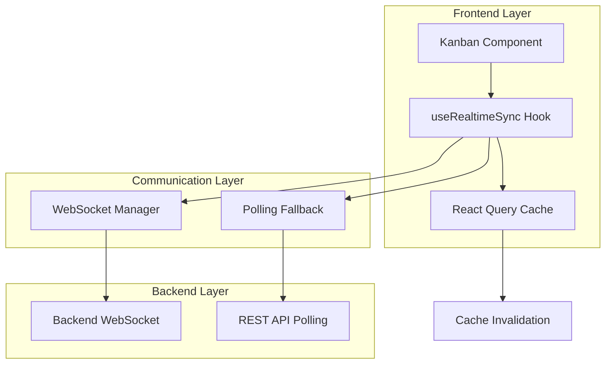

# Sistema de Sincronização em Tempo Real - Kanban

## 1. Visão Geral

Este documento especifica a implementação de um sistema completo de sincronização em tempo real para o frontend do Kanban, garantindo que a posição dos cards seja sempre consistente com os dados do banco de dados.

### 1.1 Objetivos
- Sincronização automática entre frontend e banco de dados
- Experiência de usuário fluida com atualizações em tempo real
- Tratamento robusto de erros e falhas de conexão
- Performance otimizada para grande volume de dados
- Prevenção de conflitos entre interações do usuário e atualizações automáticas

## 2. Arquitetura do Sistema

### 2.1 Componentes Principais



### 2.2 Fluxo de Dados

1. **Inicialização**: Hook `useRealtimeSync` estabelece conexão WebSocket
2. **Monitoramento**: Sistema monitora mudanças via WebSocket + polling de fallback
3. **Detecção**: Mudanças detectadas invalidam cache do React Query
4. **Atualização**: Componente re-renderiza com dados atualizados
5. **Animação**: Transições suaves aplicadas aos cards movidos

## 3. Especificações Técnicas

### 3.1 Hook de Sincronização em Tempo Real

```typescript
interface RealtimeSyncConfig {
  pollingInterval: number; // 3000ms
  maxRetries: number;
  reconnectDelay: number;
  enableAnimations: boolean;
}

interface RealtimeSyncState {
  isConnected: boolean;
  lastSync: Date;
  error: string | null;
  syncStatus: 'idle' | 'syncing' | 'error';
}

const useRealtimeSync = (config: RealtimeSyncConfig): RealtimeSyncState
```

### 3.2 Sistema de Comunicação Híbrido

#### WebSocket (Primário)
- Conexão persistente para notificações instantâneas
- Heartbeat para detecção de desconexão
- Reconexão automática com backoff exponencial

#### Polling (Fallback)
- Ativado quando WebSocket falha
- Intervalo configurável (padrão: 3000ms)
- Otimização com ETag/Last-Modified headers

### 3.3 Gerenciamento de Cache

```typescript
interface CacheStrategy {
  invalidateOnUpdate: boolean;
  staleTime: number;
  cacheTime: number;
  refetchOnWindowFocus: boolean;
}
```

## 4. Implementação Detalhada

### 4.1 Estrutura de Arquivos

```
client/src/
├── hooks/
│   ├── useRealtimeSync.ts
│   ├── useWebSocketConnection.ts
│   └── usePollingFallback.ts
├── components/
│   ├── Kanban/
│   │   ├── KanbanBoard.tsx
│   │   ├── KanbanColumn.tsx
│   │   ├── KanbanCard.tsx
│   │   └── AnimatedTransition.tsx
│   └── ui/
│       ├── ConnectionStatus.tsx
│       └── SyncIndicator.tsx
├── services/
│   ├── websocketService.ts
│   ├── pollingService.ts
│   └── syncService.ts
└── utils/
    ├── animationHelpers.ts
    └── errorHandling.ts
```

### 4.2 Hook Principal - useRealtimeSync

```typescript
export const useRealtimeSync = (config: RealtimeSyncConfig) => {
  const [state, setState] = useState<RealtimeSyncState>({
    isConnected: false,
    lastSync: new Date(),
    error: null,
    syncStatus: 'idle'
  });

  // WebSocket connection management
  const { isConnected: wsConnected, error: wsError } = useWebSocketConnection({
    onMessage: handleWebSocketMessage,
    onError: handleWebSocketError,
    onReconnect: handleReconnection
  });

  // Polling fallback
  const { startPolling, stopPolling } = usePollingFallback({
    interval: config.pollingInterval,
    enabled: !wsConnected,
    onData: handlePollingData
  });

  // React Query integration
  const queryClient = useQueryClient();

  const handleDataUpdate = useCallback((data: any) => {
    setState(prev => ({ ...prev, syncStatus: 'syncing' }));
    
    // Invalidate relevant queries
    queryClient.invalidateQueries(['purchase-requests']);
    
    // Update last sync time
    setState(prev => ({ 
      ...prev, 
      lastSync: new Date(),
      syncStatus: 'idle'
    }));
  }, [queryClient]);

  return state;
};
```

### 4.3 Componente Kanban Atualizado

```typescript
export const KanbanBoard: React.FC = () => {
  const syncState = useRealtimeSync({
    pollingInterval: 3000,
    maxRetries: 3,
    reconnectDelay: 1000,
    enableAnimations: true
  });

  const { data: requests, isLoading, error } = useQuery({
    queryKey: ['purchase-requests'],
    queryFn: fetchPurchaseRequests,
    staleTime: 1000, // 1 second
    cacheTime: 5 * 60 * 1000, // 5 minutes
    refetchOnWindowFocus: false,
    refetchInterval: syncState.isConnected ? false : 3000
  });

  // Group requests by phase with animation support
  const groupedRequests = useMemo(() => {
    return groupRequestsByPhase(requests || []);
  }, [requests]);

  return (
    <div className="kanban-board">
      <ConnectionStatus 
        isConnected={syncState.isConnected}
        lastSync={syncState.lastSync}
        error={syncState.error}
      />
      
      <div className="kanban-columns">
        {PHASES.map(phase => (
          <KanbanColumn
            key={phase.id}
            phase={phase}
            requests={groupedRequests[phase.id] || []}
            onCardMove={handleCardMove}
          />
        ))}
      </div>
    </div>
  );
};
```

### 4.4 Sistema de Animações

```typescript
export const AnimatedTransition: React.FC<{
  children: React.ReactNode;
  animationKey: string;
}> = ({ children, animationKey }) => {
  return (
    <AnimatePresence mode="wait">
      <motion.div
        key={animationKey}
        initial={{ opacity: 0, scale: 0.95 }}
        animate={{ opacity: 1, scale: 1 }}
        exit={{ opacity: 0, scale: 0.95 }}
        transition={{
          duration: 0.2,
          ease: "easeInOut"
        }}
        layout
      >
        {children}
      </motion.div>
    </AnimatePresence>
  );
};
```

## 5. Tratamento de Erros

### 5.1 Estratégias de Recuperação

```typescript
interface ErrorRecoveryStrategy {
  websocketReconnect: {
    maxAttempts: number;
    backoffMultiplier: number;
    initialDelay: number;
  };
  pollingFallback: {
    enabled: boolean;
    interval: number;
  };
  cacheRecovery: {
    useStaleData: boolean;
    maxStaleTime: number;
  };
}
```

### 5.2 Tipos de Erro

1. **Erro de Conexão WebSocket**
   - Tentativa de reconexão automática
   - Fallback para polling
   - Notificação visual ao usuário

2. **Erro de API/Polling**
   - Retry com backoff exponencial
   - Uso de dados em cache quando disponível
   - Indicador de erro na interface

3. **Erro de Sincronização**
   - Comparação de timestamps
   - Resolução de conflitos
   - Log detalhado para debugging

## 6. Otimizações de Performance

### 6.1 Estratégias de Otimização

```typescript
// Debounce para múltiplas atualizações
const debouncedSync = useMemo(
  () => debounce(handleDataUpdate, 500),
  [handleDataUpdate]
);

// Memoização de componentes pesados
const MemoizedKanbanCard = React.memo(KanbanCard, (prevProps, nextProps) => {
  return (
    prevProps.request.id === nextProps.request.id &&
    prevProps.request.currentPhase === nextProps.request.currentPhase &&
    prevProps.request.updatedAt === nextProps.request.updatedAt
  );
});

// Virtualização para grandes listas
const VirtualizedColumn = ({ requests }: { requests: Request[] }) => {
  return (
    <FixedSizeList
      height={600}
      itemCount={requests.length}
      itemSize={120}
      itemData={requests}
    >
      {({ index, style, data }) => (
        <div style={style}>
          <MemoizedKanbanCard request={data[index]} />
        </div>
      )}
    </FixedSizeList>
  );
};
```

### 6.2 Métricas de Performance

- **Tempo de sincronização**: < 100ms
- **Uso de memória**: Limitado por cache LRU
- **Largura de banda**: Otimizada com compressão
- **CPU**: Throttling em atualizações frequentes

## 7. Testes Obrigatórios

### 7.1 Testes de Sincronização

```typescript
describe('Realtime Sync System', () => {
  test('should sync after multiple simultaneous updates', async () => {
    // Simular múltiplas atualizações
    const updates = Array.from({ length: 10 }, (_, i) => ({
      id: i,
      phase: 'cotacao',
      timestamp: Date.now() + i
    }));

    // Enviar atualizações simultaneamente
    await Promise.all(updates.map(update => 
      mockWebSocket.send(JSON.stringify(update))
    ));

    // Verificar sincronização
    await waitFor(() => {
      expect(screen.getByTestId('kanban-board')).toHaveTextContent('cotacao');
    });
  });

  test('should handle intermittent connection', async () => {
    // Simular desconexão
    mockWebSocket.close();
    
    // Verificar fallback para polling
    expect(mockPollingService.start).toHaveBeenCalled();
    
    // Simular reconexão
    mockWebSocket.open();
    
    // Verificar parada do polling
    expect(mockPollingService.stop).toHaveBeenCalled();
  });

  test('should maintain performance with large dataset', async () => {
    const largeDataset = generateMockRequests(1000);
    
    const startTime = performance.now();
    render(<KanbanBoard requests={largeDataset} />);
    const endTime = performance.now();
    
    expect(endTime - startTime).toBeLessThan(1000); // < 1s
  });

  test('should not interfere with UI events', async () => {
    const user = userEvent.setup();
    render(<KanbanBoard />);
    
    // Simular drag durante sync
    const card = screen.getByTestId('kanban-card-1');
    await user.pointer({ target: card, keys: '[MouseLeft>]' });
    
    // Trigger sync durante drag
    mockWebSocket.send(JSON.stringify({ type: 'update' }));
    
    // Verificar que drag não foi interrompido
    expect(card).toHaveAttribute('data-dragging', 'true');
  });
});
```

### 7.2 Testes de Integração

```typescript
describe('Integration Tests', () => {
  test('should integrate with existing WebSocket manager', () => {
    const { result } = renderHook(() => useRealtimeSync(defaultConfig));
    
    expect(mockWebSocketManager.connect).toHaveBeenCalled();
    expect(result.current.isConnected).toBe(true);
  });

  test('should work with React Query cache', async () => {
    const queryClient = new QueryClient();
    
    render(
      <QueryClientProvider client={queryClient}>
        <KanbanBoard />
      </QueryClientProvider>
    );

    // Trigger update
    mockWebSocket.send(JSON.stringify({ type: 'update' }));

    // Verify cache invalidation
    await waitFor(() => {
      expect(queryClient.getQueryState(['purchase-requests'])?.isInvalidated).toBe(true);
    });
  });
});
```

## 8. Configuração e Deploy

### 8.1 Variáveis de Ambiente

```env
# WebSocket Configuration
REACT_APP_WS_URL=ws://localhost:5201/ws
REACT_APP_WS_RECONNECT_DELAY=1000
REACT_APP_WS_MAX_RETRIES=5

# Polling Configuration
REACT_APP_POLLING_INTERVAL=3000
REACT_APP_POLLING_ENABLED=true

# Performance
REACT_APP_CACHE_TIME=300000
REACT_APP_STALE_TIME=1000
REACT_APP_ENABLE_ANIMATIONS=true
```

### 8.2 Build e Otimizações

```json
{
  "scripts": {
    "build:optimized": "GENERATE_SOURCEMAP=false npm run build",
    "analyze": "npm run build && npx webpack-bundle-analyzer build/static/js/*.js"
  }
}
```

## 9. Monitoramento e Logs

### 9.1 Sistema de Logs

```typescript
const logger = {
  sync: (message: string, data?: any) => {
    console.log(`[SYNC] ${message}`, data);
  },
  error: (message: string, error: Error) => {
    console.error(`[SYNC ERROR] ${message}`, error);
  },
  performance: (metric: string, value: number) => {
    console.log(`[PERFORMANCE] ${metric}: ${value}ms`);
  }
};
```

### 9.2 Métricas de Monitoramento

- Taxa de sucesso de sincronização
- Tempo médio de resposta
- Frequência de reconexões WebSocket
- Uso de cache hit/miss ratio
- Erros por tipo e frequência

## 10. Roadmap de Implementação

### Fase 1: Fundação (Semana 1)
- [ ] Implementar hook `useRealtimeSync`
- [ ] Configurar WebSocket connection
- [ ] Integrar com React Query

### Fase 2: Funcionalidades Core (Semana 2)
- [ ] Sistema de polling fallback
- [ ] Tratamento de erros robusto
- [ ] Componentes de UI atualizados

### Fase 3: Otimizações (Semana 3)
- [ ] Sistema de animações
- [ ] Otimizações de performance
- [ ] Virtualização para grandes datasets

### Fase 4: Testes e Deploy (Semana 4)
- [ ] Suite completa de testes
- [ ] Testes de carga e performance
- [ ] Deploy e monitoramento

## 11. Considerações de Segurança

- Validação de dados recebidos via WebSocket
- Rate limiting para polling requests
- Sanitização de dados antes da renderização
- Logs seguros sem exposição de dados sensíveis

## 12. Conclusão

Este sistema de sincronização em tempo real proporcionará uma experiência de usuário superior, mantendo o Kanban sempre atualizado com os dados do banco de dados, com tratamento robusto de erros e performance otimizada para uso em produção.