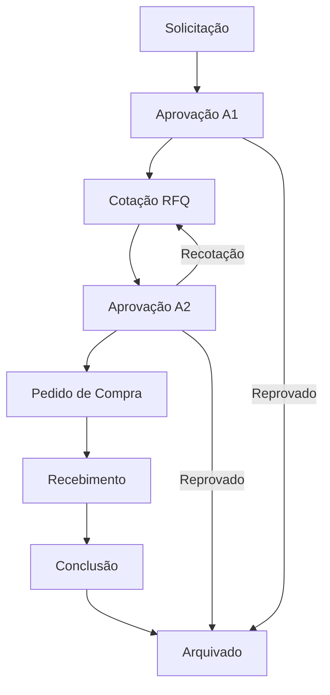
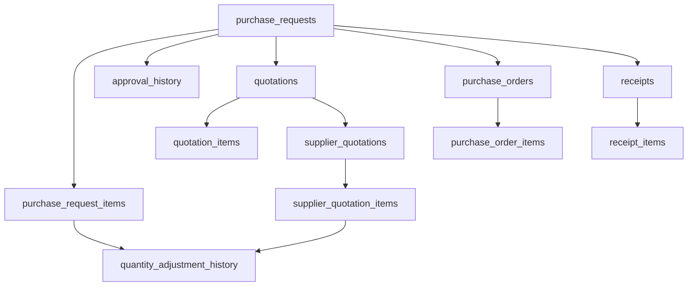
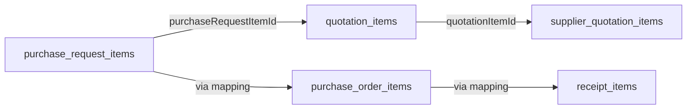

# Análise Completa do Fluxo de Processamento de Pedidos de Compra

## 1. Mapeamento Completo do Fluxo de Dados

### 1.1 Diagrama das 8 Fases do Kanban



### 1.2 Fluxo de Dados Entre Tabelas



### 1.3 Transformações de Dados por Fase

| Fase         | Tabela Principal             | Campos de Quantidade                    | Status/Estado                 |
| ------------ | ---------------------------- | --------------------------------------- | ----------------------------- |
| Solicitação  | purchase\_requests           | requestedQuantity                       | currentPhase: 'solicitacao'   |
| Aprovação A1 | approval\_history            | -                                       | currentPhase: 'aprovacao\_a1' |
| Cotação      | quotations, quotation\_items | quantity (copiada de requestedQuantity) | currentPhase: 'cotacao'       |
| Fornecedores | supplier\_quotation\_items   | availableQuantity, quantity             | status: 'pending/received'    |
| Aprovação A2 | approval\_history            | approvedQuantity                        | currentPhase: 'aprovacao\_a2' |
| Pedido       | purchase\_order\_items       | quantity (da cotação aprovada)          | status: 'draft/confirmed'     |
| Recebimento  | receipt\_items               | quantityReceived                        | currentPhase: 'recebimento'   |

## 2. Análise de Persistência de Dados

### 2.1 Estrutura das Tabelas Principais

#### purchase\_requests

```sql
- id (PK)
- requestNumber (único)
- currentPhase (enum: 8 fases)
- requesterId, buyerId, approverA1Id, approverA2Id
- createdAt, updatedAt
- approvedA1, approvedA2 (boolean)
- approvalDateA1, approvalDateA2
```

#### purchase\_request\_items

```sql
- id (PK)
- purchaseRequestId (FK)
- requestedQuantity (quantidade inicial)
- approvedQuantity (quantidade aprovada)
- unit, description, productCode
```

#### quotation\_items

```sql
- id (PK)
- quotationId (FK)
- purchaseRequestItemId (FK) -- CRÍTICO para rastreamento
- quantity (copiada de requestedQuantity)
- unit, description, itemCode
```

#### supplier\_quotation\_items

```sql
- id (PK)
- supplierQuotationId (FK)
- quotationItemId (FK) -- CRÍTICO para rastreamento
- quantity (quantidade cotada)
- availableQuantity (quantidade disponível)
- fulfillmentPercentage
- isAvailable (boolean)
- quantityAdjustmentReason
```

### 2.2 Gerenciamento de Quantidades

#### Fluxo Normal de Quantidades:

1. **Solicitação**: `requestedQuantity` = 10 unidades
2. **Cotação**: `quotation_items.quantity` = 10 (copiado)
3. **Fornecedor**: `supplier_quotation_items.availableQuantity` = 5 (alterado)
4. **Aprovação**: `approvedQuantity` = 5 (baseado na disponibilidade)
5. **Pedido**: `purchase_order_items.quantity` = 5 (da cotação aprovada)

#### Pontos Críticos de Alteração:

* **Fase de Cotação**: Fornecedores podem alterar `availableQuantity`

* **Aprovação A2**: Aprovador pode ajustar `approvedQuantity`

* **Recebimento**: Registro de `quantityReceived` pode diferir

### 2.3 Mecanismos de Versionamento e Auditoria

#### approval\_history

```sql
- purchaseRequestId (FK)
- approverType ('A1' | 'A2')
- approverId, approved (boolean)
- rejectionReason
- createdAt
```

#### quantity\_adjustment\_history

```sql
- purchaseRequestItemId (FK)
- originalQuantity, newQuantity
- adjustmentReason, adjustedBy
- adjustmentDate
```

#### audit\_logs (implícito no sistema)

* Logs de alterações em campos críticos

* Rastreamento de mudanças de fase

* Histórico de aprovações/reprovações

## 3. Rastreabilidade e Auditoria

### 3.1 Relacionamentos para Rastreamento



### 3.2 Pontos de Modificação de Dados

1. **Criação da Solicitação** (`POST /api/purchase-requests`)

   * Registro inicial de `requestedQuantity`

   * Criação de `purchase_request_items`

2. **Criação da Cotação** (`POST /api/quotations`)

   * Cópia de dados para `quotation_items`

   * Preservação do link `purchaseRequestItemId`

3. **Cotação de Fornecedores** (`PUT /api/supplier-quotations/:id/update-quantities`)

   * Alteração de `availableQuantity`

   * Registro de `quantityAdjustmentReason`

   * Atualização de `fulfillmentPercentage`

4. **Aprovação A2** (`POST /api/purchase-requests/:id/approve-a2`)

   * Definição de `approvedQuantity`

   * Criação automática de `purchase_order`

5. **Recebimento** (`POST /api/purchase-requests/:id/confirm-receipt`)

   * Registro de `quantityReceived`

   * Possível divergência com quantidade pedida

### 3.3 Logs de Auditoria Identificados

* **Histórico de Aprovações**: Tabela `approval_history`

* **Ajustes de Quantidade**: Tabela `quantity_adjustment_history`

* **Mudanças de Fase**: Campo `currentPhase` com timestamps

* **Logs de Sistema**: Console logs em operações críticas

## 4. Cenário de Teste Específico: 10 → 5 Unidades

### 4.1 Análise do Fluxo de Alteração

#### Estado Inicial:

```json
{
  "purchase_request_items": {
    "requestedQuantity": "10",
    "approvedQuantity": null
  }
}
```

#### Após Criação da Cotação:

```json
{
  "quotation_items": {
    "quantity": "10",
    "purchaseRequestItemId": 123
  }
}
```

#### Cotação do Fornecedor (PONTO CRÍTICO):

```json
{
  "supplier_quotation_items": {
    "quotationItemId": 456,
    "quantity": "10",
    "availableQuantity": "5",
    "fulfillmentPercentage": 50,
    "quantityAdjustmentReason": "Estoque limitado"
  }
}
```

#### Aprovação A2:

```json
{
  "purchase_request_items": {
    "requestedQuantity": "10",
    "approvedQuantity": "5"
  }
}
```

#### Purchase Order:

```json
{
  "purchase_order_items": {
    "quantity": "5",
    "unitPrice": "100.00",
    "totalPrice": "500.00"
  }
}
```

### 4.2 Identificação de Pontos de Divergência

1. **Inconsistência Visual**: Interface pode mostrar quantidade original (10) em vez da disponível (5)
2. **Mapeamento de Itens**: Falha no relacionamento entre `quotation_items` e `supplier_quotation_items`
3. **Atualização de Estados**: `approvedQuantity` pode não refletir a quantidade real disponível
4. **Cálculos de Preço**: Valores podem estar baseados na quantidade original

## 5. Endpoints da API

### 5.1 Purchase Requests

```
GET    /api/purchase-requests
GET    /api/purchase-requests/:id
POST   /api/purchase-requests
PUT    /api/purchase-requests/:id
PATCH  /api/purchase-requests/:id
POST   /api/purchase-requests/:id/send-to-approval
POST   /api/purchase-requests/:id/approve-a1
POST   /api/purchase-requests/:id/approve-a2
```

### 5.2 Quotations

```
GET    /api/quotations
GET    /api/quotations/:id
POST   /api/quotations
PUT    /api/quotations/:id
GET    /api/quotations/purchase-request/:purchaseRequestId
GET    /api/quotations/:id/quantity-comparison
POST   /api/quotations/:id/send-rfq
```

### 5.3 Supplier Quotations

```
GET    /api/quotations/:id/supplier-quotations
POST   /api/quotations/:id/supplier-quotations
PUT    /api/supplier-quotations/:id
PUT    /api/supplier-quotations/:id/update-quantities
POST   /api/quotations/:quotationId/select-supplier
```

### 5.4 Purchase Orders

```
GET    /api/purchase-orders/:id
POST   /api/purchase-orders
GET    /api/purchase-requests/:id/purchase-order
GET    /api/purchase-orders/:id/items
```

### 5.5 Items Management

```
GET    /api/purchase-requests/:id/items
POST   /api/purchase-requests/:id/items
PUT    /api/purchase-request-items/:id
DELETE /api/purchase-request-items/:id
GET    /api/quotations/:id/items
GET    /api/supplier-quotations/:id/items
```

## 6. Recomendações para Correção

### 6.1 Garantia de Consistência de Dados

#### 1. Implementar Transações Atômicas

```javascript
// Exemplo de transação para atualização de quantidades
async function updateQuantitiesWithTransaction(quotationId, updates) {
  const client = await pool.connect();
  try {
    await client.query('BEGIN');
    
    // Atualizar supplier_quotation_items
    await client.query(updateSupplierItemsQuery, updates);
    
    // Registrar histórico de ajustes
    await client.query(insertAdjustmentHistoryQuery, adjustmentData);
    
    // Atualizar purchase_request_items se necessário
    await client.query(updateRequestItemsQuery, approvedQuantities);
    
    await client.query('COMMIT');
  } catch (error) {
    await client.query('ROLLBACK');
    throw error;
  } finally {
    client.release();
  }
}
```

#### 2. Validações de Integridade

```javascript
// Validar consistência entre tabelas
function validateQuantityConsistency(requestItem, quotationItem, supplierItem) {
  const checks = [
    quotationItem.purchaseRequestItemId === requestItem.id,
    supplierItem.quotationItemId === quotationItem.id,
    supplierItem.availableQuantity <= quotationItem.quantity
  ];
  
  return checks.every(check => check === true);
}
```

### 6.2 Melhorias no Sistema de Auditoria

#### 1. Auditoria Completa de Alterações

```sql
CREATE TABLE detailed_audit_log (
  id SERIAL PRIMARY KEY,
  table_name VARCHAR(50) NOT NULL,
  record_id INTEGER NOT NULL,
  field_name VARCHAR(50) NOT NULL,
  old_value TEXT,
  new_value TEXT,
  changed_by INTEGER REFERENCES users(id),
  changed_at TIMESTAMP DEFAULT NOW(),
  change_reason TEXT
);
```

#### 2. Triggers para Auditoria Automática

```sql
CREATE OR REPLACE FUNCTION audit_quantity_changes()
RETURNS TRIGGER AS $$
BEGIN
  IF OLD.quantity IS DISTINCT FROM NEW.quantity THEN
    INSERT INTO quantity_adjustment_history (
      purchase_request_item_id,
      original_quantity,
      new_quantity,
      adjustment_reason,
      adjusted_by,
      adjustment_date
    ) VALUES (
      NEW.purchase_request_item_id,
      OLD.quantity,
      NEW.quantity,
      'Automatic audit trigger',
      NEW.updated_by,
      NOW()
    );
  END IF;
  RETURN NEW;
END;
$$ LANGUAGE plpgsql;
```

### 6.3 Implementação de Validações Adicionais

#### 1. Middleware de Validação de Quantidades

```javascript
async function validateQuantityUpdates(req, res, next) {
  const { quotationId, items } = req.body;
  
  // Buscar dados originais
  const originalItems = await storage.getQuotationItems(quotationId);
  
  // Validar cada item
  for (const item of items) {
    const original = originalItems.find(o => o.id === item.quotationItemId);
    
    if (item.availableQuantity > original.quantity) {
      return res.status(400).json({
        message: `Quantidade disponível (${item.availableQuantity}) não pode ser maior que a solicitada (${original.quantity})`
      });
    }
  }
  
  next();
}
```

#### 2. Verificação de Integridade em Tempo Real

```javascript
// Endpoint para verificar consistência
app.get('/api/quotations/:id/integrity-check', async (req, res) => {
  const quotationId = parseInt(req.params.id);
  
  const issues = await checkDataIntegrity(quotationId);
  
  res.json({
    quotationId,
    hasIssues: issues.length > 0,
    issues
  });
});
```

### 6.4 Estratégias de Prevenção de Inconsistências

#### 1. Versionamento de Cotações

```javascript
// Criar nova versão quando houver alterações significativas
async function createQuotationVersion(quotationId, changes) {
  const currentVersion = await storage.getQuotationById(quotationId);
  
  const newVersion = await storage.createQuotation({
    ...currentVersion,
    rfqVersion: currentVersion.rfqVersion + 1,
    parentQuotationId: quotationId,
    changes: JSON.stringify(changes)
  });
  
  return newVersion;
}
```

#### 2. Estados Intermediários

```javascript
// Adicionar estados para controle de fluxo
const QUOTATION_STATES = {
  DRAFT: 'draft',
  SENT_TO_SUPPLIERS: 'sent',
  RECEIVING_QUOTES: 'receiving',
  UNDER_REVIEW: 'review',
  APPROVED: 'approved',
  REJECTED: 'rejected'
};
```

#### 3. Notificações de Alterações

```javascript
// Sistema de notificações para mudanças críticas
async function notifyQuantityChange(quotationId, itemId, oldQty, newQty, reason) {
  const notification = {
    type: 'QUANTITY_CHANGE',
    quotationId,
    itemId,
    changes: { oldQty, newQty, reason },
    timestamp: new Date(),
    severity: calculateSeverity(oldQty, newQty)
  };
  
  await sendNotificationToStakeholders(notification);
}
```

## 7. Conclusões e Próximos Passos

### 7.1 Pontos Críticos Identificados

1. **Mapeamento de Itens**: Relacionamento entre `quotation_items` e `supplier_quotation_items` pode falhar
2. **Atualização de Quantidades**: Falta de sincronização entre tabelas relacionadas
3. **Auditoria Limitada**: Sistema atual não captura todas as alterações relevantes
4. **Validações Insuficientes**: Falta de verificações de integridade em tempo real

### 7.2 Impacto no Negócio

* **Divergências Financeiras**: Pedidos com quantidades/valores incorretos

* **Problemas de Estoque**: Expectativas não alinhadas com disponibilidade

* **Auditoria Comprometida**: Dificuldade para rastrear alterações

* **Experiência do Usuário**: Informações inconsistentes nas interfaces

### 7.3 Prioridades de Implementação

1. **Alta Prioridade**: Implementar transações atômicas para alterações de quantidade
2. **Média Prioridade**: Melhorar sistema de auditoria com logs detalhados
3. **Baixa Prioridade**: Implementar versionamento de cotações

### 7.4 Métricas de Sucesso

* **Consistência de Dados**: 100% de integridade entre tabelas relacionadas

* **Rastreabilidade**: Capacidade de auditar 100% das alterações de quantidade

* **Tempo de Resolução**: Redução de 80% no tempo para identificar divergências

* **Satisfação do Usuário**: Eliminação de reclamações sobre dados inconsistentes

***

*Documento gerado em: {{ new Date().toISOString() }}*
*Versão: 1.0*
*Autor: Sistema de Análise Técnica*
