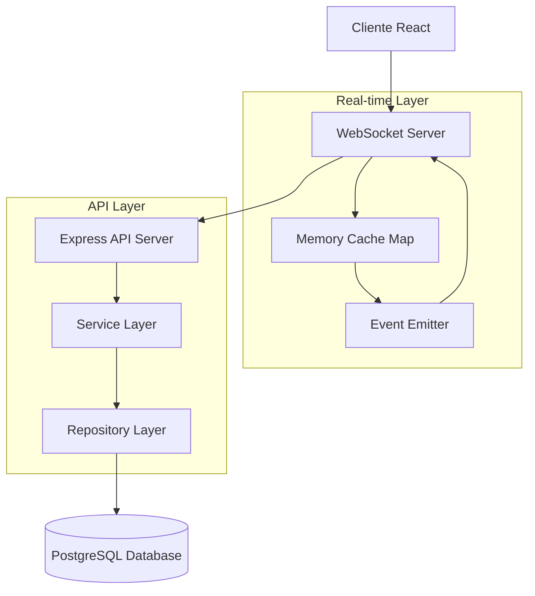
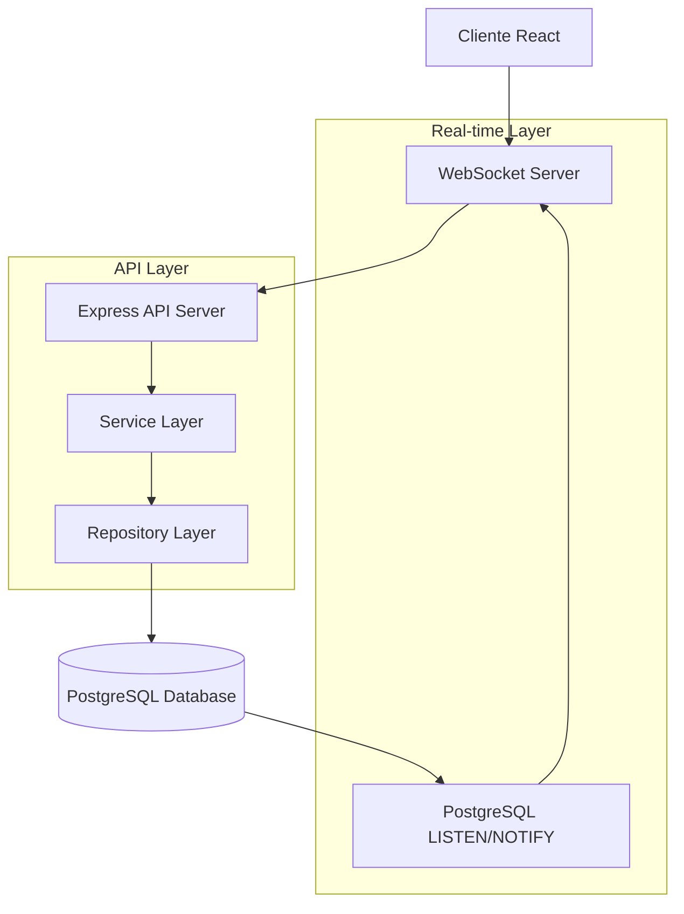

# Arquitetura Técnica: Atualizações Automáticas em Quadros Kanban (Sem Redis)

## 1. Arquitetura Geral

### Opção 1: Cache em Memória Local + WebSocket


### Opção 2: PostgreSQL LISTEN/NOTIFY


## 2. Tecnologias por Abordagem

### Opção 1: Cache em Memória Local
- Frontend: React@18 + TypeScript + @dnd-kit/core + Zustand + tailwindcss@3
- Backend: Express@4 + TypeScript + ws (WebSocket) + events (Node.js EventEmitter)
- Database: PostgreSQL + Drizzle ORM
- Cache: Map/WeakMap em memória local
- Real-time: WebSocket nativo + EventEmitter

### Opção 2: PostgreSQL LISTEN/NOTIFY
- Frontend: React@18 + TypeScript + @dnd-kit/core + Zustand + tailwindcss@3
- Backend: Express@4 + TypeScript + ws (WebSocket) + pg (PostgreSQL client)
- Database: PostgreSQL + Drizzle ORM + LISTEN/NOTIFY
- Real-time: WebSocket + PostgreSQL pub/sub

### Opção 3: Polling Otimizado
- Frontend: React@18 + TypeScript + @dnd-kit/core + Zustand + tailwindcss@3
- Backend: Express@4 + TypeScript
- Database: PostgreSQL + Drizzle ORM
- Real-time: HTTP polling com timestamps + debouncing

## 3. Implementação Detalhada

### 3.1 Opção 1: Cache em Memória Local

#### Backend - Memory Cache Manager
```typescript
// server/src/services/memoryCache.ts
import { EventEmitter } from 'events';

interface CacheItem {
  data: any;
  timestamp: number;
  version: number;
}

class MemoryCacheManager extends EventEmitter {
  private cache = new Map<string, CacheItem>();
  private readonly TTL = 5 * 60 * 1000; // 5 minutos

  set(key: string, data: any, version: number = 1): void {
    this.cache.set(key, {
      data,
      timestamp: Date.now(),
      version
    });
    
    // Emitir evento para WebSocket
    this.emit('cache:update', { key, data, version });
  }

  get(key: string): any {
    const item = this.cache.get(key);
    if (!item) return null;
    
    // Verificar TTL
    if (Date.now() - item.timestamp > this.TTL) {
      this.cache.delete(key);
      return null;
    }
    
    return item.data;
  }

  invalidate(key: string): void {
    this.cache.delete(key);
    this.emit('cache:invalidate', { key });
  }

  // Limpeza automática de cache expirado
  startCleanup(): void {
    setInterval(() => {
      const now = Date.now();
      for (const [key, item] of this.cache.entries()) {
        if (now - item.timestamp > this.TTL) {
          this.cache.delete(key);
        }
      }
    }, 60000); // Limpar a cada minuto
  }
}

export const cacheManager = new MemoryCacheManager();
```

#### WebSocket Server com Cache
```typescript
// server/src/websocket/server.ts
import WebSocket from 'ws';
import { cacheManager } from '../services/memoryCache';

interface ClientConnection {
  ws: WebSocket;
  userId: string;
  subscriptions: Set<string>;
}

class WebSocketManager {
  private clients = new Map<string, ClientConnection>();
  private wss: WebSocket.Server;

  constructor(server: any) {
    this.wss = new WebSocket.Server({ server });
    this.setupEventListeners();
    this.handleConnections();
  }

  private setupEventListeners(): void {
    // Escutar eventos do cache
    cacheManager.on('cache:update', (event) => {
      this.broadcastToSubscribers(event.key, {
        type: 'CACHE_UPDATE',
        key: event.key,
        data: event.data,
        version: event.version
      });
    });

    cacheManager.on('cache:invalidate', (event) => {
      this.broadcastToSubscribers(event.key, {
        type: 'CACHE_INVALIDATE',
        key: event.key
      });
    });
  }

  private handleConnections(): void {
    this.wss.on('connection', (ws, request) => {
      const userId = this.extractUserId(request);
      
      const client: ClientConnection = {
        ws,
        userId,
        subscriptions: new Set()
      };
      
      this.clients.set(userId, client);

      ws.on('message', (message) => {
        this.handleMessage(client, JSON.parse(message.toString()));
      });

      ws.on('close', () => {
        this.clients.delete(userId);
      });
    });
  }

  private handleMessage(client: ClientConnection, message: any): void {
    switch (message.type) {
      case 'SUBSCRIBE':
        client.subscriptions.add(message.key);
        break;
      case 'UNSUBSCRIBE':
        client.subscriptions.delete(message.key);
        break;
    }
  }

  private broadcastToSubscribers(key: string, message: any): void {
    for (const client of this.clients.values()) {
      if (client.subscriptions.has(key) && client.ws.readyState === WebSocket.OPEN) {
        client.ws.send(JSON.stringify(message));
      }
    }
  }

  private extractUserId(request: any): string {
    // Extrair userId do token JWT ou session
    return 'user-' + Math.random().toString(36).substr(2, 9);
  }
}

export { WebSocketManager };
```

### 3.2 Opção 2: PostgreSQL LISTEN/NOTIFY

#### Database Triggers
```sql
-- Criar função para notificação
CREATE OR REPLACE FUNCTION notify_opportunity_change()
RETURNS TRIGGER AS $$
BEGIN
  PERFORM pg_notify(
    'opportunity_changes',
    json_build_object(
      'operation', TG_OP,
      'table', TG_TABLE_NAME,
      'data', row_to_json(NEW),
      'old_data', row_to_json(OLD),
      'timestamp', extract(epoch from now())
    )::text
  );
  RETURN COALESCE(NEW, OLD);
END;
$$ LANGUAGE plpgsql;

-- Criar triggers
CREATE TRIGGER opportunity_notify_trigger
  AFTER INSERT OR UPDATE OR DELETE ON opportunities
  FOR EACH ROW EXECUTE FUNCTION notify_opportunity_change();
```

#### PostgreSQL Listener Service
```typescript
// server/src/services/pgListener.ts
import { Client } from 'pg';
import { EventEmitter } from 'events';

class PostgreSQLListener extends EventEmitter {
  private client: Client;
  private isConnected = false;

  constructor() {
    super();
    this.client = new Client({
      connectionString: process.env.DATABASE_URL
    });
  }

  async connect(): Promise<void> {
    try {
      await this.client.connect();
      this.isConnected = true;
      
      // Escutar notificações
      this.client.on('notification', (msg) => {
        if (msg.channel === 'opportunity_changes') {
          const payload = JSON.parse(msg.payload!);
          this.emit('opportunity:change', payload);
        }
      });

      // Subscrever ao canal
      await this.client.query('LISTEN opportunity_changes');
      
      console.log('PostgreSQL LISTEN/NOTIFY conectado');
    } catch (error) {
      console.error('Erro ao conectar PostgreSQL listener:', error);
      setTimeout(() => this.connect(), 5000); // Reconectar em 5s
    }
  }

  async disconnect(): Promise<void> {
    if (this.isConnected) {
      await this.client.query('UNLISTEN opportunity_changes');
      await this.client.end();
      this.isConnected = false;
    }
  }
}

export const pgListener = new PostgreSQLListener();
```

### 3.3 Opção 3: Polling Otimizado

#### Smart Polling Service
```typescript
// server/src/services/smartPolling.ts
interface PollingConfig {
  baseInterval: number;
  maxInterval: number;
  backoffMultiplier: number;
}

class SmartPollingService {
  private lastCheck = new Map<string, number>();
  private intervals = new Map<string, number>();
  private config: PollingConfig = {
    baseInterval: 1000,    // 1 segundo
    maxInterval: 30000,    // 30 segundos
    backoffMultiplier: 1.5
  };

  async getChanges(userId: string, lastTimestamp?: number): Promise<any> {
    const now = Date.now();
    const userLastCheck = this.lastCheck.get(userId) || 0;
    const checkTimestamp = lastTimestamp || userLastCheck;

    // Buscar mudanças desde o último check
    const changes = await this.fetchChangesFromDB(checkTimestamp);
    
    this.lastCheck.set(userId, now);
    
    // Ajustar intervalo baseado na atividade
    if (changes.length > 0) {
      // Há atividade, usar intervalo base
      this.intervals.set(userId, this.config.baseInterval);
    } else {
      // Sem atividade, aumentar intervalo
      const currentInterval = this.intervals.get(userId) || this.config.baseInterval;
      const newInterval = Math.min(
        currentInterval * this.config.backoffMultiplier,
        this.config.maxInterval
      );
      this.intervals.set(userId, newInterval);
    }

    return {
      changes,
      nextPollInterval: this.intervals.get(userId),
      timestamp: now
    };
  }

  private async fetchChangesFromDB(since: number): Promise<any[]> {
    // Implementar query para buscar mudanças
    // usando campo updated_at ou similar
    return [];
  }
}
```

## 4. Comparação de Performance

| Abordagem | Latência | Uso de Memória | Complexidade | Escalabilidade |
|-----------|----------|----------------|--------------|----------------|
| Cache Memória | ~10ms | Médio | Baixa | Limitada (single server) |
| PostgreSQL LISTEN/NOTIFY | ~50ms | Baixo | Média | Boa |
| Polling Otimizado | ~500ms-5s | Baixo | Baixa | Excelente |

## 5. Implementação Frontend

### Zustand Store sem Redis
```typescript
// client/src/stores/kanbanStore.ts
import { create } from 'zustand';
import { subscribeWithSelector } from 'zustand/middleware';

interface KanbanState {
  opportunities: Opportunity[];
  lastSync: number;
  isConnected: boolean;
  updateOpportunity: (id: string, updates: Partial<Opportunity>) => void;
  syncFromServer: (data: Opportunity[]) => void;
}

export const useKanbanStore = create<KanbanState>()()
  subscribeWithSelector((set, get) => ({
    opportunities: [],
    lastSync: 0,
    isConnected: false,
    
    updateOpportunity: (id, updates) => {
      set((state) => ({
        opportunities: state.opportunities.map(opp => 
          opp.id === id ? { ...opp, ...updates } : opp
        ),
        lastSync: Date.now()
      }));
    },
    
    syncFromServer: (data) => {
      set({
        opportunities: data,
        lastSync: Date.now()
      });
    }
  }))
);
```

## 6. Plano de Implementação

### Fase 1: Implementação Base (1 semana)
- Escolher abordagem (recomendado: PostgreSQL LISTEN/NOTIFY)
- Implementar WebSocket básico
- Configurar triggers no banco

### Fase 2: Sincronização CRUD (1 semana)
- Implementar eventos de criação, edição, exclusão
- Integrar com frontend Zustand
- Testes básicos

### Fase 3: Otimizações (1 semana)
- Implementar debouncing
- Adicionar fallback para polling
- Monitoramento e logs

### Fase 4: Deploy e Monitoramento (0.5 semana)
- Deploy em produção
- Monitoramento de performance
- Ajustes finais

## 7. Vantagens de Cada Abordagem

### Cache em Memória
✅ Muito rápido
✅ Simples de implementar
❌ Limitado a um servidor
❌ Perda de dados em restart

### PostgreSQL LISTEN/NOTIFY
✅ Nativo do PostgreSQL
✅ Confiável e persistente
✅ Escalável horizontalmente
❌ Latência ligeiramente maior

### Polling Otimizado
✅ Muito simples
✅ Funciona com qualquer infraestrutura
✅ Fácil debug
❌ Maior latência
❌ Mais requisições HTTP

## Recomendação

Para o projeto CRM, recomendo a **Opção 2: PostgreSQL LISTEN/NOTIFY** por oferecer o melhor equilíbrio entre performance, confiabilidade e simplicidade de implementação, sem dependências externas como Redis.