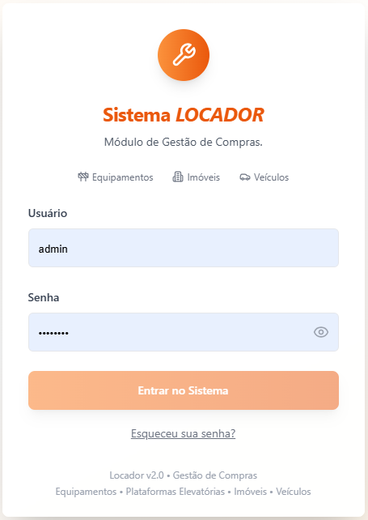
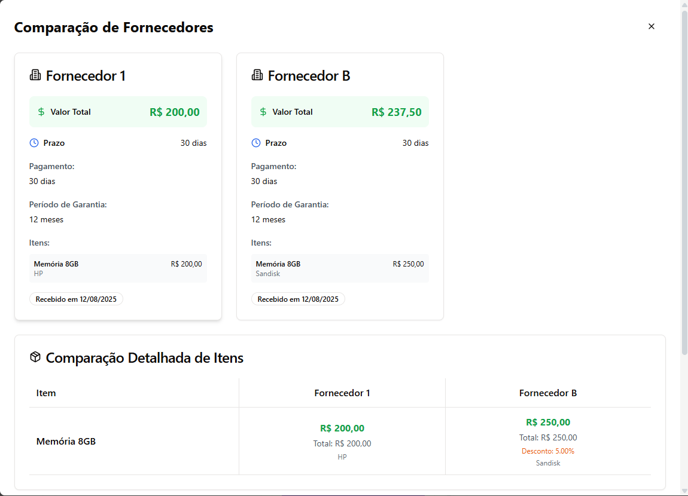
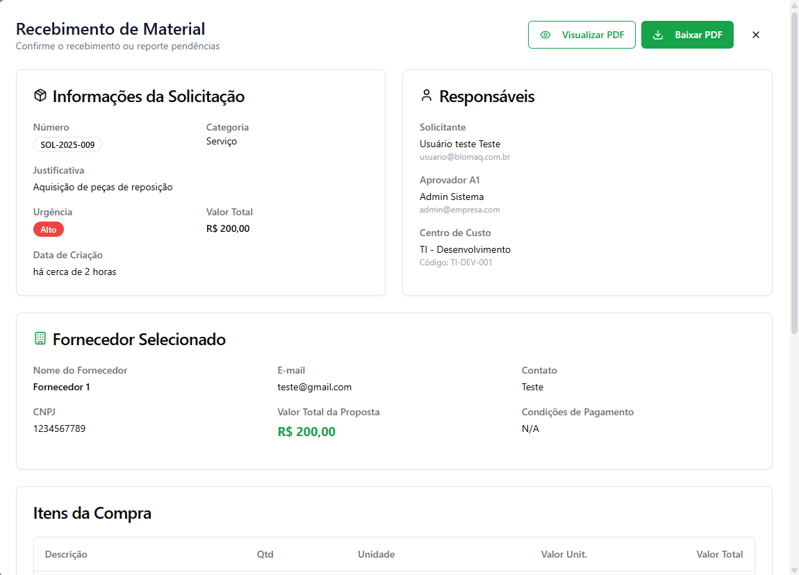

# Sistema de Gestão de Compras


Plataforma full-stack para gestão completa do processo de compras corporativas, desde a solicitação até o recebimento e arquivamento, com trilha de auditoria, aprovações por regra de negócio, cotações (RFQ), geração de PDF e integração com ERP.

## Sumário

- [Visão Geral](#visão-geral)
- [Demonstração Visual](#demonstração-visual)
- [Funcionalidades Principais](#funcionalidades-principais)
- [Arquitetura da Solução](#arquitetura-da-solução)
- [Tecnologias Utilizadas](#tecnologias-utilizadas)
- [Pré-requisitos](#pré-requisitos)
- [Instalação e Configuração](#instalação-e-configuração)
- [Como Executar](#como-executar)
- [Exemplos de Uso](#exemplos-de-uso)
- [Documentação da API](#documentação-da-api)
- [Estrutura de Pastas](#estrutura-de-pastas)
- [Contribuição](#contribuição)
- [Licença](#licença)
- [Links Úteis](#links-úteis)

## Visão Geral

O sistema foi desenhado para digitalizar o fluxo de compras em empresas com múltiplos perfis de usuário e controles de aprovação. O fluxo principal segue fases fixas:

**Solicitação → Aprovação A1 → Cotação → Aprovação A2 → Pedido de Compra → Conclusão → Recebimento → Arquivado**

O projeto suporta:
- Operação multiempresa
- Gestão de fornecedores, departamentos, centros de custo e locais de entrega
- Recebimento fiscal/material (incluindo XML de NFe)
- Integração com ERP Locador
- Atualizações em tempo real via WebSocket

## Demonstração Visual

> As imagens abaixo usam os assets versionados do próprio repositório.

### Login


### Kanban de Compras


### Fluxo de Cotação (RFQ)


### Recebimento


Mais capturas em: [docs/screenshots](./docs/screenshots)

## Funcionalidades Principais

- Workflow Kanban completo com fases do processo de compras
- Aprovações hierárquicas por papel, centro de custo e regras de valor
- Gestão de RFQ com fornecedores, upload de propostas e análise comparativa
- Geração de PDFs de documentos de compra
- Recebimento com validações de quantidade e registro de pendências
- Auditoria detalhada de ações críticas
- Integração ERP (consultas e envio controlado por configuração)
- Notificações e sincronização em tempo real

## Arquitetura da Solução

### Frontend
- React 18 + TypeScript
- Vite para build/dev server
- Wouter para roteamento
- TanStack Query para cache e sincronização de dados
- Shadcn/ui (Radix UI + Tailwind CSS) para interface

### Backend
- Node.js + Express + TypeScript
- Sessão server-side com `express-session` + `connect-pg-simple`
- WebSocket (`ws`) para eventos em tempo real
- Multer para upload de arquivos
- Puppeteer para geração de PDF

### Dados
- PostgreSQL como banco principal
- Drizzle ORM para schema e acesso tipado
- Drizzle Kit para evolução de schema/migrations
- Contratos compartilhados em `shared/` para reduzir inconsistências front/back

## Tecnologias Utilizadas

### Linguagens
- TypeScript
- JavaScript
- SQL
- HTML/CSS

### Frameworks e Runtime
- React
- Express
- Node.js
- Vite

### Bibliotecas-chave
- UI/UX: Tailwind CSS, Radix UI, shadcn/ui, Lucide
- Estado/Forms: TanStack Query, React Hook Form, Zod
- Banco: Drizzle ORM, pg
- Auth/Sessão: express-session, connect-pg-simple, bcryptjs
- Arquivos/PDF: Multer, Puppeteer, html-pdf-node
- Integrações: Nodemailer, SendGrid, web-push, fast-xml-parser, xlsx
- Testes: Jest, Testing Library, Supertest

## Pré-requisitos

- Node.js 20+ (recomendado)
- npm 9+ (ou pnpm, se preferir)
- PostgreSQL acessível local/remoto
- Variáveis de ambiente configuradas

Dependências críticas de ambiente:
- `DATABASE_URL_DEV` e/ou `DATABASE_URL`
- `SESSION_SECRET`
- `CONFIG_ENCRYPTION_KEY` (obrigatório ao usar configs secretas no banco)

Referência completa: [.env.example](./.env.example)

## Instalação e Configuração

1. **Clonar o repositório**

```bash
git clone <url-do-repositorio>
cd Gestao-de-Compras
```

2. **Instalar dependências**

```bash
npm install
```

3. **Criar arquivo de ambiente**

```bash
cp .env.example .env
```

4. **Configurar variáveis obrigatórias no `.env`**
- Banco (`DATABASE_URL_DEV`/`DATABASE_URL`)
- Sessão (`SESSION_SECRET`)
- Criptografia de segredos (`CONFIG_ENCRYPTION_KEY`)

5. **Aplicar schema no banco (Drizzle)**

```bash
npm run db:push
```

## Como Executar

### Desenvolvimento

```bash
npm run dev
```

Aplicação disponível em `http://localhost:3000` (ou porta definida por `PORT`).

### Build de Produção

```bash
npm run build
npm run start
```

### Verificação de tipos e testes

```bash
npm run check
npm run test
```

## Exemplos de Uso

### 1) Obter documentação OpenAPI

```bash
curl http://localhost:3000/api-docs/openapi.json
```

### 2) Login via API

```bash
curl -X POST http://localhost:3000/api/auth/login \
  -H "Content-Type: application/json" \
  -d "{\"email\":\"admin@empresa.com\",\"password\":\"sua_senha\"}"
```

### 3) Verificar saúde da integração Locador

```bash
curl http://localhost:3000/api/integration/locador/health
```

## Documentação da API

### Endpoints principais

- **Autenticação**
  - `POST /api/auth/login`
  - `POST /api/auth/logout`
  - `GET /api/auth/me`
  - `GET /api/auth/check`
- **Compras**
  - `GET/POST /api/purchase-requests`
  - `GET/POST /api/quotations`
  - `GET/POST /api/purchase-orders`
- **Recebimento**
  - Prefixos `/api/receipts` e `/api/recebimentos`
- **Integração ERP Locador**
  - `GET /api/integration/locador/combos/*`
  - `POST /api/integration/locador/solicitacoes`
  - `POST /api/integration/locador/recebimentos`
  - `GET /api/integration/locador/health`
- **Configuração da integração (admin)**
  - `GET/PUT /api/config/locador`
  - `POST /api/config/locador/reload`

### OpenAPI

- JSON OpenAPI: `/api-docs/openapi.json`

## Estrutura de Pastas

```text
Gestao-de-Compras/
├─ client/                 # Frontend React (pages, components, hooks, libs)
├─ server/                 # Backend Express (rotas, serviços, realtime, integração)
├─ shared/                 # Schemas e tipos compartilhados front/back
├─ migrations/             # Scripts SQL de migração/evolução
├─ scripts/                # Utilitários operacionais e diagnóstico
├─ docs/                   # Documentação técnica/funcional e screenshots
├─ attached_assets/        # Arquivos auxiliares e exemplos
├─ package.json
└─ .env.example
```

## Contribuição

Contribuições são bem-vindas.

1. Faça um fork do projeto
2. Crie uma branch de feature (`git checkout -b feat/minha-feature`)
3. Faça commits pequenos e descritivos
4. Rode validações locais:

```bash
npm run check
npm run test
```

5. Abra um Pull Request com contexto técnico e evidências (prints/logs/testes)

Boas práticas:
- Seguir os padrões já existentes no código
- Evitar incluir segredos/chaves em commits
- Atualizar documentação quando alterar comportamento relevante

## Licença

Este projeto está sob a licença **MIT**.  
Consulte `package.json` (campo `license`) para referência.

## Links Úteis

- Manual do usuário: [docs/MANUAL_USUARIO.md](./docs/MANUAL_USUARIO.md)
- Manual completo: [docs/MANUAL_USUARIO_COMPLETO.md](./docs/MANUAL_USUARIO_COMPLETO.md)
- Documentação técnica: [docs/DOCUMENTACAO_TECNICA.md](./docs/DOCUMENTACAO_TECNICA.md)
- Requisitos: [docs/DOCUMENTACAO_REQUISITOS.md](./docs/DOCUMENTACAO_REQUISITOS.md)
- Deploy em produção: [docs/PRODUCTION_DEPLOYMENT.md](./docs/PRODUCTION_DEPLOYMENT.md)
- Integração ERP: [docs/ERP_INTEGRATION.md](./docs/ERP_INTEGRATION.md)
- Demonstração online: não disponível no repositório no momento

---
