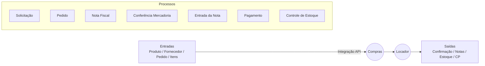
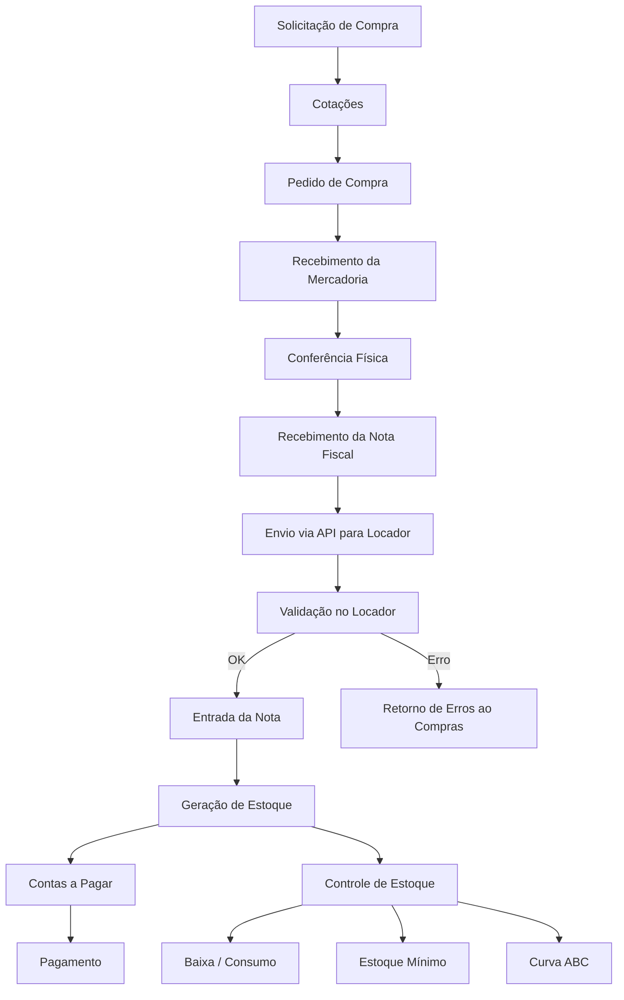

# Documento Completo — Fluxo de Integração e Processo de Compras

Este documento descreve o **processo macro e detalhado** do ciclo de compras, considerando:
- o processo operacional interno;
- as responsabilidades de cada sistema (**Locador** e **Compras**);
- a integração via API (entradas e saídas);
- o fluxo de almoxarifado e financeiro após o recebimento;
- os dados trafegados;
- os fluxos estruturados em diagramas.

O objetivo é ter uma única fonte da verdade para orientar **desenvolvimento, integração e operação do processo**.

---

# 1. Visão Geral do Processo (Macro Fluxo)

O fluxo completo do processo de compras e recebimento, alinhado ao desenho macro fornecido, segue a ordem lógica:

1. **Solicitação de Compra**
2. **Cotação (opcional)**
3. **Pedido de Compra (PC)**
4. **Envio ao Fornecedor**
5. **Recebimento da Mercadoria**
6. **Conferência Física**
7. **Recebimento da Nota Fiscal**
8. **Entrada da Nota no Locador** (integração)
9. **Geração de Estoque**
10. **Geração de Contas a Pagar**
11. **Baixa e Consumo dos Itens (Almoxarifado)**
12. **Atualização de Estoque Mínimo, Curva ABC e Indicadores**

---

# 2. Objetivo da Integração
A integração entre **Locador** e **Compras** tem dois papéis fundamentais:

### **Entradas (Locador recebe do Compras)**
- Produto (código, descrição, unidade)
- Fornecedor (CNPJ, razão social)
- Pedido de compra
- Itens do pedido
- Dados fiscais da nota

### **Saídas (Locador devolve ao Compras)**
- Confirmação de recebimento
- Erros de importação
- Situação da nota
- Situação da entrada de estoque
- Situação das contas a pagar

---

# 3. Diagrama de Integração (Macro)

---

# 4. Fluxo Detalhado do Processo (Operacional + Sistema)

A seguir, o fluxo completo com responsabilidades e interações.

## **4.1 Solicitação de Compra**
- Usuário cria requisição.
- Pode conter itens, justificativa, anexos.
- Passa por aprovação conforme alçada.
- Sistema: **Compras**.

## **4.2 Cotação**
- Comprador convida fornecedores.
- Recebe propostas.
- Seleciona o vencedor.
- Sistema: **Compras**.

## **4.3 Pedido de Compra (PC)**
- Gerado após seleção do fornecedor.
- Passa por aprovação conforme regras.
- Após aprovação, PC é enviado ao fornecedor.

Sistema: **Compras**.

## **4.4 Recebimento da Mercadoria (Almoxarifado)**
- Material chega na empresa.
- Conferência física por quantidade, qualidade e correspondência ao pedido.
- Se houver divergência: processo de regularização.

Sistema: **Processo interno (operacional)**.

## **4.5 Recebimento da Nota Fiscal**
- Fornecedor envia nota.
- Almoxarifado/Financeiro confere se os dados da nota batem com o pedido.
- Após validação, nota está pronta para ser integrada.

Sistema: **Compras**.

## **4.6 Envio da Nota via API para o Locador**
O módulo Compras envia:

- Dados da nota
- Dados do pedido
- Itens da nota
- Fornecedor

Sistema: **Compras → Locador** via API.

## **4.7 Validação no Locador**
O Locador valida:
- fornecedor existe?
- produtos existem?
- pedido é válido?
- nota já existe (duplicidade)?
- impostos válidos?

Caso algum item falhe, Locador devolve erro.

## **4.8 Entrada da Nota e Geração de Documentos**
Ao validar:
- cria **nota de entrada**;
- cria **movimentação de estoque**;
- gera **contas a pagar**;
- atualiza **saldo de estoque**;
- guarda histórico/auditoria.

Sistema: **Locador**.

## **4.9 Retorno ao Sistema Compras**
O Locador devolve status:
- Sucesso
- Erro
- Itens pendentes de cadastro
- Divergências

Sistema: **Locador → Compras**.

## **4.10 Processo de Almoxarifado (pós-entrada)**
Após entrada da nota:
- saldo atualizado
- baixa por consumo
- movimentações (transferências internas, requisições)
- estoque mínimo
- curva ABC
- rastreamento

Sistema: **Locador**.

## **4.11 Processo Financeiro**
Contas a pagar geradas automaticamente:
- datas de vencimento
- parcelas
- fornecedor
- integração com pagamentos

Sistema: **Locador**.

---

# 5. Diagrama do Fluxo Detalhado (Processo Completo)

---

# 6. Modelo de Dados da Integração

### **6.1 Payload enviado do Compras → Locador**

- Pedido
- Itens
- Fornecedor
- Nota fiscal
- Informações tributárias
- Condições de pagamento

### **6.2 Retorno do Locador → Compras**

- Nota registrada
- Contas a pagar criadas
- Movimentação de estoque realizada
- Erros e pendências

---

# 7. Regras de Negócio Importantes

### **Produtos inexistentes** 
- Locador devolve erro
- Compras deve exibir como pendência de cadastro

### **Fornecedor inexistente**
- Não entra no Locador

### **Nota duplicada**
- Identificada pela chave NFe

### **Divergência entre pedido e nota**
- Rejeitada

---

# 8. Considerações Técnicas

- API REST com autenticação
- Logs e auditoria
- Idempotência
- Transações
- Versionamento da API
- Controle de fila para grandes volumes

---

# 9. Conclusão
Este documento estabelece o processo completo — operacional, sistêmico e integrado — entre **Compras** e **Locador**, garantindo o alinhamento para desenvolvimento, testes e operação.

Se quiser, posso gerar também a versão **PDF pronta**, com gráficos renderizados automaticamente.

