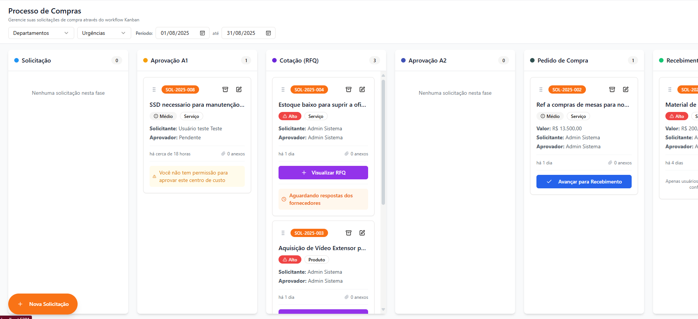

# Deck Executivo — Desacoplamento do Ciclo de Vida de Solicitações e Recebimentos

Formato sugerido: Markdown com separador `---` para apresentação (ex.: Reveal.js / Marp / Pandoc).

---

## 1) Executive Summary (1 slide)

**Situação atual**
- O Kanban é centrado em “Solicitações” e o status da solicitação é impactado por eventos do recebimento/fiscal, gerando acoplamento operacional.
- O processo de recebimento parcial é suportado, mas o controle de fase/status cria efeitos colaterais (ex.: conclusão da solicitação por regras de receipt), dificultando previsibilidade e rastreabilidade ponta a ponta.

**Proposta**
- Separar explicitamente o ciclo de vida de **Compras (Solicitação)** do ciclo de vida de **Recebimentos (cards independentes)**.
- Concluir automaticamente a solicitação no “handoff” para recebimento, sem depender do andamento dos receipts.

**Benefícios de negócio (quantificáveis)**
- Redução de retrabalho e “voltas” de card por conflitos de fase/rollback (medir antes/depois).
- Aumento de throughput do time de Compras (menos bloqueios por fiscal/recebimento).
- Melhor compliance: trilha auditável por receipt e por solicitação, com menor risco de perda de evidências.

**Decisão solicitada**
- Aprovar a implementação em duas camadas: (1) adequação de dados + auditoria; (2) mudança de fluxo e UI.

---

## 2) Contexto do Fluxo Atual (1 slide)

**Colunas foco no Kanban**
- Pedido de Compra → Recebimento Físico → Conf. Fiscal

**Como funciona hoje (resumo)**
- O “card” do Kanban representa a **solicitação**.
- Recebimentos (NF/serviço/avulso) existem como registros, mas influenciam a fase da solicitação.

**Sinal de acoplamento**
- A solicitação pode ser “concluída” ou “reaberta” por regras relacionadas a receipts, mesmo quando o objetivo é apenas movimentar/tratar um recebimento específico.

---

## 2.1) Visuais do estado atual (1 slide)

Kanban (exemplo):



Fluxo de recebimento (referência visual):


---

## 3) Diagnóstico: dores e efeitos observáveis (1 slide)

**Dores operacionais**
- Conflito entre a necessidade de concluir o fluxo de compras vs. tratar recebimentos parciais e conferência fiscal com tempos distintos.
- Dependência do fiscal para “fechar” a solicitação, gerando fila e bloqueio de indicadores do Kanban.

**Dores de governança**
- Rollback que pode excluir registros de receipt (dependendo do caso) reduz evidências históricas e aumenta risco de auditoria.

**Dores de produto/usuário**
- Ambiguidade do card: “o que está atrasado?” (compra ou recebimento?) não é respondido com clareza por um único estado.

---

## 4) Métricas de Performance (baseline e como medir) (1 slide)

Atualmente não existe telemetria explícita consolidada por evento de processo. Recomenda-se estabelecer baseline com dados do banco (últimos 3–6 meses) usando timestamps já disponíveis e, quando necessário, instrumentação via `audit_logs`.

**KPIs recomendados (antes/depois)**
- Lead time “Pedido de Compra → Handoff para Recebimento” (compras).
- Lead time “Receipt criado → Físico confirmado → Fiscal concluído” (recebimento).
- Backlog de receipts por fase (Recebimento / Conf. Fiscal / Erro Integração).
- Taxa de retrabalho: nº de rollbacks/reaberturas por receipt.
- Taxa de divergência: nº de “pendências” reportadas por PO/receipt.

**Fonte de dados**
- `purchase_requests` (fases e timestamps existentes)
- `receipts` e dependências (`receipt_items`, etc.)
- `audit_logs` (com padronização dos eventos de receipt)

---

## 5) Proposta — o que muda conceitualmente (1 slide)

**De**
- Um único card (Solicitação) tentando representar dois ciclos (compras + recebimento/fiscal).

**Para**
- Dois ciclos explícitos:
  - **Solicitação (Compras):** encerra no handoff para recebimento (“Concluída” do ponto de vista de compras).
  - **Recebimentos (Receipts):** cards independentes com ciclo próprio, permitindo múltiplos recebimentos por solicitação (parciais).

**Regra-chave**
- Movimentar/tratar um receipt em Conf. Fiscal **não altera** o status da solicitação.

---

## 6) Arquitetura — Estado Atual (1 slide)

```mermaid
flowchart LR
  UI[Frontend Kanban\n(card = Purchase Request)] --> API[Backend Node/Express]
  API --> PR[(purchase_requests\ncurrent_phase)]
  API --> PO[(purchase_orders\nfulfillment_status)]
  API --> R[(receipts\nstatus)]

  R -->|conclusão fiscal / checagem pendentes| PR
  R -->|rollback / exclusões em alguns fluxos| R
```

Leitura executiva: o recebimento influencia a fase/conclusão da solicitação, gerando dependências cruzadas.

---

## 7) Arquitetura — Proposta Alvo (1 slide)

```mermaid
flowchart LR
  UI1[Kanban Compras\n(card = Solicitação)] --> API[Backend Node/Express]
  UI2[Kanban Recebimentos\n(card = Receipt)] --> API

  API --> PR[(purchase_requests\nprocurement_status)]
  API --> PO[(purchase_orders\nfulfillment_status)]
  API --> R[(receipts\nreceipt_phase + status)]

  PR -.->|vínculo| R
  R -->|integração e auditoria por receipt| ERP[(Locador ERP)]
```

Leitura executiva: a solicitação encerra seu ciclo; receipts evoluem sem efeitos colaterais na solicitação.

---

## 8) Impacto Operacional (1 slide)

**Compras**
- Fecha o ciclo de compras mais cedo (handoff), reduzindo cards “presos” por fiscal.
- Indicadores de compras passam a refletir o trabalho da área de compras (não o fiscal).

**Recebimento/Almoxarifado**
- Gerencia recebimentos parciais com múltiplos cards e histórico por remessa.

**Fiscal**
- Trabalha por receipt-card, com fila e prioridade por nota/remessa (independente da solicitação).

---

## 9) Impacto Organizacional (RACI resumido) (1 slide)

**Papéis**
- Buyer/Compras: responsável por concluir handoff e acompanhar PO.
- Recebedor: responsável por confirmar físico por receipt.
- Fiscal: responsável por concluir conferência fiscal por receipt (com/sem ERP).
- Admin/Manager: governança de reabertura/cancelamento e auditoria.

**Mudança prática**
- Métricas e filas passam a ser separadas: “Fila de compras” vs. “Fila fiscal/recebimentos”.

---

## 10) Benefícios Quantificáveis (modelo de quantificação) (1 slide)

Como base, recomenda-se medir “antes” por amostragem (últimos 3–6 meses) e projetar “depois” com base em redução de retrabalho e ganho de throughput.

**Dimensões com ganhos esperados**
- Redução de retrabalho (rollbacks, correções, reaberturas).
- Redução de bloqueios (compras deixa de depender de fiscal para concluir).
- Menor risco de não conformidade (trilha auditável por receipt).

**Modelo de ROI (parametrizado)**
- Horas economizadas/mês = (eventos evitados/mês) × (tempo médio por evento)
- ROI (%) = (benefício anual − investimento anual) / investimento anual
- Payback (meses) = investimento / benefício mensal

Campos a preencher pelo negócio:
- Volume mensal de solicitações / receipts
- Tempo médio de retrabalho por ocorrência
- Custo hora (Compras, Recebimento, Fiscal)
- Custo de incidentes/compliance (quando aplicável)

---

## 11) Custos Envolvidos (investimento) (1 slide)

Para evitar números não validados, o investimento deve ser estimado a partir de itens de escopo (WBS). Estrutura típica:

- Engenharia (backend + frontend): refatoração de fluxo, endpoints, UI de receipts-board.
- Dados: migrações, backfill, validações e scripts.
- Qualidade: testes (unit/integration/E2E), validação de migração e regressão.
- Change management: treinamento, comunicação, atualização de manuais.
- Operação: janela de deploy e monitoramento.

Recomendação: estimar por marcos (abaixo) e revalidar após Discovery técnico (Anexo).

---

## 12) Roadmap (marcos principais, sem datas) (1 slide)

**Marco 1 — Preparação**
- Modelagem e migrações: novos campos para vínculo request↔receipt; auditoria padronizada.

**Marco 2 — Compatibilidade**
- Backfill histórico; ajustes de relatórios e PDFs que dependem de fase; feature flag para coexistência.

**Marco 3 — Mudança de Fluxo**
- Recebimento físico e fiscal passam a operar por receipt-card; solicitação deixa de ser alterada por receipts.

**Marco 4 — UI e Adoção**
- Kanban de receipts (ou visão dedicada), treinamento e corte definitivo das rotas antigas.

---

## 13) Riscos e Mitigações (1 slide)

**Risco: inconsistência de dados em migração**
- Mitigação: migração em duas fases (additive + backfill), validações por queries, feature flag.

**Risco: regressão em relatórios/dashboards**
- Mitigação: listar dependências de `currentPhase` e criar novas métricas por receipts; testes de regressão em relatórios críticos.

**Risco: auditoria/compliance**
- Mitigação: evitar deleção física de receipts (usar cancelamento/reabertura), log obrigatório de eventos por receipt.

**Risco: adoção pelo usuário**
- Mitigação: comunicação e treinamento por perfil (gestor vs keyuser), piloto com grupo controlado.

---

## 14) Plano de Comunicação (gestores e keyusers) (1 slide)

**Gestores**
- Mensagem: separação de filas e KPIs (compras vs fiscal), maior previsibilidade e governança.
- Rituais: checkpoints por marco, leitura de métricas antes/depois.

**Keyusers operacionais**
- Mensagem: “cada recebimento é um card”, como criar recebimentos parciais e como concluir fiscalmente.
- Materiais: guia rápido (1 página), vídeo curto (fluxo), FAQ (erros comuns e como resolver).

**Suporte**
- Canal dedicado para dúvidas nas primeiras semanas do go-live.
- Plano de fallback (feature flag).

---

## 15) Próximos Passos / Aprovações necessárias (1 slide)

**Aprovações**
- Aprovação do conceito (dois ciclos de vida) e do modelo de auditoria.
- Aprovação do corte de indicadores: KPIs de compras vs KPIs de recebimento/fiscal.

**Inputs necessários do negócio**
- Volumes mensais e custo-hora por perfil para cálculo de ROI.
- Regras regulatórias específicas (retenção, auditoria, trilhas).

**Referências**
- Anexo técnico: [ANEXO_EXECUTIVO_DESACOPLAMENTO_RECEBIMENTOS_TECNICO.md](file:///c:/Projetos/Locador/webapps/Gestao-de-Compras/docs/ANEXO_EXECUTIVO_DESACOPLAMENTO_RECEBIMENTOS_TECNICO.md)
- Detalhamento técnico completo: [decouple-request-receipts-lifecycle.md](file:///c:/Projetos/Locador/webapps/Gestao-de-Compras/docs/technical/decouple-request-receipts-lifecycle.md)
