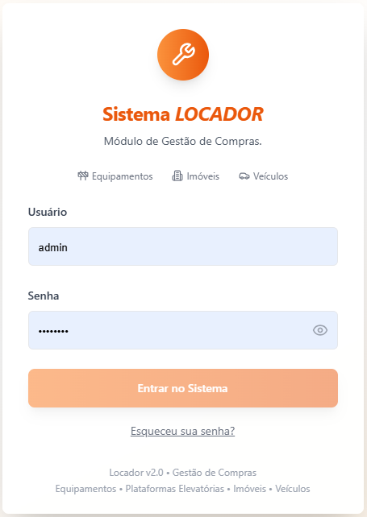
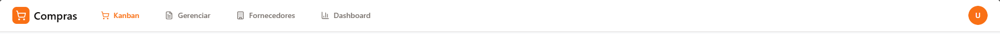
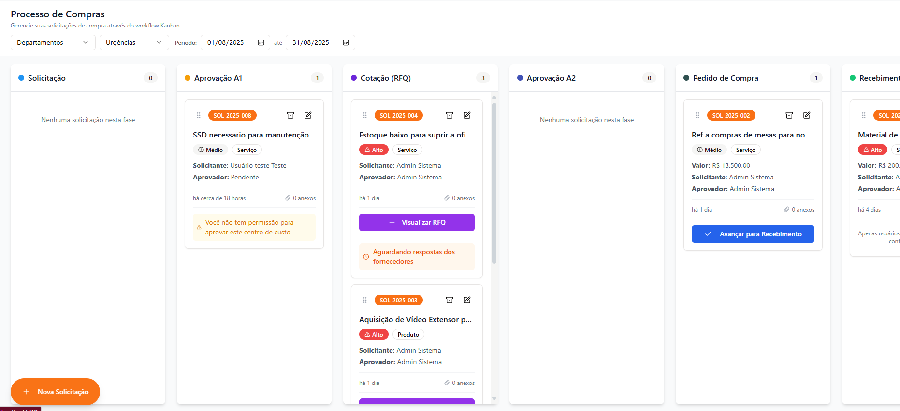
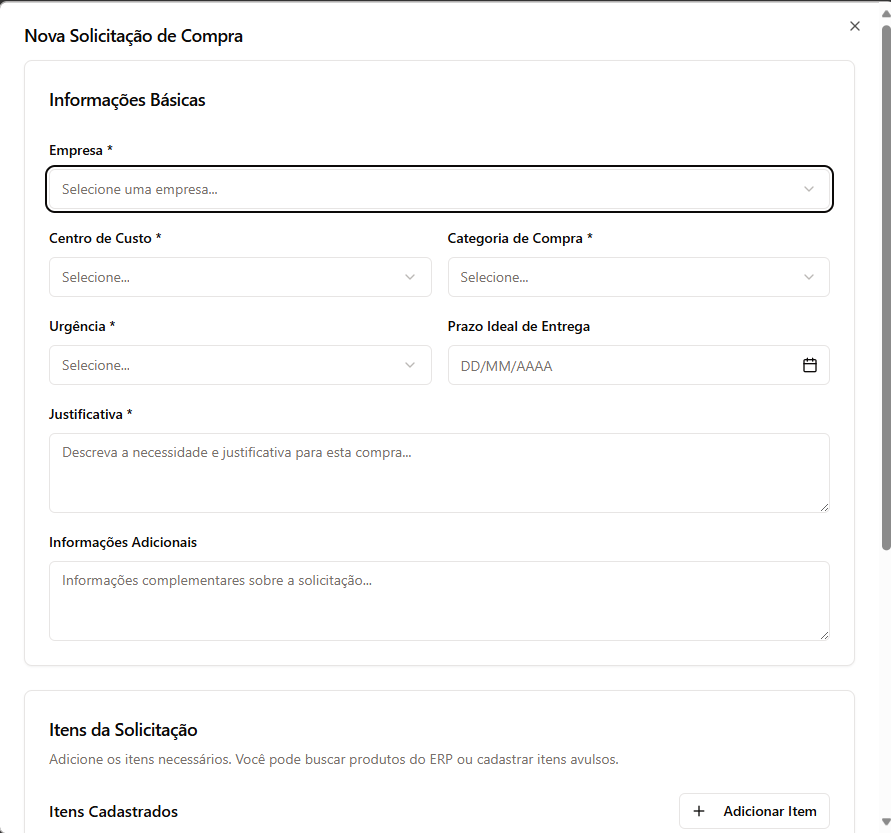
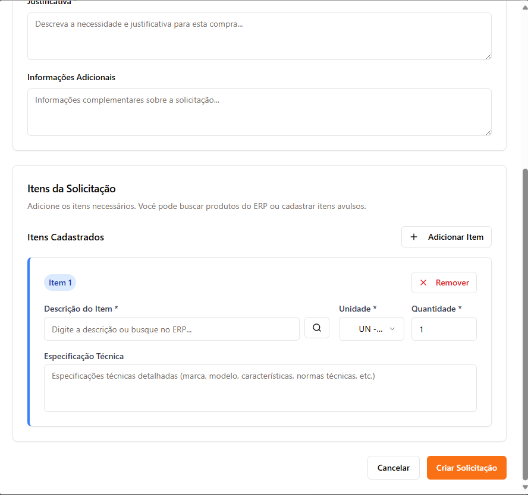
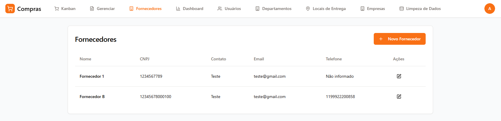
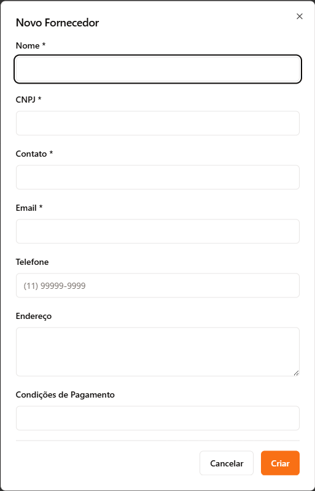
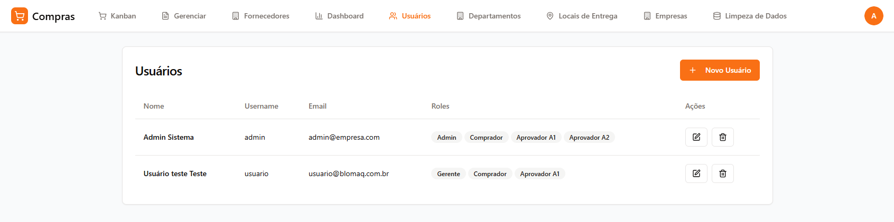

# 📖 Exemplo de Integração de Imagens no Manual

Este documento mostra como integrar as capturas de tela no Manual do Usuário para melhorar a experiência de leitura.

## 🎯 Formato de Integração

### Estrutura Padrão
```markdown
## Seção do Manual

Texto explicativo sobre a funcionalidade...


*Figura X: Descrição detalhada da captura de tela*

Continuação do texto explicativo...
```

---

## 📝 Exemplos Práticos

### 1. Tela de Login

```markdown
### Acessando o Sistema

1. **Abra seu navegador** e acesse o endereço do sistema
2. **Tela de Login**: Digite seu usuário/email e senha
3. **Esqueceu a senha?**: Clique em "Esqueci minha senha" para redefinir


*Figura 1: Tela de login do sistema com campos de usuário/email e senha*

### Primeiro Acesso
- Você receberá suas credenciais do administrador do sistema
- É recomendado alterar sua senha no primeiro acesso
```

### 2. Menu de Navegação

```markdown
### Menu Superior
O sistema possui um menu superior com as seguintes opções:


*Figura 2: Menu principal do sistema com todas as opções de navegação*

#### 🏢 **Processo de Compras** (Kanban)
- Visualização principal do sistema
- Mostra todas as solicitações em formato Kanban
- Permite arrastar cards entre as fases
```

### 3. Kanban - Visão Geral

```markdown
## 🔄 Workflow de Compras - Guia Completo

O sistema utiliza um workflow Kanban com 8 fases fixas. Cada fase tem responsáveis específicos e ações permitidas.


*Figura 3: Visão completa do Kanban mostrando as 8 fases do processo de compras*

### 📝 Fase 1: Solicitação

#### Como criar uma nova solicitação:

1. **Clique no botão "+" flutuante** (canto inferior direito) ou
2. **Menu** → **Nova Solicitação**


*Figura 4: Botão flutuante para criação de nova solicitação*
```

### 4. Formulário de Solicitação

```markdown
#### Preenchendo o formulário:

**📋 Dados Obrigatórios:**


*Figura 5: Seção de dados básicos do formulário de solicitação*

- **Empresa**: Selecione a empresa (geralmente pré-selecionada)
- **Centro de Custo**: Escolha o centro de custo apropriado
- **Categoria**: Produto, Serviço ou Outros
- **Urgência**: Baixo, Médio ou Alto
- **Justificativa**: Explique detalhadamente a necessidade

**📦 Itens da Solicitação:**


*Figura 6: Seção de itens com campos para descrição, quantidade e especificações*

Para cada item, informe:
- **Descrição**: Nome/descrição do produto/serviço
- **Unidade**: UN, KG, M², HR, etc.
- **Quantidade**: Quantidade necessária
- **Especificação Técnica**: Detalhes técnicos, marca preferida, normas
```

### 5. Aprovação A1

```markdown
### ✅ Fase 2: Aprovação A1

#### Como aprovar/reprovar:

1. **Acesse o Kanban** e localize a solicitação na coluna "Aprovação A1"
2. **Clique no card** para ver os detalhes


*Figura 7: Tela de detalhes para aprovação A1 com botões de ação*

#### Opções disponíveis:

**❌ Reprovar:**
- Clique em **"Reprovar"**
- **Obrigatório**: Informe o motivo da reprovação


*Figura 8: Modal de reprovação com campo obrigatório para motivo*
```

### 6. Cotação (RFQ)

```markdown
### 💰 Fase 3: Cotação (RFQ)

#### Criando uma RFQ (Request for Quotation):

1. **Clique no card** da solicitação na coluna "Cotação"
2. **Clique em "Criar Solicitação de Cotação"**


*Figura 9: Formulário de criação de RFQ com dados da cotação*

**🏭 Seleção de Fornecedores:**


*Figura 10: Lista de fornecedores com checkboxes para seleção múltipla*

- Marque os fornecedores que devem receber a RFQ
- Mínimo: 1 fornecedor
- Recomendado: 3 ou mais para competitividade
```

### 7. Gestão de Fornecedores

```markdown
## 🏭 Gestão de Fornecedores

### Acessando Fornecedores
**Menu** → **Fornecedores** (disponível para Compradores e Administradores)


*Figura 11: Lista de fornecedores cadastrados com opções de edição*

### Cadastrando Novo Fornecedor

1. **Clique em "Novo Fornecedor"**


*Figura 12: Formulário de cadastro de fornecedor com campos obrigatórios*

2. **Preencha os dados obrigatórios:**
   - **Nome**: Razão social do fornecedor
   - **CNPJ**: Validação automática
   - **Contato**: Pessoa responsável
```

---

## 🎨 Formatação Avançada

### Imagens Lado a Lado
```markdown
<div style="display: flex; gap: 20px;">
  <div style="flex: 1;">
    
    <p><em>Figura A: Kanban em desktop</em></p>
  </div>
  <div style="flex: 1;">
    
    <p><em>Figura B: Kanban em dispositivos móveis</em></p>
  </div>
</div>
```

### Imagem com Destaque
```markdown

*Figura 13: Dashboard com métricas e indicadores de performance*

> **💡 Dica**: O dashboard é atualizado em tempo real e mostra apenas dados dos últimos 30 dias por padrão.
```

### Sequência de Passos
```markdown
#### Processo Passo a Passo

**Passo 1**: Acesse o menu de usuários


**Passo 2**: Clique em "Novo Usuário"


**Passo 3**: Preencha os dados e defina permissões
```

---

## 📱 Responsividade

### Versões Mobile
```markdown
### 📱 Uso em Dispositivos Móveis

O sistema é totalmente responsivo e se adapta a diferentes tamanhos de tela:

**Desktop:**

*Figura 14: Interface completa em desktop*

**Mobile:**

*Figura 15: Interface adaptada para dispositivos móveis*
```

---

## 🔧 Configurações de Markdown

### Tamanho de Imagens
```markdown
<!-- Imagem em tamanho original -->


<!-- Imagem redimensionada -->


<!-- Imagem responsiva -->

```

### Links para Imagens
```markdown
[](screenshots/pasta/arquivo.png)
*Clique na imagem para ampliar*
```

### Galerias de Imagens
```markdown
### Galeria de Badges

| Badge | Significado | Exemplo |
|-------|-------------|---------|
|  | Pendência no recebimento | Problemas de qualidade |
|  | Necessita nova cotação | Reprovação A2 |
```

---

## 📋 Checklist de Integração

### Antes de Publicar
- [ ] Todas as imagens estão referenciadas corretamente
- [ ] Caminhos dos arquivos estão corretos
- [ ] Descrições (alt text) são claras e úteis
- [ ] Numeração das figuras está sequencial
- [ ] Imagens carregam corretamente
- [ ] Tamanhos são adequados para leitura
- [ ] Versões mobile foram incluídas quando relevante

### Validação Final
- [ ] Manual testado em diferentes dispositivos
- [ ] Links funcionam corretamente
- [ ] Imagens são acessíveis
- [ ] Qualidade adequada para impressão
- [ ] Consistência visual mantida

---

## 💡 Dicas Importantes

1. **Sempre use alt text** para acessibilidade
2. **Mantenha consistência** na numeração das figuras
3. **Teste em diferentes dispositivos** antes de publicar
4. **Use caminhos relativos** para portabilidade
5. **Otimize tamanhos** para carregamento rápido
6. **Documente mudanças** quando atualizar imagens

---

Este exemplo serve como guia para integrar todas as 35 capturas de tela no Manual do Usuário, criando uma documentação visual completa e profissional.