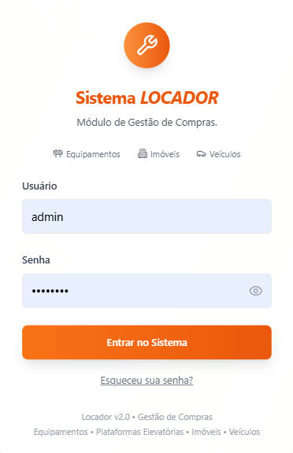
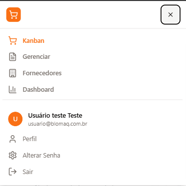

# 🖼️ Instruções para Integração de Imagens no Manual

## 📋 Resumo do Processo

Após capturar todas as 35 imagens conforme o **CHECKLIST_CAPTURAS.md**, você precisará integrar essas imagens no arquivo **MANUAL_USUARIO.md**. Este documento fornece instruções específicas para cada seção.

---

## 🔧 Sintaxe Básica do Markdown

```markdown


<!-- Para controlar tamanho -->


<!-- Para imagens lado a lado -->
<div style="display: flex; gap: 10px;">
  
  
</div>
```

---

## 📍 Locais Específicos para Inserção

### 1. **Seção: Bem-vindo ao Sistema de Gestão de Compras**
**Localização**: Após o parágrafo introdutório  
**Imagem**: `screenshots/01-login/01-login.png`
```markdown

*Figura 1: Tela de login do Sistema de Gestão de Compras*
```

### 2. **Seção: Navegação Principal**
**Localização**: Após "O sistema possui um menu intuitivo..."  
**Imagem**: `screenshots/02-navegacao/02-menu-superior.png`
```markdown

*Figura 2: Menu principal com todas as funcionalidades*
```

### 3. **Subseção: Processo de Compras**
**Localização**: Após "O Processo de Compras é o coração..."  
**Imagem**: `screenshots/03-kanban/03-kanban-geral.png`
```markdown

*Figura 3: Kanban com as 8 fases do processo de compras*
```

### 4. **Fase: Solicitação**
**Localização**: Após "Para criar uma nova solicitação..."  
**Imagens**: 
- `screenshots/04-solicitacao/04-nova-solicitacao.png`
- `screenshots/04-solicitacao/05-solicitacao-dados-basicos.png`
- `screenshots/04-solicitacao/06-solicitacao-itens.png`

```markdown

*Figura 4: Botão flutuante para criar nova solicitação*


*Figura 5: Seção de dados básicos da solicitação*


*Figura 6: Seção para adicionar itens à solicitação*
```

### 5. **Fase: Aprovação A1**
**Localização**: Após "Nesta fase, o gestor..."  
**Imagens**:
- `screenshots/05-aprovacoes/08-aprovacao-a1.png`
- `screenshots/05-aprovacoes/09-aprovacao-a1-reprovar.png`

```markdown

*Figura 7: Tela de aprovação A1 com detalhes da solicitação*


*Figura 8: Modal para reprovar solicitação com campo de motivo*
```

### 6. **Fase: Cotação (RFQ)**
**Localização**: Após "A fase de cotação permite..."  
**Imagens**:
- `screenshots/06-cotacao/10-cotacao-criar-rfq.png`
- `screenshots/06-cotacao/11-cotacao-fornecedores.png`
- `screenshots/06-cotacao/12-cotacao-upload-propostas.png`
- `screenshots/06-cotacao/13-cotacao-analise.png`

```markdown

*Figura 9: Formulário para criar Request for Quotation (RFQ)*


*Figura 10: Seleção de fornecedores para envio da cotação*


*Figura 11: Área para upload das propostas recebidas*


*Figura 12: Análise comparativa das propostas recebidas*
```

### 7. **Fase: Aprovação A2**
**Localização**: Após "Após a cotação..."  
**Imagens**:
- `screenshots/05-aprovacoes/14-aprovacao-a2.png`
- `screenshots/05-aprovacoes/15-aprovacao-a2-reprovar.png`

### 8. **Fase: Pedido de Compra**
**Localização**: Após "Com a aprovação A2..."  
**Imagens**:
- `screenshots/07-pedido/16-pedido-compra.png`
- `screenshots/07-pedido/17-pedido-pdf.png`

### 9. **Fase: Recebimento**
**Localização**: Após "O recebimento é controlado..."  
**Imagens**:
- `screenshots/08-recebimento/18-recebimento.png`
- `screenshots/08-recebimento/19-recebimento-pendencia.png`

### 10. **Fase: Conclusão de Compra**
**Localização**: Após "Na conclusão..."  
**Imagem**: `screenshots/09-conclusao/20-conclusao.png`

### 11. **Gestão de Fornecedores**
**Localização**: Após "O sistema permite..."  
**Imagens**:
- `screenshots/10-gestao/21-fornecedores.png`
- `screenshots/10-gestao/22-cadastro-fornecedor.png`

### 12. **Gestão de Usuários**
**Localização**: Após "Controle completo..."  
**Imagens**:
- `screenshots/10-gestao/23-usuarios.png`
- `screenshots/10-gestao/24-cadastro-usuario.png`

### 13. **Dashboard**
**Localização**: Após "O dashboard oferece..."  
**Imagem**: `screenshots/11-dashboard/29-dashboard.png`

### 14. **Uso em Dispositivos Móveis**
**Localização**: Após "O sistema é totalmente responsivo..."  
**Imagens**:
- `screenshots/01-login/01-login-mobile.png`
- `screenshots/02-navegacao/02-menu-mobile.png`
- `screenshots/13-extras/34-mobile-kanban.png`

```markdown
<div style="display: flex; gap: 15px; justify-content: center;">
  
  
  
</div>
*Figura X: Interface adaptada para dispositivos móveis*
```

---

## 🎨 Diretrizes de Formatação

### Padrão de Legendas
```markdown
*Figura X: Descrição clara e objetiva da imagem*
```

### Numeração Sequencial
- Manter numeração sequencial das figuras
- Começar com "Figura 1" e seguir ordem crescente
- Atualizar referências no texto quando necessário

### Tamanhos Recomendados
- **Imagens grandes** (kanban, dashboard): `width="800"`
- **Imagens médias** (formulários): `width="600"`
- **Imagens pequenas** (botões, modais): `width="400"`
- **Mobile**: `width="250"`

### Agrupamento de Imagens
Para sequências de passos, use:
```markdown
<div style="display: flex; gap: 10px; flex-wrap: wrap;">
  
  
  
</div>
```

---

## ✅ Checklist de Integração

### Antes de Começar
- [ ] Todas as 35 imagens foram capturadas
- [ ] Imagens estão nas pastas corretas
- [ ] Nomenclatura está padronizada
- [ ] Backup do MANUAL_USUARIO.md original

### Durante a Integração
- [ ] Inserir imagens na ordem correta
- [ ] Manter numeração sequencial das figuras
- [ ] Adicionar legendas descritivas
- [ ] Verificar caminhos das imagens
- [ ] Testar visualização no preview

### Após a Integração
- [ ] Revisar todo o manual
- [ ] Verificar se todas as imagens carregam
- [ ] Confirmar responsividade
- [ ] Validar acessibilidade (alt text)
- [ ] Testar em diferentes dispositivos

---

## 🔧 Comandos Úteis

### Para testar o manual localmente:
```bash
# Se usando um servidor local
python -m http.server 8000
# Acessar: http://localhost:8000/docs/MANUAL_USUARIO.md
```

### Para otimizar imagens (se necessário):
```bash
# Reduzir tamanho sem perder qualidade
# Use ferramentas como TinyPNG ou ImageOptim
```

---

## 📞 Suporte

Se encontrar dificuldades durante a integração:

1. **Verificar caminhos**: Confirme se os caminhos das imagens estão corretos
2. **Testar preview**: Use um visualizador de Markdown para testar
3. **Validar sintaxe**: Verifique se a sintaxe Markdown está correta
4. **Backup**: Sempre mantenha backup antes de grandes alterações

---

**Última Atualização**: Janeiro 2025  
**Versão**: 1.0