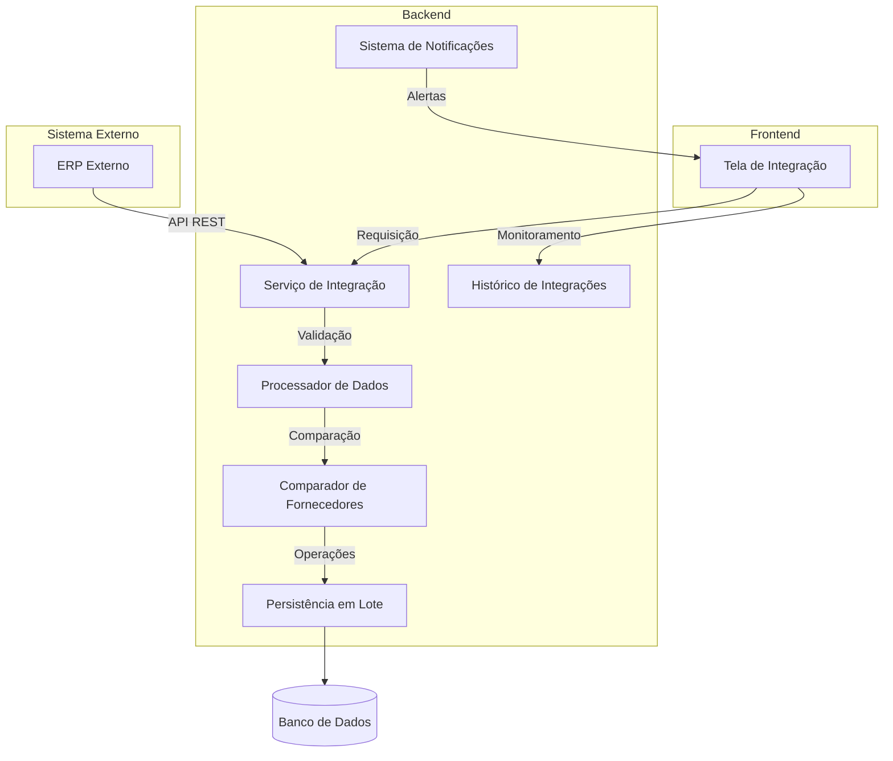
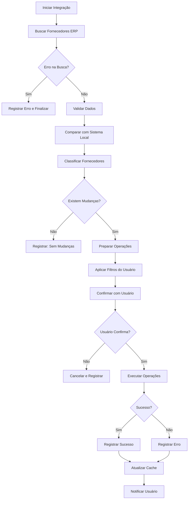

# Integração de Fornecedores com ERP - Documentação Técnica

## 1. Visão Geral

Este documento descreve a implementação do sistema de integração de fornecedores entre o sistema de gestão de compras e o ERP externo, permitindo a sincronização automatizada de dados de fornecedores.

### 1.1 Objetivos
- Sincronizar fornecedores do ERP com o sistema de gestão de compras
- Manter consistência de dados entre sistemas
- Automatizar o processo de atualização de fornecedores
- Garantir integridade e segurança dos dados

### 1.2 Escopo
- Integração unidirecional (ERP → Sistema)
- Sincronização de fornecedores ativos
- Atualização de dados existentes e criação de novos registros
- Interface de administração para controle do processo

## 2. Arquitetura da Solução

### 2.1 Diagrama de Arquitetura



### 2.2 Componentes Principais

1. **Serviço de Integração**: Responsável pela comunicação com o ERP
2. **Processador de Dados**: Valida e transforma os dados recebidos
3. **Comparador de Fornecedores**: Identifica diferenças entre sistemas
4. **Persistência em Lote**: Executa operações de banco de dados em massa
5. **Histórico de Integrações**: Registra todas as operações realizadas

## 3. Endpoints e APIs

### 3.1 Endpoints do ERP

Base URL: `http://54.232.194.197:5001/api`

#### GET /api/Fornecedor
- **Descrição**: Retorna lista de fornecedores
- **Parâmetros**:
  - `search` (opcional): Texto para busca
  - `limit` (opcional): Quantidade máxima de registros (padrão: 10)

- **Resposta de Sucesso** (200):
```json
[
  {
    "id": 1,
    "name": "Fornecedor Exemplo",
    "description": "Fornecedor Exemplo",
    "email": null,
    "phone": "(92) 2121-4650",
    "cnpj": "84.125.962/0001-67",
    "cpf": null,
    "address": null,
    "website": null,
    "contact": "Contato",
    "supplierType": 0
  }
]
```

#### GET /api/Fornecedor/GetCount
- **Descrição**: Retorna a contagem total de fornecedores considerando o filtro `search`
- **Parâmetros**: `search` (opcional)
- **Resposta**: número inteiro com total

#### GET /api/Fornecedor/{id}
- **Descrição**: Retorna detalhes de um fornecedor específico
- **Parâmetros**: `id` (path) - ID do fornecedor

### 3.2 Endpoints do Sistema

#### POST /api/erp-integration/suppliers/fetch
- **Descrição**: Inicia o processo de busca de fornecedores do ERP
- **Corpo da Requisição**:
```json
{
  "sync_type": "full|incremental",
  "filters": {
    "updated_after": "ISO 8601",
    "status": "active"
  }
}
```

#### POST /api/erp-integration/suppliers/process
- **Descrição**: Processa e aplica as integrações identificadas
- **Corpo da Requisição**:
```json
{
  "integration_id": "uuid",
  "selected_suppliers": ["supplier_id_1", "supplier_id_2"],
  "operation_type": "create|update|both"
}
```

#### GET /api/erp-integration/suppliers/comparison/{integration_id}
- **Descrição**: Retorna comparação detalhada entre sistemas

#### GET /api/erp-integration/history
- **Descrição**: Retorna histórico de integrações realizadas
- **Parâmetros**:
  - `page` (opcional): Número da página
  - `limit` (opcional): Quantidade de registros
  - `status` (opcional): Filtrar por status

## 4. Lógica de Comparação e Integração

### 4.1 Algoritmo de Comparação

A comparação segue a seguinte ordem de prioridade:

1. **idsuppliererp**: Se o ID do ERP já existe no sistema, o fornecedor é ignorado
2. **CNPJ**: Se encontrado, atualiza o idsuppliererp com o ID do ERP
3. **CPF**: Se encontrado (e CNPJ não existir), atualiza o idsuppliererp com o ID do ERP
4. **Nenhum encontrado**: Marca para criação de novo fornecedor

### 4.2 Fluxo de Integração



## 5. Estrutura de Dados

### 5.1 Tabela de Fornecedores (suppliers)

```sql
CREATE TABLE suppliers (
    id UUID PRIMARY KEY DEFAULT gen_random_uuid(),
    name VARCHAR(255) NOT NULL,
    cnpj VARCHAR(14) UNIQUE,
    cpf VARCHAR(11) UNIQUE,
    email VARCHAR(255),
    phone VARCHAR(20),
    idsuppliererp VARCHAR(100) UNIQUE,
    address JSONB,
    status VARCHAR(20) DEFAULT 'active',
    created_at TIMESTAMP WITH TIME ZONE DEFAULT NOW(),
    updated_at TIMESTAMP WITH TIME ZONE DEFAULT NOW(),
    CONSTRAINT check_cnpj_cpf CHECK (
        (cnpj IS NOT NULL AND cpf IS NULL) OR 
        (cnpj IS NULL AND cpf IS NOT NULL) OR
        (cnpj IS NULL AND cpf IS NULL)
    )
);
```

### 5.2 Tabela de Histórico de Integrações (integration_history)

```sql
CREATE TABLE supplier_integration_history (
    id UUID PRIMARY KEY DEFAULT gen_random_uuid(),
    integration_id UUID NOT NULL,
    operation_type VARCHAR(50) NOT NULL,
    supplier_id UUID,
    erp_supplier_id VARCHAR(100),
    supplier_name VARCHAR(255),
    action_taken VARCHAR(50) NOT NULL,
    status VARCHAR(20) NOT NULL,
    error_message TEXT,
    processed_data JSONB,
    created_at TIMESTAMP WITH TIME ZONE DEFAULT NOW(),
    created_by UUID REFERENCES users(id)
);
```

### 5.3 Tabela de Integrações em Processo (integration_queue)

```sql
CREATE TABLE supplier_integration_queue (
    id UUID PRIMARY KEY DEFAULT gen_random_uuid(),
    integration_id UUID NOT NULL,
    erp_supplier_id VARCHAR(100) NOT NULL,
    supplier_data JSONB NOT NULL,
    comparison_result VARCHAR(50) NOT NULL,
    action_required VARCHAR(50) NOT NULL,
    local_supplier_id UUID REFERENCES suppliers(id),
    status VARCHAR(20) DEFAULT 'pending',
    processed_at TIMESTAMP WITH TIME ZONE,
    created_at TIMESTAMP WITH TIME ZONE DEFAULT NOW()
);
```

## 6. Validações e Segurança

### 6.1 Validações de Dados

1. **CNPJ/CPF**: Validação de formato e dígitos verificadores
2. **Email**: Validação de formato RFC 5322
3. **Telefone**: Validação de formato brasileiro
4. **Endereço**: Validação de CEP e consistência de dados
5. **Duplicatas**: Verificação de CNPJ/CPF duplicados no lote

### 6.2 Segurança

1. **Autenticação**: Token JWT para acesso à API
2. **Autorização**: Permissões específicas para integração
3. **Rate Limiting**: Limite de requisições por minuto
4. **Criptografia**: Dados sensíveis criptografados em repouso
5. **Auditoria**: Registro de todas as operações
6. **Validação de Entrada**: Sanitização de todos os dados recebidos

### 6.3 Tratamento de Erros

1. **Timeout**: Configuração de timeout de 30 segundos para requisições
2. **Retry**: Mecanismo de retry com backoff exponencial
3. **Circuit Breaker**: Interrupção de requisições após múltiplas falhas
4. **Validação de Schema**: Rejeição de dados com estrutura inválida
5. **Rollback**: Capacidade de reverter operações em caso de erro

## 7. Performance e Escalabilidade

### 7.1 Otimizações

1. **Paginação**: Busca de fornecedores em lotes de 100 registros
2. **Índices**: Índices em campos de busca (cnpj, cpf, idsuppliererp)
3. **Cache**: Cache de fornecedores locais por 5 minutos
4. **Processamento Assíncrono**: Operações em background para grandes volumes
5. **Batch Operations**: Inserção/atualização em lotes de 50 registros

### 7.2 Métricas de Performance

- **Tempo de Resposta**: < 2 segundos para busca de até 1000 fornecedores
- **Throughput**: Capacidade de processar 10.000 fornecedores por minuto
- **Memória**: Uso máximo de 500MB para processamento de lotes grandes
- **Taxa de Erro**: < 0.1% em condições normais

## 8. Interface de Usuário

### 8.1 Componentes da Tela

1. **Botão Carregar Fornecedores**: Inicia o processo de busca
2. **Tabela de Comparação**: Exibe fornecedores com diferenças
3. **Filtros**: Permite filtrar por status, tipo de operação, nome
4. **Paginação**: Navegação entre páginas de resultados
5. **Botão Gravar**: Executa as operações selecionadas
6. **Barra de Progresso**: Mostra o andamento do processo
7. **Mensagens de Status**: Feedback sobre operações realizadas

### 8.2 Estados da Interface

- **Carregando**: Exibido durante busca de dados do ERP
- **Comparação**: Mostra fornecedores que precisam de ação
- **Confirmação**: Solicita confirmação do usuário antes de aplicar mudanças
- **Processando**: Executa operações em background
- **Concluído**: Mostra resumo das operações realizadas
- **Erro**: Exibe mensagens de erro e opções de retry

## 9. Monitoramento e Manutenção

### 9.1 Logs e Auditoria

Todos os eventos são registrados com:
- Timestamp preciso
- Usuário responsável
- Tipo de operação
- Dados antes/depois (para auditoria)
- Status e mensagens de erro

### 9.2 Alertas e Notificações

- **Falhas de Integração**: Notificação imediata para administradores
- **Grandes Volumes**: Alerta quando número de mudanças excede limite
- **Erros Críticos**: Notificação por email/SMS para equipe técnica
- **Sucesso**: Confirmação visual para usuário

### 9.3 Manutenção

- **Limpeza de Logs**: Remoção automática de logs antigos (> 90 dias)
- **Reindexação**: Manutenção periódica de índices de banco de dados
- **Validação de Integridade**: Verificação semanal de consistência de dados
- **Backup**: Backup automático antes de grandes integrações

## 10. Considerações de Deploy

### 10.1 Configuração de Ambiente

Variáveis de ambiente necessárias:
```bash
ERP_API_URL=http://54.232.194.197:5001
ERP_API_TIMEOUT=30000
ERP_API_KEY=your_api_key_here
SUPPLIER_INTEGRATION_BATCH_SIZE=50
SUPPLIER_INTEGRATION_CACHE_TTL=300
```

### 10.2 Rollback

Em caso de problemas, o sistema permite:
- Reversão de integrações específicas
- Restauração de backup pontual
- Desativação temporária da integração
- Execução de scripts de correção

## 11. Testes e Validação

### 11.1 Testes Automatizados

- **Unitários**: Validação de funções individuais
- **Integração**: Testes de comunicação com ERP
- **Carga**: Simulação de alto volume de dados
- **Regressão**: Garantia de não quebra de funcionalidades existentes

### 11.2 Casos de Teste

1. Integração com fornecedores novos
2. Atualização de fornecedores existentes
3. Tratamento de dados inválidos
4. Recuperação de falhas de comunicação
5. Performance com grandes volumes
6. Concorrência de múltiplos usuários

## 12. Conclusão

Esta arquitetura garante uma integração robusta, segura e escalável entre o sistema de gestão de compras e o ERP externo, mantendo a integridade dos dados e proporcionando uma experiência de usuário adequada para o processo de sincronização de fornecedores.