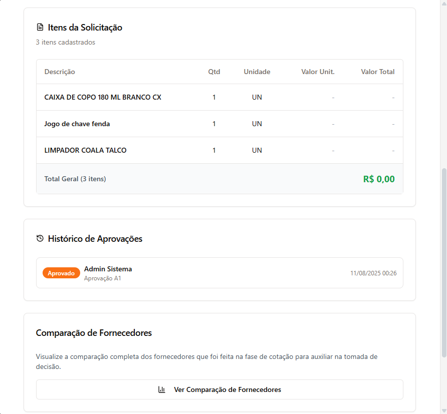
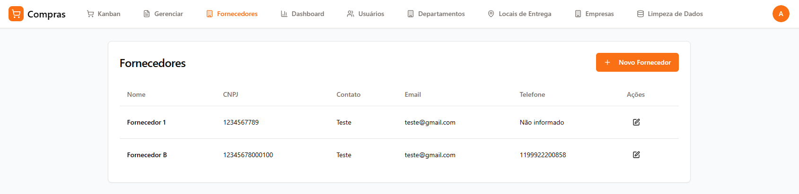
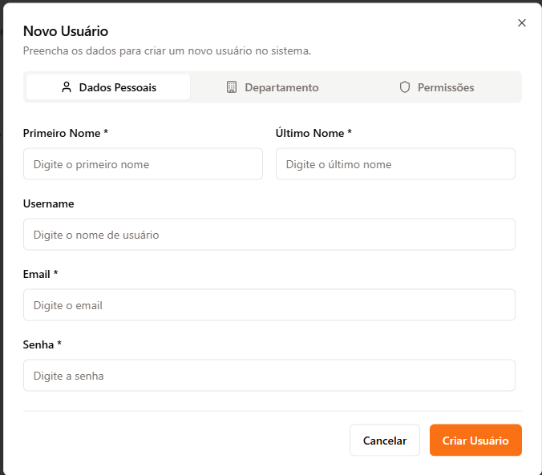
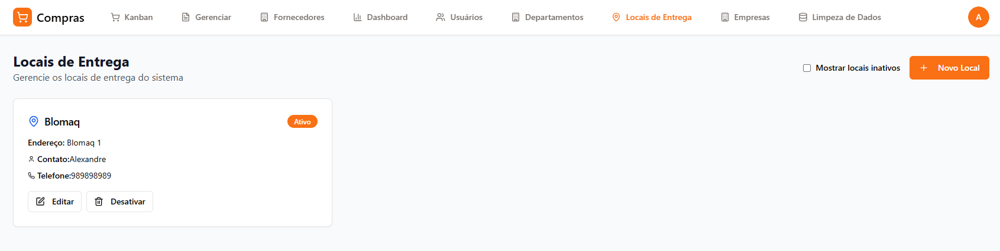

# 📖 Manual do Usuário - Sistema de Gestão de Compras

## 📋 Índice

1. [Bem-vindo ao Sistema de Gestão de Compras](#-bem-vindo-ao-sistema-de-gestão-de-compras)
2. [Políticas e Diretrizes de Compras](#-políticas-e-diretrizes-de-compras)
3. [Primeiros Passos](#-primeiros-passos)
4. [Navegação Principal](#-navegação-principal)
5. [Workflow de Compras - Guia Completo](#-workflow-de-compras---guia-completo)
6. [Gestão de Fornecedores](#-gestão-de-fornecedores)
7. [Gestão de Usuários](#-gestão-de-usuários)
8. [Gestão de Empresas](#-gestão-de-empresas)
9. [Gestão de Locais de Entrega](#-gestão-de-locais-de-entrega)
10. [Gestão de Departamentos](#-gestão-de-departamentos)
11. [Dashboard](#-dashboard)
12. [Configurações Pessoais](#-configurações-pessoais)
13. [Uso em Dispositivos Móveis](#-uso-em-dispositivos-móveis)
14. [Sistema de Notificações](#-sistema-de-notificações)
15. [Solução de Problemas Comuns](#-solução-de-problemas-comuns)
16. [Auditoria e Controles Internos](#-auditoria-e-controles-internos)
17. [Suporte e Contato](#-suporte-e-contato)
18. [Dicas e Boas Práticas](#-dicas-e-boas-práticas)
19. [Métricas e Indicadores](#-métricas-e-indicadores)
20. [Fluxo Completo - Exemplo Prático](#-fluxo-completo---exemplo-prático)

## 🎯 Bem-vindo ao Sistema de Gestão de Compras

Este manual irá guiá-lo através de todas as funcionalidades do sistema, desde o primeiro acesso até a conclusão completa de um processo de compra.

### O que você encontrará neste manual:
- **Navegação básica** e primeiros passos
- **Políticas e diretrizes** de compras
- **Processo completo de compras** (8 fases)
- **Gestão de fornecedores** e usuários
- **Configurações** e personalização
- **Dicas e boas práticas** para cada perfil
- **Solução de problemas** comuns

*Figura 1: Tela de login do Sistema de Gestão de Compras*

---

## 📜 Políticas e Diretrizes de Compras

### 🎯 Objetivo da Política

A Blomaq Locação de Equipamentos e Imóveis Ltda. estabelece diretrizes, critérios e procedimentos para as compras de materiais, produtos, insumos e contratação de serviços, conforme Política de Compras oficial (Versão 1.0 - 11/08/2025), visando assegurar:

- **Eficiência** no processo de aquisições
- **Controle** rigoroso das operações
- **Economicidade** na aplicação de recursos
- **Qualidade** dos produtos e serviços adquiridos
- **Transparência** em todas as etapas
- **Eficácia** na melhor condição de compra

### 🎯 Princípios Fundamentais

- **Obrigatoriedade do Fluxo**: Todas as solicitações devem passar pelo processo de compras oficial
- **Utilização do Sistema**: Uso obrigatório do Módulo de Compras integrado ao ERP
- **Classificação de Urgência**: Solicitantes devem classificar corretamente o grau de urgência
- **Controle de Assinaturas**: Todas as assinaturas corporativas devem ser gerenciadas pelo setor de compras
- **Ética e Integridade**: Relações comerciais sustentáveis e responsáveis
- **Transparência**: Todos os processos são rastreáveis e auditáveis
- **Conformidade**: Aderência às políticas internas e regulamentações

### 🏛️ Estrutura de Aprovações e Alçadas

#### Níveis de Aprovação por Valor

**📊 Nível 1 (N1) - Até R$ 2.500,00:**
- **Aprovador**: CFO (Chief Financial Officer)
- **Critério**: Validação da necessidade e adequação da solicitação
- **Processo**: Aprovação única para valores até R$ 2.500,00

**📊 Nível 2 (N2) - Acima de R$ 2.500,00:**
- **Aprovadores**: CFO + CEO (Chief Executive Officer)
- **Critério**: Dupla aprovação obrigatória para valores superiores
- **Processo**: Aprovação sequencial - primeiro CFO, depois CEO

#### Aprovação A1 (Primeira Aprovação)
- **Responsabilidade**: Aprovadores A1 designados por centro de custo
- **Critério**: Validação da necessidade e adequação da solicitação
- **Restrição**: Aprovadores só podem aprovar solicitações dos centros de custo aos quais estão associados
- **Ação**: Aprovação move para "Cotação" / Reprovação retorna para "Solicitação"

#### Aprovação A2 (Segunda Aprovação)
- **Responsabilidade**: Aprovadores A2 com visão ampla da organização
- **Critério**: Validação de valores, fornecedores e condições comerciais conforme alçadas estabelecidas
- **Flexibilidade**: Podem aprovar qualquer solicitação que chegue à fase A2
- **Opções de Reprovação**:
  - **Arquivar**: Para necessidades que não são mais válidas
  - **Nova Cotação**: Para refazer o processo de cotação

#### Signatários Autorizados (Blomaq)

**👨‍💼 CEO - Chief Executive Officer:**
- **Nome**: Bruno Derzi
- **Alçada**: Aprovação obrigatória para valores acima de R$ 2.500,00 (N2)
- **Responsabilidade**: Aprovação final em conjunto com CFO

**👨‍💼 CFO - Chief Financial Officer:**
- **Nome**: Fabrizio Toyoda
- **Alçada**: Aprovação para todos os valores (N1 e N2)
- **Responsabilidade**: Validação financeira e orçamentária

**👨‍💼 Suporte Compras:**
- **Nome**: Edson Derzi
- **Responsabilidade**: Apoio operacional ao processo de compras

> **⚠️ Importante**: Em caso de mudanças nos signatários, a atualização deve ser formalizada na política de compras.

### 💰 Diretrizes de Valores e Cotações

#### Orçamento e Planejamento
- Todas as solicitações devem ter **orçamento disponível** informado
- Valores devem ser **realistas** e baseados em pesquisa de mercado
- **Justificativa detalhada** é obrigatória para todas as solicitações
- **Classificação correta** do grau de urgência é obrigatória

#### Processo de Cotação Obrigatória
- **Cotação obrigatória** para todas as compras, independente do valor
- **Mínimo de 3 fornecedores** sempre que possível para competitividade
- **Análise comparativa** obrigatória antes da seleção
- **Justificativa da escolha** deve ser documentada detalhadamente
- **Negociação de valores** permitida e incentivada
- **Documentação completa** de todas as propostas recebidas

#### Exceções ao Processo
- **Fornecedor único**: Quando comprovadamente existe apenas um fornecedor
- **Urgência extrema**: Com justificativa e aprovação especial
- **Contratos vigentes**: Para itens já contratados em acordo marco

### 🏪 Critérios de Seleção de Fornecedores

#### Requisitos Obrigatórios
- **Regularidade fiscal e trabalhista**: Documentação em dia
- **Capacidade técnica**: Qualificação adequada para produtos/serviços
- **Estrutura logística**: Capacidade de cumprimento de prazos
- **Portfólio e certificações**: Quando aplicável ao tipo de aquisição
- **Cases anteriores**: Comprovação de experiência

#### Critérios de Desqualificação
- **Práticas ilegais**: Envolvimento em corrupção ou suborno
- **Violação do código de conduta**: Condutas incompatíveis com a ética Blomaq
- **Irregularidades documentais**: Documentação incompleta ou irregular
- **Incapacidade técnica**: Não atendimento aos requisitos mínimos

#### Avaliação Comercial
- **Competitividade de preços**: Análise comparativa obrigatória
- **Condições de pagamento**: Alinhamento com política financeira
- **Prazos de entrega**: Compatibilidade com necessidades
- **Garantias oferecidas**: Cobertura adequada para produtos/serviços

### 💳 Regras de Pagamento

#### Controle Financeiro
- **Previsibilidade**: Manutenção da saúde financeira e fluxo de caixa
- **Condições acordadas**: Pagamentos previamente negociados
- **Limites orçamentários**: Respeito aos budgets aprovados
- **Critérios padronizados**: Conformidade com diretrizes da empresa

#### Modalidades de Pagamento
- **À vista**: Para obtenção de descontos comerciais
- **Parcelado**: Conforme capacidade de fluxo de caixa
- **Faturamento**: Para fornecedores com relacionamento estabelecido
- **Cartão corporativo**: Para compras de menor valor e urgentes

#### Documentação Obrigatória
- **Nota fiscal**: Emissão obrigatória para todos os pagamentos
- **Ordem de compra**: Referência ao processo de aquisição
- **Comprovante de entrega**: Confirmação do recebimento
- **Aprovações**: Validação conforme alçadas estabelecidas

### 🏢 Segregação por Centro de Custo

#### Controle de Acesso
- **Aprovadores A1**: Limitados aos centros de custo associados
- **Solicitantes**: Podem criar solicitações conforme permissões:
  - **Gerentes**: Qualquer centro de custo disponível
  - **Demais usuários**: Apenas centros de custo associados
- **Administradores**: Acesso irrestrito a todos os centros

#### Responsabilidades
- Cada centro de custo deve ter **aprovadores designados**
- **Orçamentos específicos** por centro de custo
- **Relatórios segregados** para controle departamental

### 📋 Categorização e Urgência

#### Categorias de Compra
- **Produto**: Bens tangíveis e materiais
- **Serviço**: Prestação de serviços diversos
- **Outros**: Categorias especiais conforme necessidade

#### Níveis de Urgência
- **Alto**: Necessidade imediata (até 7 dias)
- **Médio**: Necessidade moderada (até 15 dias)
- **Baixo**: Planejamento normal (mais de 15 dias)

### 🔒 Controles e Auditoria

#### Rastreabilidade Completa
- **Histórico completo** de todas as ações no sistema
- **Timestamps** de cada movimentação
- **Identificação** de todos os usuários envolvidos
- **Justificativas** documentadas para todas as decisões
- **Controle de alçadas** conforme valores (N1/N2)
- **Auditoria de aprovações** por nível hierárquico

#### Notificações e Alertas
- **E-mails automáticos** para todas as transições
- **Notificações direcionadas** conforme permissões e alçadas
- **Alertas de prazo** para ações pendentes
- **Notificações de aprovação** para CFO e CEO conforme valor
- **Alertas de compliance** para desvios do processo

### 📊 Métricas e Indicadores

#### Acompanhamento de Performance
- **Tempo médio** de aprovação por fase e alçada
- **Taxa de aprovação** por aprovador (CFO/CEO)
- **Economia obtida** através de negociações
- **Desempenho de fornecedores** e qualidade das entregas
- **Aderência à política** de compras estabelecida
- **Eficiência do processo** por nível de aprovação

#### Relatórios Gerenciais
- **Dashboard executivo** com indicadores-chave por alçada
- **Relatórios por departamento** e centro de custo
- **Análise de tendências** e padrões de compra
- **Controle de gastos** por nível de aprovação (N1/N2)
- **Relatórios de compliance** com a política Blomaq

### ⚠️ Compliance e Boas Práticas

#### Obrigatoriedades da Política Blomaq
- **Uso obrigatório do sistema** para todas as compras
- **Documentação completa** de todas as solicitações
- **Cotação obrigatória** para todas as compras, independente do valor
- **Aprovações sequenciais** conforme alçadas estabelecidas (N1/N2)
- **Recebimento formal** de todos os itens
- **Classificação correta** do grau de urgência
- **Controle centralizado** de assinaturas corporativas

#### Recomendações
- **Planejamento antecipado** das necessidades
- **Relacionamento ético** com fornecedores
- **Busca contínua** por melhores condições
- **Feedback constante** sobre o processo
- **Sustentabilidade** nas escolhas de fornecedores
- **Economicidade** na aplicação de recursos

---

## 🚀 Primeiros Passos

### Acessando o Sistema

1. **Abra seu navegador** e acesse o endereço do sistema
2. **Tela de Login**: Digite seu usuário/email e senha
3. **Esqueceu a senha?**: Clique em "Esqueci minha senha" para redefinir

  

*Figura 2: Tela de login em desktop e dispositivos móveis*

### Primeiro Acesso
- Você receberá suas credenciais do administrador do sistema
- É recomendado alterar sua senha no primeiro acesso
- Acesse **Perfil** → **Alterar Senha** para definir uma nova senha

---

## 🏠 Navegação Principal

### Menu Superior
O sistema possui um menu superior com as seguintes opções:

*Figura 3: Menu principal com todas as funcionalidades*

  
   
  

*Figura 4: Menu de navegação em desktop e dispositivos móveis*

#### 🏢 **Processo de Compras** (Kanban)
- Visualização principal do sistema
- Mostra todas as solicitações em formato Kanban
- Permite arrastar cards entre as fases

*Figura 5: Kanban com as 8 fases do processo de compras*

*Figura 6: Visualização detalhada dos cards no Kanban*

  
   
  

*Figura 7: Kanban em desktop e dispositivos móveis*

#### 📊 **Dashboard** (Apenas Gerentes)
- Métricas e indicadores do sistema
- Gráficos de performance
- Relatórios executivos

#### 📋 **Gestão de Solicitações**
- Lista completa de solicitações
- Filtros avançados
- Busca por número ou descrição

#### 🏭 **Empresas** (Apenas Administradores)
- Cadastro e gestão de empresas
- Upload de logos
- Dados corporativos

#### 🚚 **Fornecedores** (Compradores e Administradores)
- Cadastro de fornecedores
- Dados de contato e condições
- Histórico de cotações

#### 👥 **Usuários**
- Gestão de usuários do sistema
- Permissões e roles
- Associação com departamentos

#### 🏢 **Departamentos**
- Estrutura organizacional
- Centros de custo
- Hierarquia empresarial

#### 📍 **Locais de Entrega**
- Endereços para entrega
- Contatos e observações
- Ativação/desativação

---

## 🔄 Workflow de Compras - Guia Completo

O sistema utiliza um workflow Kanban com 8 fases fixas. Cada fase tem responsáveis específicos e ações permitidas.

### 📝 Fase 1: Solicitação

#### Quem pode usar: Todos os usuários autenticados

#### Como criar uma nova solicitação:

1. **Clique no botão "+" flutuante** (canto inferior direito) ou
2. **Menu** → **Nova Solicitação**

*Figura 8: Botão flutuante para criar nova solicitação*

#### Preenchendo o formulário:

*Figura 9: Seção de dados básicos da solicitação*

**📋 Dados Obrigatórios:**
- **Empresa**: Selecione a empresa (geralmente pré-selecionada)
- **Centro de Custo**: Escolha o centro de custo apropriado
  - **Gerentes**: Podem selecionar qualquer centro de custo da empresa
  - **Outros usuários**: Limitados aos centros de custo associados
- **Categoria**: 
  - 🔧 **Produto**: Materiais físicos, equipamentos
  - 🛠️ **Serviço**: Manutenção, consultoria, treinamento
  - 📦 **Outros**: Demais necessidades
- **Urgência**:
  - 🟢 **Baixo**: Processo normal (15-30 dias)
  - 🟡 **Médio**: Necessidade moderada (7-15 dias)
  - 🔴 **Alto**: Urgente (até 7 dias)
  - 🔵 **Muito Alto**: Crítico (até 3 dias)
- **Justificativa**: Explique detalhadamente a necessidade

**📦 Itens da Solicitação:**
Para cada item, informe:
- **Descrição**: Nome/descrição do produto/serviço
- **Unidade**: UN, KG, M², HR, etc.
- **Quantidade**: Quantidade necessária
- **Especificação Técnica**: Detalhes técnicos, marca preferida, normas

  
  

*Figura 10: Seção para adicionar itens - entrada manual e integração com ERP*

**📅 Dados Opcionais:**
- **Prazo Ideal de Entrega**: Quando você precisa receber
- **Orçamento Disponível**: Valor estimado/limite
- **Informações Adicionais**: Observações extras

#### Dicas importantes:
- ✅ Seja específico nas especificações técnicas
- ✅ Justifique adequadamente a necessidade
- ✅ Verifique se o centro de custo está correto
- ✅ Revise todos os dados antes de enviar

#### Após criar a solicitação:
- O sistema gera um **número único** (ex: SOL-2025-001)
- A solicitação aparece na fase "Solicitação" do Kanban
- **Aprovadores A1** recebem notificação por e-mail
- Você pode **editar** a solicitação enquanto estiver nesta fase

### ✅ Fase 2: Aprovação A1

#### Quem pode usar: Usuários com permissão "Aprovador A1"

#### Restrições importantes:
- Aprovadores A1 só veem solicitações dos **centros de custo associados** ao seu perfil
- Não é possível aprovar solicitações de outros centros de custo
- O sistema **valida automaticamente** se você tem permissão para aprovar cada solicitação
- Se não tiver permissão, será exibida a mensagem: *"Você não tem permissão para aprovar este centro de custo"*
- Os botões de aprovação só aparecem para solicitações que você pode aprovar
- A validação ocorre tanto no **frontend** quanto no **backend** para máxima segurança

#### Como aprovar/reprovar:

1. **Acesse o Kanban** e localize a solicitação na coluna "Aprovação A1"
2. **Clique no card** para ver os detalhes
3. **Revise cuidadosamente**:
   - Justificativa da necessidade
   - Especificações técnicas dos itens
   - Orçamento disponível
   - Urgência solicitada

  
  

*Figura 11: Cards na fase Aprovação A1 - com e sem autorização para aprovar*

  
  

*Figura 12: Tela de aprovação A1 - usuário autorizado vs não autorizado*

#### Opções disponíveis:

**✅ Aprovar:**
- Clique em **"Aprovar"**
- A solicitação move automaticamente para **"Cotação"**
- **Compradores** recebem notificação
- Histórico de aprovação é registrado

**❌ Reprovar:**
- Clique em **"Reprovar"**
- **Obrigatório**: Informe o motivo da reprovação
- A solicitação volta para **"Solicitação"**
- Solicitante recebe notificação com o motivo
- Solicitante pode corrigir e reenviar

*Figura 13: Modal para reprovar solicitação com campo de motivo*

#### Dicas para aprovadores A1:
- ✅ Verifique se a necessidade está bem justificada
- ✅ Confirme se o centro de custo está correto
- ✅ Avalie se a urgência é adequada
- ✅ Seja específico nos motivos de reprovação

### 💰 Fase 3: Cotação (RFQ)

#### Quem pode usar: Usuários com permissão "Comprador"

Esta é uma das fases mais importantes do processo, onde são obtidas as propostas dos fornecedores.

#### Criando uma RFQ (Request for Quotation):

1. **Clique no card** da solicitação na coluna "Cotação"
2. **Clique em "Criar Solicitação de Cotação"**

*Figura 14: Card na fase Cotação com opção para criar RFQ*

#### Preenchendo a RFQ:

**📋 Dados da Cotação:**
- **Número da Cotação**: Gerado automaticamente
- **Local de Entrega**: Selecione onde o material deve ser entregue
- **Prazo para Cotação**: Data limite para fornecedores responderem
- **Termos e Condições**: Condições gerais da cotação
- **Especificações Técnicas**: Detalhes técnicos consolidados

  
  

*Figura 15: Formulário de criação de RFQ - dados básicos e especificações*

  
  

*Figura 16: Formulário de RFQ - termos e condições e finalização*

**🏭 Seleção de Fornecedores:**
- Marque os fornecedores que devem receber a RFQ
- Mínimo: 1 fornecedor
- Recomendado: 3 ou mais para competitividade

  
  
  

*Figura 17: Processo de seleção de fornecedores para a RFQ*

#### Enviando a RFQ:

1. **Clique em "Enviar RFQ para Fornecedores"**
2. O sistema envia **automaticamente** e-mails para todos os fornecedores selecionados
3. E-mail contém:
   - Dados da empresa
   - Detalhes da cotação
   - Itens solicitados
   - Prazo de resposta
   - Instruções para envio da proposta

#### Recebendo e Analisando Propostas:

**📄 Upload de Propostas:**
- Fornecedores enviam propostas por e-mail
- Comprador faz upload dos arquivos no sistema
- Tipos aceitos: PDF, DOC, DOCX, XLS, XLSX, TXT, PNG, JPG
- Limite: 10MB por arquivo

  
  

*Figura 18: Área de upload de propostas e arquivos enviados*

**📊 Análise Comparativa:**
- Compare preços, prazos e condições
- Avalie qualidade técnica das propostas
- Considere histórico do fornecedor
- Negocie melhorias se necessário

  
  
  

*Figura 19: Análise comparativa das propostas e seleção do fornecedor vencedor*

**🏆 Seleção do Vencedor:**
- Marque o fornecedor escolhido
- Informe o motivo da escolha:
  - Melhor preço
  - Melhor prazo
  - Melhor qualidade
  - Melhor relacionamento
  - Outros motivos
- Registre valor negociado
- Informe descontos obtidos

#### Funcionalidades Especiais:

**🔄 Nova RFQ:**
- Se necessário, crie uma nova versão da RFQ
- Útil quando A2 reprova e solicita recotação
- Mantém histórico de todas as versões

**📚 Histórico de RFQs:**
- Visualize todas as versões criadas
- Compare resultados entre versões
- Auditoria completa do processo

**🏷️ Badge "Nec.Cotação":**
- Aparece quando A2 reprova e solicita nova cotação
- Indica que é necessária uma recotação
- Prioridade no atendimento

#### Finalizando a Cotação:
- Após selecionar o vencedor, a solicitação está pronta para A2
- Clique em **"Enviar para Aprovação A2"**
- **Aprovadores A2** recebem notificação

### ✅ Fase 4: Aprovação A2

#### Quem pode usar: Usuários com permissão "Aprovador A2"

Esta é a aprovação final antes da geração do pedido de compra.

#### Como aprovar/reprovar:

1. **Clique no card** na coluna "Aprovação A2"
2. **Revise detalhadamente**:
   - Resultado da cotação
   - Fornecedor selecionado
   - Valores negociados
   - Justificativa da escolha
   - Condições de pagamento

  
  

*Figura 20: Cards na fase Aprovação A2 - com e sem autorização para aprovar*

  
  
  

*Figura 21: Tela de aprovação A2 - visualização completa do resultado da cotação*

#### Opções disponíveis:

**✅ Aprovar:**
- Clique em **"Aprovar"**
- A solicitação move para **"Pedido de Compra"**
- **Compradores** recebem notificação
- Processo pode prosseguir

**❌ Reprovar com duas opções:**

**1. 🗃️ Arquivar Definitivamente:**
- Use quando a necessidade não é mais válida
- Solicitação vai direto para **"Arquivado"**
- Processo é encerrado

**2. 🔄 Retornar para Nova Cotação:**
- Use quando cotação precisa ser refeita
- Solicitação volta para **"Cotação"**
- Badge "Nec.Cotação" aparece no card
- Comprador deve criar nova RFQ

*Figura 22: Modal de reprovação A2 com opções de arquivar ou nova cotação*

#### Dicas para aprovadores A2:
- ✅ Avalie se o fornecedor escolhido é adequado
- ✅ Verifique se os valores estão dentro do orçamento
- ✅ Confirme se as condições são favoráveis
- ✅ Considere o histórico do fornecedor

### 📋 Fase 5: Pedido de Compra

#### Quem pode usar: Usuários com permissão "Comprador"

Nesta fase é gerado o pedido oficial de compra.

#### Funcionalidades disponíveis:

*Figura 23: Card na fase Pedido de Compra*

**📄 Visualização do Pedido:**
- PDF é gerado automaticamente
- Contém todos os dados da empresa
- Logo da empresa (se cadastrado)
- Dados completos do fornecedor
- Itens com preços e especificações
- Assinaturas eletrônicas com datas

  
  

*Figura 24: Tela de visualização e edição do pedido de compra*

**📝 Observações do Pedido:**
- Campo para observações específicas
- Instruções especiais para o fornecedor
- Condições particulares
- Informações de entrega

**🖨️ Ações disponíveis:**
- **Visualizar PDF**: Abre o pedido em nova janela
- **Baixar PDF**: Download do arquivo
- **Editar Observações**: Adicionar/alterar observações
- **Avançar para Recebimento**: Confirma envio do pedido

  
  

*Figura 25: PDF do pedido de compra gerado automaticamente*

#### Dados incluídos no PDF:

**🏢 Dados da Empresa:**
- Logo (se cadastrado)
- Nome e razão social
- CNPJ e endereço
- Telefone e e-mail

**🏭 Dados do Fornecedor:**
- Nome e CNPJ
- Endereço e contatos
- Condições de pagamento
- Prazo de entrega

**📦 Itens do Pedido:**
- Código e descrição
- Quantidade e unidade
- Preço unitário e total
- Marca (se informada)

**✍️ Assinaturas Eletrônicas:**
- Solicitante (Comprador)
- Liberador (Aprovador A2)
- Datas e horários automáticos

#### Finalizando o Pedido:
- Após revisar, clique em **"Avançar para Recebimento"**
- **Recebedores** são notificados
- PDF final é gerado e arquivado

### 📦 Fase 6: Recebimento

#### Quem pode usar: Usuários com permissão "Recebedor"

Fase de recebimento e conferência dos materiais.

#### Informações disponíveis:

*Figura 26: Card na fase Recebimento*

**📋 Dados do Pedido:**
- Número do pedido
- Fornecedor e dados de contato
- Itens solicitados
- Prazos de entrega
- **Observações do Pedido**: Destacadas em azul

  
  

*Figura 27: Tela de recebimento com dados do pedido e opções de ação*

**📊 Status do Recebimento:**
- Pendente
- Recebido parcialmente
- Recebido completamente
- Com pendências

#### Ações disponíveis:

**✅ Confirmar Recebimento:**
- Material recebido conforme pedido
- Qualidade aprovada
- Quantidades corretas
- Move para **"Conclusão"**

**⚠️ Registrar Pendência:**
- Material não conforme
- Quantidades incorretas
- Problemas de qualidade
- Atraso na entrega
- **Obrigatório**: Descrever o problema
- Retorna para **"Pedido de Compra"**
- Badge "Pendência" aparece no card

  
  

*Figura 28: Modal para registrar pendências e notificação de pendência*

#### Controle de Qualidade:
- ✅ Confira se os itens estão conforme especificação
- ✅ Verifique quantidades
- ✅ Teste funcionalidades (se aplicável)
- ✅ Documente problemas encontrados

### 🎯 Fase 7: Conclusão de Compra

#### Quem pode acessar: Todos os usuários (visualização)

Fase final com resumo completo do processo.

#### Informações exibidas:

*Figura 29: Card na fase Conclusão de Compra*

**📊 Métricas do Processo:**
- **Tempo Total**: Dias desde a criação
- **Valor Total**: Soma de todos os itens
- **Fornecedor Selecionado**: Dados do vencedor

  
  

*Figura 30: Tela de conclusão com métricas e dados do processo*

**👤 Dados do Processo:**
- **Solicitante**: Quem criou a solicitação
- **Centro de Custo**: Onde será debitado
- **Departamento**: Área solicitante

**📈 Timeline Completa:**
- Histórico de todas as fases
- Usuários responsáveis por cada ação
- Datas e horários precisos
- Motivos de reprovações (se houver)

**📎 Anexos Disponíveis:**
- **Anexos da Solicitação**: Documentos iniciais
- **Anexos de Cotações**: Propostas dos fornecedores
- Download individual de cada arquivo

**🖨️ Função de Impressão:**
- Gera relatório completo para impressão
- Inclui todas as informações da tela
- Layout otimizado para papel

  
  

*Figura 31: Timeline completa, anexos disponíveis e função de impressão*

#### Finalizando:
- Clique em **"Arquivar"** para mover para a fase final
- Processo é considerado concluído

### 🗃️ Fase 8: Arquivado

#### Acesso: Somente leitura para auditoria

- Processos finalizados
- Dados preservados para histórico
- Consulta para auditoria
- Relatórios e estatísticas

---

## 🏭 Gestão de Fornecedores

### Acessando Fornecedores
**Menu** → **Fornecedores** (disponível para Compradores e Administradores)

*Figura 32: Lista de fornecedores cadastrados no sistema*

### Cadastrando Novo Fornecedor

1. **Clique em "Novo Fornecedor"**
2. **Preencha os dados obrigatórios:**
   - **Nome**: Razão social do fornecedor
   - **CNPJ**: Validação automática
   - **Contato**: Pessoa responsável
   - **E-mail**: Para recebimento de RFQs
   - **Telefone**: Contato direto

3. **Dados opcionais:**
   - **Endereço**: Endereço completo
   - **Condições de Pagamento**: Ex: "30/60/90 dias"
   - **Produtos/Serviços**: Descrição do que oferece

*Figura 33: Formulário de cadastro de novo fornecedor*

### Editando Fornecedores
- Clique no ícone de edição
- Altere os dados necessários
- Salve as alterações

### Excluindo Fornecedores
- Clique no ícone de lixeira
- Confirme a exclusão
- **Atenção**: Não é possível excluir fornecedores com cotações ativas

---

## 👥 Gestão de Usuários

### Acessando Usuários
**Menu** → **Usuários**

*Figura 34: Lista de usuários e suas permissões*

### Criando Novo Usuário

1. **Clique em "Novo Usuário"**
2. **Dados pessoais:**
   - **Nome de usuário**: Login único
   - **E-mail**: E-mail válido
   - **Nome** e **Sobrenome**
   - **Senha**: Mínimo 6 caracteres

3. **Associações:**
   - **Empresa**: Selecione a empresa
   - **Departamento**: Departamento do usuário

4. **Permissões** (marque as aplicáveis):
   - ☑️ **Comprador**: Pode gerenciar cotações e pedidos
   - ☑️ **Aprovador A1**: Primeira aprovação (restrito aos centros de custo associados)
   - ☑️ **Aprovador A2**: Segunda aprovação
   - ☑️ **Administrador**: Acesso total ao sistema
   - ☑️ **Gerente**: Acesso a dashboards e criação de solicitações para qualquer centro de custo

  
  
  

*Figura 35: Formulário de cadastro de usuário com dados pessoais e permissões*
   - ☑️ **Recebedor**: Pode receber materiais

### Editando Usuários
- Clique no ícone de edição
- Altere dados e permissões
- **Não é possível alterar**: Username (após criação)

### Associando Centros de Custo (Aprovadores A1)
- Usuários com permissão "Aprovador A1" devem ter centros de custo associados
- Clique em "Editar" → "Centros de Custo"
- Selecione os centros que o usuário pode aprovar

---

## 🏢 Gestão de Empresas (Administradores)

### Cadastrando Nova Empresa

*Figura 36: Lista de empresas cadastradas*

1. **Menu** → **Empresas** → **"Nova Empresa"**
2. **Dados obrigatórios:**
   - **Nome**: Razão social
   - **Nome Fantasia**: Nome comercial
   - **CNPJ**: Validação automática

3. **Dados de contato:**
   - **Endereço**: Endereço completo
   - **Telefone** e **E-mail**

4. **Logo da empresa:**
   - Clique em "Selecionar arquivo"
   - Formatos: PNG, JPG, JPEG
   - Tamanho máximo: 5MB
   - Logo é convertida para base64 automaticamente

  
  

*Figura 37: Formulário de cadastro e edição de empresa*

### Ativando/Desativando Empresas
- Use o switch "Ativa" para ativar/desativar
- Empresas inativas não aparecem em formulários
- Dados são preservados para auditoria

---

## 📍 Gestão de Locais de Entrega

### Cadastrando Local de Entrega

*Figura 39: Lista de locais de entrega cadastrados*

1. **Menu** → **Locais de Entrega** → **"Novo Local"**
2. **Dados obrigatórios:**
   - **Nome**: Identificação do local
   - **Endereço**: Endereço completo

3. **Dados opcionais:**
   - **Pessoa de Contato**: Responsável no local
   - **Telefone** e **E-mail**
   - **Observações**: Instruções especiais

### Ativando/Desativando Locais
- Use o switch para ativar/desativar
- Locais inativos não aparecem em RFQs
- Filtro "Mostrar locais inativos" para reativação

---

## 🏢 Gestão de Departamentos

### Estrutura Organizacional
- **Empresas** → **Departamentos** → **Centros de Custo**
- Hierarquia bem definida
- Controle de permissões por nível

### Cadastrando Departamento
1. **Menu** → **Departamentos** → **"Novo Departamento"**
2. **Dados:**
   - **Nome**: Nome do departamento
   - **Descrição**: Função do departamento
   - **Empresa**: Empresa proprietária

### Cadastrando Centro de Custo
1. **Clique em "Novo Centro de Custo"**
2. **Dados:**
   - **Código**: Código único (ex: CC001)
   - **Nome**: Nome do centro
   - **Departamento**: Departamento pai

  
  

*Figura 38: Gestão de departamentos e centros de custo*

---

## 📊 Dashboard (Gerentes)

### Acessando o Dashboard
**Menu** → **Dashboard** (apenas usuários com permissão "Gerente")

*Figura 40: Dashboard com métricas e indicadores*

### Métricas Disponíveis
- **Solicitações por Status**: Distribuição por fase
- **Tempo Médio de Processo**: Performance temporal
- **Volume por Período**: Tendências mensais
- **Taxa de Aprovação**: Eficiência do processo
- **Fornecedores Mais Utilizados**: Ranking de parceiros

### Filtros Disponíveis
- **Período**: Últimos 30, 60, 90 dias ou personalizado
- **Empresa**: Filtro por empresa específica
- **Departamento**: Filtro por departamento
- **Status**: Filtro por fase do processo

---

## 🔧 Configurações Pessoais

### Acessando o Perfil
**Menu do usuário** (canto superior direito) → **Perfil**

  
  

*Figura 41: Perfil do usuário e alteração de senha*

### Alterando Dados Pessoais
- **Nome** e **Sobrenome**
- **E-mail**: Usado para notificações
- **Telefone**: Contato opcional

### Alterando Senha
1. **Menu do usuário** → **Alterar Senha**
2. **Digite**:
   - Senha atual
   - Nova senha
   - Confirmação da nova senha
3. **Clique em "Alterar Senha"**

### Recuperação de Senha
1. **Tela de login** → **"Esqueci minha senha"**
2. **Digite seu e-mail**
3. **Verifique sua caixa de entrada**
4. **Clique no link recebido**
5. **Digite a nova senha**

---

## 📱 Uso em Dispositivos Móveis

### Design Responsivo
- Sistema otimizado para tablets e smartphones
- Layout adaptativo
- Navegação touch-friendly

### Funcionalidades Mobile
- ✅ Visualização do Kanban
- ✅ Criação de solicitações
- ✅ Aprovações A1 e A2
- ✅ Upload de arquivos
- ✅ Visualização de PDFs
- ✅ Notificações por e-mail

### Dicas para Mobile
- Use orientação paisagem para melhor visualização do Kanban
- Toque longo para acessar menus contextuais
- Deslize para navegar entre colunas

---

## 🔔 Sistema de Notificações

### Notificações Automáticas por E-mail

**📧 Quando você recebe notificações:**
- **Nova solicitação criada** (se você é Aprovador A1 do centro de custo)
- **Solicitação aprovada em A1** (se você é Comprador)
- **RFQ criada** (se você é Fornecedor selecionado)
- **Solicitação aprovada em A2** (se você é Comprador)
- **Pedido gerado** (se você é Recebedor)
- **Solicitação reprovada** (se você é o Solicitante)

**📧 Conteúdo das notificações:**
- Número da solicitação
- Dados básicos do processo
- Link direto para o sistema
- Instruções sobre próximos passos

### Configurações de E-mail
- Verifique se seu e-mail está correto no perfil
- Adicione o remetente do sistema à lista de contatos seguros
- Verifique a pasta de spam se não receber notificações

---

## 🚨 Solução de Problemas Comuns

### Problemas de Login
**❌ "Usuário ou senha incorretos"**
- Verifique se está digitando corretamente
- Use "Esqueci minha senha" se necessário
- Contate o administrador se persistir

**❌ "Sessão expirada"**
- Faça login novamente
- Sessões expiram após período de inatividade

### Problemas de Permissão
**❌ "Você não tem permissão para esta ação"**
- Verifique se tem a permissão necessária
- Contate o administrador para ajustar permissões

**❌ "Não vejo solicitações para aprovar"**
- Aprovadores A1: Verifique se tem centros de custo associados
- Contate o administrador para configurar

### Problemas de Upload
**❌ "Arquivo muito grande"**
- Limite máximo: 10MB
- Comprima o arquivo se necessário

**❌ "Tipo de arquivo não suportado"**
- Tipos aceitos: PDF, DOC, DOCX, XLS, XLSX, TXT, PNG, JPG
- Converta para um formato suportado

### Problemas de E-mail
**❌ "Não recebo notificações"**
- Verifique se o e-mail está correto no perfil
- Verifique pasta de spam
- Contate o administrador para verificar configurações

### Problemas de Performance
**❌ "Sistema lento"**
- Verifique sua conexão com a internet
- Feche outras abas do navegador
- Limpe cache do navegador

---

## 🔍 Auditoria e Controles Internos

### Rastreabilidade Completa
O sistema mantém registro detalhado de todas as ações:
- **Log de ações** - Quem fez o quê e quando
- **Histórico de alterações** - Todas as modificações são registradas
- **Trilha de aprovações** - Caminho completo das decisões
- **Anexos versionados** - Controle de documentos enviados

### Segregação de Funções
- **Solicitantes** não podem aprovar suas próprias solicitações
- **Aprovadores A1** limitados aos seus centros de custo
- **Compradores** não podem aprovar cotações
- **CFO (Fabrizio Toyoda)** - Aprovação para todos os valores (N1 e N2)
- **CEO (Bruno Derzi)** - Aprovação obrigatória para valores acima de R$ 2.500 (N2)
- **Suporte Compras (Edson Derzi)** - Apoio operacional sem poder de aprovação
- **Recebedores** confirmam entregas de forma imparcial

### Controles Automáticos
- ✅ **Validação de permissões** em tempo real
- ✅ **Controle de alçadas** - N1 (até R$ 2.500) e N2 (acima R$ 2.500)
- ✅ **Notificações direcionadas** - CFO para N1, CFO+CEO para N2
- ✅ **Bloqueios por valor** - Sistema impede aprovações fora da alçada
- ✅ **Dupla aprovação automática** - Para valores N2 (CFO + CEO)
- ✅ **Backup automático** de todos os dados
- ✅ **Logs de segurança** para auditoria
- ✅ **Conformidade Blomaq** - Validação automática da política

### Relatórios de Auditoria
Disponíveis no dashboard para gestores:
- **Tempo médio por fase** do processo
- **Taxa de aprovação/reprovação** por aprovador
- **Fornecedores mais utilizados** e performance
- **Centros de custo** com maior volume
- **Usuários mais ativos** no sistema

### Compliance e Governança
- 📋 **Política Blomaq integrada** - Versão 1.0 (11/08/2025) incorporada ao sistema
- 🔒 **Controle de acesso** - Permissões baseadas em alçadas (N1/N2)
- 📊 **Métricas de compliance** - Indicadores de aderência à política
- 🎯 **Alertas automáticos** - Notificações de desvios das alçadas
- ⚖️ **Conformidade Blomaq** - Atendimento às diretrizes corporativas
- 👥 **Signatários autorizados** - CFO, CEO e Suporte Compras identificados
- 💰 **Controle financeiro** - Validação automática de limites por valor
- 📝 **Documentação obrigatória** - Conforme exigências da política

---

## 📞 Suporte e Contato

### Quando Contatar o Suporte
- Problemas técnicos persistentes
- Dúvidas sobre permissões
- Solicitação de novos usuários
- Configurações de empresa/departamento
- Problemas com notificações

### Informações para o Suporte
Ao entrar em contato, forneça:
- **Seu nome de usuário**
- **Descrição detalhada do problema**
- **Passos que levaram ao erro**
- **Mensagem de erro (se houver)**
- **Navegador utilizado**
- **Horário aproximado do problema**

### Administrador do Sistema
- Responsável por configurações gerais
- Criação de usuários e permissões
- Gestão de empresas e departamentos
- Resolução de problemas técnicos

---

## 💡 Dicas e Boas Práticas

### Para Solicitantes:
- ✅ **Planeje com antecedência** - Evite solicitações de última hora
- ✅ **Seja específico** - Descreva detalhadamente o que precisa
- ✅ **Pesquise preços** - Tenha uma estimativa realista de valores
- ✅ **Justifique bem** - Explique claramente a necessidade e urgência
- ✅ **Anexe documentos** - Inclua especificações, catálogos, etc.
- ✅ **Verifique orçamento** - Confirme disponibilidade antes de solicitar
- ✅ **Respeite centros de custo** - Solicite apenas para centros autorizados
- ✅ **Categorize corretamente** - Use a categoria adequada (Produto/Serviço/Outros)

### Para Aprovadores A1:
- ✅ **Analise criteriosamente** - Verifique se a necessidade é real e justificada
- ✅ **Verifique orçamento** - Confirme se há verba disponível no centro de custo
- ✅ **Respeite suas alçadas** - Aprove apenas solicitações dos seus centros de custo
- ✅ **Seja ágil** - Não deixe solicitações paradas desnecessariamente
- ✅ **Comunique-se** - Use o campo de observações para orientações
- ✅ **Mantenha histórico** - Documente suas decisões e critérios
- ✅ **Valide urgência** - Confirme se o nível de urgência é adequado
- ✅ **Oriente solicitantes** - Forneça feedback construtivo nas reprovações

### Para Compradores:
- ✅ **Busque múltiplas cotações** - Mínimo de 3 fornecedores para competitividade
- ✅ **Negocie sempre** - Busque melhores condições de preço e prazo
- ✅ **Documente tudo** - Mantenha registros detalhados das negociações
- ✅ **Cumpra prazos** - Respeite os cronogramas da RFQ
- ✅ **Avalie fornecedores** - Considere qualidade, prazo e relacionamento
- ✅ **Justifique escolhas** - Documente claramente os critérios de seleção
- ✅ **Use análise comparativa** - Aproveite as ferramentas do sistema
- ✅ **Mantenha relacionamentos** - Cultive parcerias estratégicas

### Para Aprovadores A2 (CFO e CEO):
- ✅ **Respeite alçadas** - CFO aprova até R$ 2.500 (N1), CFO+CEO acima (N2)
- ✅ **Analise impacto financeiro** - Verifique conformidade com fluxo de caixa e orçamento
- ✅ **Valide cotações** - Revise detalhadamente as propostas apresentadas
- ✅ **Confirme justificativas** - Verifique adequação da escolha do fornecedor
- ✅ **Considere estratégia** - Avalie impacto no negócio e relacionamentos
- ✅ **Documente decisões** - Registre motivos das aprovações/reprovações
- ✅ **Use opções corretas** - Escolha entre arquivar ou nova cotação
- ✅ **Valide condições** - Confirme termos de pagamento e prazos
- ✅ **Monitore compliance** - Verifique aderência à Política Blomaq
- ✅ **Dupla aprovação** - Para valores N2, ambos CFO e CEO devem aprovar
- ✅ **Agilidade decisória** - Não atrase processos dentro da alçada

### Para Recebedores:
- ✅ **Confira tudo** - Verifique quantidade, qualidade e especificações
- ✅ **Documente problemas** - Registre qualquer divergência imediatamente
- ✅ **Seja ágil** - Não atrase o processo desnecessariamente
- ✅ **Comunique-se** - Informe problemas ao comprador e fornecedor
- ✅ **Mantenha organização** - Guarde documentos e comprovantes
- ✅ **Use sistema de pendências** - Registre formalmente problemas encontrados
- ✅ **Valide conformidade** - Confirme se entrega está conforme pedido
- ✅ **Atualize status** - Mantenha informações sempre atualizadas

### Dicas Gerais de Compliance:
- 🔄 **Use exclusivamente o sistema** - Evite processos paralelos ou informais
- 📋 **Documente todas as ações** - Mantenha rastreabilidade completa
- 🔒 **Respeite segregação de funções** - Não execute ações fora do seu perfil
- ⚖️ **Siga as políticas** - Aderência às diretrizes é obrigatória
- 🎯 **Foque na transparência** - Todas as ações devem ser auditáveis
- 📊 **Monitore indicadores** - Acompanhe métricas de performance
- 🔔 **Atenda notificações** - Responda prontamente aos alertas do sistema
- 🆘 **Peça ajuda quando necessário** - Entre em contato com o suporte

### Boas Práticas Tecnológicas:
- 📱 **Use versão mobile** - Aproveite a responsividade para ações rápidas
- 🔔 **Configure notificações** - Mantenha e-mails atualizados
- 💾 **Faça backups** - Salve documentos importantes localmente
- 🔄 **Atualize regularmente** - Mantenha dados sempre atualizados
- 📈 **Use dashboard** - Aproveite relatórios para tomada de decisão

---

## 📈 Métricas e Indicadores

### Acompanhando Performance
- **Tempo médio de processo**: Meta < 15 dias úteis
- **Taxa de aprovação A1**: Ideal > 80%
- **Taxa de aprovação A2**: Ideal > 90%
- **Tempo de cotação**: Meta < 5 dias úteis

### Indicadores de Qualidade
- **Solicitações sem pendência**: Meta > 95%
- **Fornecedores que respondem RFQ**: Meta > 80%
- **Economia obtida em cotações**: Acompanhar tendência
- **Satisfação dos usuários**: Feedback contínuo

---

## 🔄 Fluxo Completo - Exemplo Prático

### Cenário: Compra de Computadores

**👤 João (Solicitante) - Departamento de TI**
1. Acessa o sistema e clica no botão "+"
2. Preenche:
   - Empresa: TechCorp Ltda
   - Centro de Custo: CC-TI-001
   - Categoria: Produto
   - Urgência: Médio
   - Justificativa: "Substituição de equipamentos obsoletos"
3. Adiciona itens:
   - Descrição: "Computador Desktop"
   - Quantidade: 5
   - Unidade: UN
   - Especificação: "Intel i5, 8GB RAM, SSD 256GB, Windows 11"
4. Submete a solicitação → **SOL-2025-015**

**✅ Maria (Aprovadora A1) - Gerente de TI**
1. Recebe e-mail de notificação
2. Acessa o Kanban e clica no card SOL-2025-015
3. Revisa a justificativa e especificações
4. Aprova a solicitação
5. Sistema move para "Cotação" e notifica compradores

**💰 Carlos (Comprador)**
1. Recebe notificação
2. Acessa a solicitação na coluna "Cotação"
3. Cria RFQ selecionando 3 fornecedores de informática
4. Define prazo de 5 dias para resposta
5. Sistema envia e-mails automaticamente
6. Recebe propostas e faz upload no sistema
7. Analisa preços: Fornecedor A (R$ 15.000), B (R$ 14.500), C (R$ 16.000)
8. Seleciona Fornecedor B por melhor preço
9. Envia para Aprovação A2

**✅ Ana (Aprovadora A2) - Diretora Financeira**
1. Recebe notificação
2. Revisa cotação e escolha do fornecedor
3. Aprova por estar dentro do orçamento
4. Sistema move para "Pedido de Compra"

**📋 Carlos (Comprador) - Gerando Pedido**
1. Sistema gera PDF automaticamente
2. Revisa dados e adiciona observação: "Entrega no 3º andar"
3. Confirma pedido
4. Sistema notifica recebedores

**📦 Pedro (Recebedor)**
1. Recebe notificação
2. Aguarda entrega dos equipamentos
3. Confere itens contra o pedido
4. Testa funcionamento básico
5. Confirma recebimento sem pendências
6. Sistema move para "Conclusão"

**🎯 Conclusão**
1. Timeline completa é exibida
2. Métricas mostram: 12 dias de processo, R$ 14.500 total
3. Processo é arquivado para histórico

---

Este manual cobre todas as funcionalidades principais do sistema. Para dúvidas específicas ou problemas técnicos, entre em contato com o administrador do sistema ou suporte técnico.