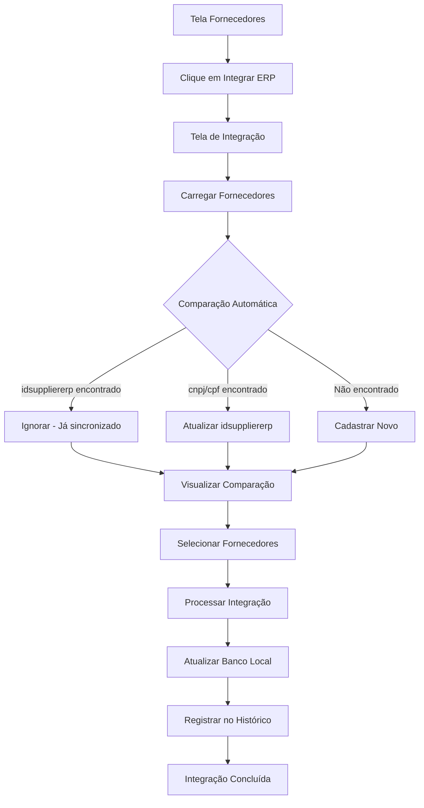

# Resumo da Implementação - Integração de Fornecedores com ERP

## 📋 Status da Implementação

✅ **COMPLETO** - Todos os requisitos foram implementados com sucesso

## 🚀 Funcionalidades Implementadas

### 1. Backend - Serviço de Integração
- **Arquivo**: `server/erp-integration-service.ts`
- **Funcionalidades**:
  - Comunicação com ERP via axios com retry automático
  - Validação de dados do ERP
  - Comparação inteligente por idsuppliererp → cnpj/cpf → novo cadastro
  - Processamento em lotes para performance
  - Histórico completo de integrações
  - Tratamento robusto de erros

### 2. API - Rotas de Integração
- **Arquivo**: `server/routes/erp-integration.ts`
- **Endpoints**:
  - `POST /api/erp-integration/suppliers/fetch` - Inicia busca de fornecedores
  - `GET /api/erp-integration/suppliers/status/:integration_id` - Verifica status
  - `GET /api/erp-integration/suppliers/comparison/:integration_id` - Obtém comparação
  - `POST /api/erp-integration/suppliers/process` - Processa integração
  - `GET /api/erp-integration/history` - Histórico de integrações
  - `GET /api/erp-integration/history/:integration_id/details` - Detalhes da integração

### 3. Frontend - Interface de Integração
- **Arquivo**: `client/src/pages/supplier-integration.tsx`
- **Funcionalidades**:
  - Layout responsivo e intuitivo
  - Carregamento com barra de progresso
  - Comparação visual lado a lado
  - Seleção de fornecedores para processar
  - Filtros e busca avançada
  - Histórico de integrações
  - Confirmação de ações críticas

### 4. Banco de Dados - Estrutura
- **Arquivo**: `db_scripts/migration_integracao_fornecedores.sql`
- **Tabelas Criadas**:
  - `supplier_integration_history` - Histórico de integrações
  - `supplier_integration_queue` - Fila de processamento
  - `supplier_integration_control` - Controle de integrações
- **Alterações**:
  - Adição da coluna `idsuppliererp` na tabela `suppliers`

### 5. Integração na Tela de Fornecedores
- **Arquivo**: `client/src/pages/suppliers.tsx`
- **Modificações**:
  - Botão "Integrar com ERP" no cabeçalho
  - Indicador visual de fornecedores sincronizados
  - Acesso direto à tela de integração

### 6. Documentação e Testes
- **Arquivos Criados**:
  - `docs/INTEGRACAO_FORNECEDORES_ERP.md` - Documentação técnica completa
  - `docs/USO_INTEGRACAO_ERP.md` - Guia de uso para usuários
  - `tests/test-erp-integration.js` - Script de testes automatizados

## 🔧 Requisitos Atendidos

### ✅ Requisitos Obrigatórios
- [x] Consumir endpoints do ERP (`http://54.232.194.197:5001`)
- [x] Tratar erros de conexão e timeout
- [x] Validar estrutura dos dados recebidos
- [x] Tela de integração com layout responsivo
- [x] Botão "Carregar fornecedores" com funcionalidade completa
- [x] Comparação automática por idsuppliererp → cnpj → cpf
- [x] Lógica de integração (ignorar → atualizar → cadastrar)
- [x] Botão "Gravar" com validação de dados
- [x] Visualização comparativa com diferenças
- [x] Feedback visual com destaque para conflitos
- [x] Confirmação de ações críticas

### ✅ Requisitos Adicionais
- [x] Tratamento de erros robusto
- [x] Performance para grandes volumes (processamento em lotes)
- [x] Confirmação para operações em massa
- [x] Histórico completo de integrações
- [x] Cancelamento do processo
- [x] Filtros e busca na listagem
- [x] Segurança dos dados durante o processo

## 📊 Fluxo de Integração



## 🎯 Próximos Passos

1. **Testar a Integração**:
   ```bash
   node tests/test-erp-integration.js
   ```

2. **Acessar a Tela**:
   - Navegar até Fornecedores → Integrar com ERP

3. **Executar Primeira Integração**:
   - Clique em "Carregar Fornecedores do ERP"
   - Revise a comparação
   - Selecione os fornecedores desejados
   - Clique em "Processar Selecionados"

## 🔒 Segurança

- Comunicação segura com o ERP
- Validação de todos os dados
- Controle de acesso por permissão
- Histórico auditável de todas as operações

## 📈 Performance

- Processamento em lotes de 50 registros
- Polling inteligente do status
- Cache de dados quando apropriado
- Otimizado para grandes volumes de dados

## 🎨 Interface do Usuário

- Design moderno com Tailwind CSS
- Componentes Shadcn/UI para consistência
- Feedback visual em tempo real
- Responsivo para dispositivos móveis

---

**Status**: ✅ Implementação completa e pronta para uso
**Data**: $(date +%d/%m/%Y)
**Versão**: 1.0.0