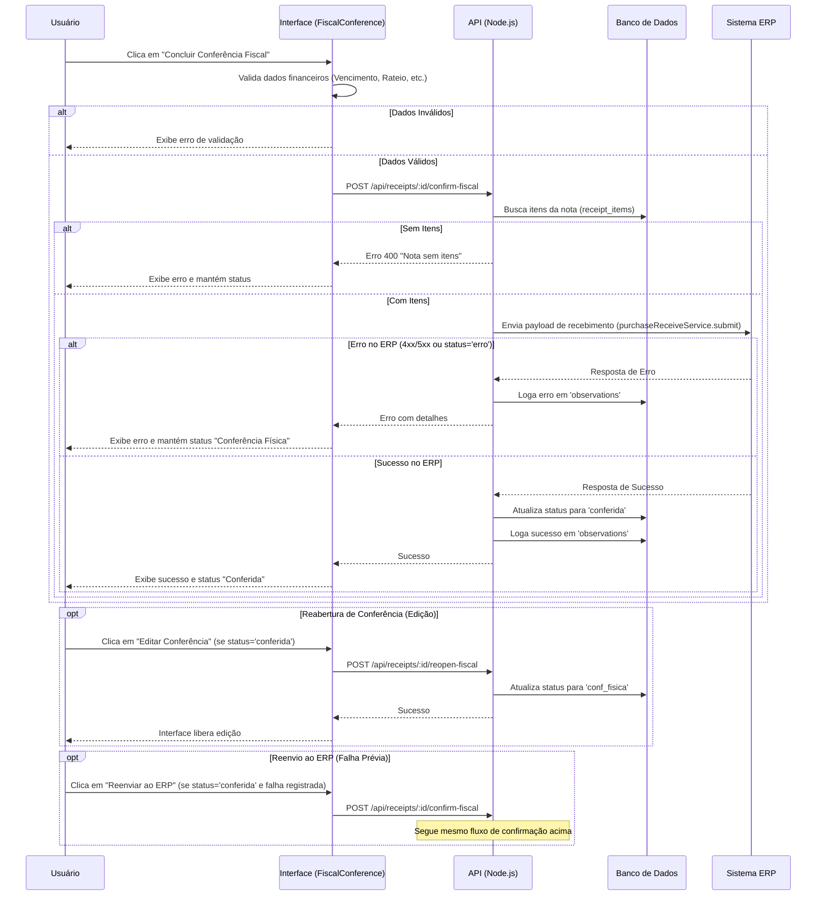

# Fluxo de Conferência Fiscal e Integração ERP

Este documento descreve o fluxo de conferência fiscal, validações e integração com o ERP.

```mermaid
sequenceDiagram
    participant User as Usuário
    participant Frontend as Interface (FiscalConference)
    participant Backend as API (Node.js)
    participant DB as Banco de Dados
    participant ERP as Sistema ERP

    User->>Frontend: Clica em "Concluir Conferência Fiscal"
    Frontend->>Frontend: Valida dados financeiros (Vencimento, Rateio, etc.)
    
    alt Dados Inválidos
        Frontend-->>User: Exibe erro de validação
    else Dados Válidos
        Frontend->>Backend: POST /api/receipts/:id/confirm-fiscal
        
        Backend->>DB: Busca itens da nota (receipt_items)
        
        alt Sem Itens
            Backend-->>Frontend: Erro 400 "Nota sem itens"
            Frontend-->>User: Exibe erro e mantém status
        else Com Itens
            Backend->>ERP: Envia payload de recebimento (purchaseReceiveService.submit)
            
            alt Erro no ERP (4xx/5xx ou status='erro')
                ERP-->>Backend: Resposta de Erro
                Backend->>DB: Loga erro em 'observations'
                Backend-->>Frontend: Erro com detalhes
                Frontend-->>User: Exibe erro e mantém status "Conferência Física"
            else Sucesso no ERP
                ERP-->>Backend: Resposta de Sucesso
                Backend->>DB: Atualiza status para 'conferida'
                Backend->>DB: Loga sucesso em 'observations'
                Backend-->>Frontend: Sucesso
                Frontend-->>User: Exibe sucesso e status "Conferida"
            end
        end
    end

    opt Reabertura de Conferência (Edição)
        User->>Frontend: Clica em "Editar Conferência" (se status='conferida')
        Frontend->>Backend: POST /api/receipts/:id/reopen-fiscal
        Backend->>DB: Atualiza status para 'conf_fisica'
        Backend-->>Frontend: Sucesso
        Frontend-->>User: Interface libera edição
    end

    opt Reenvio ao ERP (Falha Prévia)
        User->>Frontend: Clica em "Reenviar ao ERP" (se status='conferida' e falha registrada)
        Frontend->>Backend: POST /api/receipts/:id/confirm-fiscal
        Note over Backend: Segue mesmo fluxo de confirmação acima
    end
```
