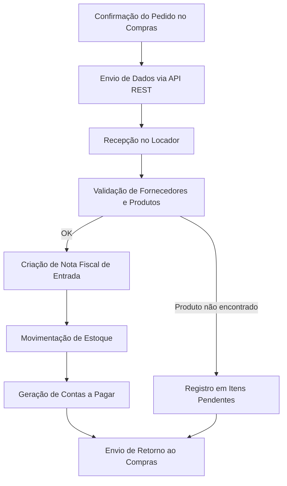

# Fluxo de Integração — Recebimento de Compras

## 1. Objetivo
Integrar o módulo **Compras** (React + Node + PostgreSQL) com o sistema **Locador** (WinForms + SQL Server), permitindo que os pedidos confirmados e notas fiscais emitidas no Compras sejam automaticamente recebidos, processados e refletidos no Locador com as devidas movimentações de estoque e geração de contas a pagar.

---

## 2. Visão Geral do Processo

### Etapas Principais
1. **Confirmação do Pedido (Compras)**  
   O comprador confirma o pedido e o status muda para *Confirmado*.

2. **Envio ao Locador (API)**  
   O backend do Compras envia os dados do pedido e da nota fiscal via API REST para o Locador.

3. **Recebimento e Validação (Locador)**  
   O Locador valida os dados recebidos (fornecedor, produtos, duplicidade de nota, etc.).

4. **Criação de Documentos**  
   - Gera **Nota Fiscal de Entrada**.
   - Cria **Movimentação de Estoque**.
   - Gera **Contas a Pagar**.

5. **Retorno de Status ao Compras**  
   O Locador devolve a resposta do processamento, confirmando sucesso ou relatando erros.

---

## 3. Diagrama do Fluxo de Integração



---

## 4. Estrutura Técnica da Integração

| Camada | Sistema | Responsabilidade |
|--------|----------|------------------|
| **API REST** | Compras → Locador | Envio de pedidos e notas confirmadas |
| **Endpoint de Recebimento** | Locador (C# WebAPI) | Receber payload, validar e registrar |
| **Fila/Buffer (opcional)** | RabbitMQ / SQL | Evitar sobrecarga e garantir retry |
| **Módulo de Importação** | Locador | Processar lote, gerar estoque e contas a pagar |
| **Logs e Auditoria** | Ambos | Registro de sucesso/erro com timestamps |

---

## 5. Modelo de Payload JSON

```json
{
  "pedido_id": 1234,
  "numero_pedido": "PC-2025-045",
  "data_pedido": "2025-11-12",
  "fornecedor": {
    "fornecedor_id": 50,
    "cnpj": "12.345.678/0001-99",
    "nome": "ABC Materiais LTDA"
  },
  "nota_fiscal": {
    "numero": "98765",
    "serie": "1",
    "chave_nfe": "35251112345678900011550010009876543219876543",
    "data_emissao": "2025-11-10",
    "valor_total": 1980.00    
  },
  "condicoes_pagamento": {
    "forma_pagamento": 1,
    "data_vencimento": "2025-12-10",
    "parcelas": 1,
    "rateio": [{
      "plano_conta_id": 101,
      "centro_custo_id": 201,
      "valor": 1980.00,
      "percentual": 100.00
    }]
  },
  "itens": [
    {
      "codigo_produto": "MAT-001",
      "descricao": "Cimento CP-II 50kg",
      "quantidade": 50,
      "preco_unitario": 39.60,
      "unidade": "UN",
      "ncm": "2001.00.00",
      "cest": "123456"
    },
    {
      "codigo_produto": "FER-002",
      "descricao": "Vergalhão 8mm",
      "quantidade": 30,
      "preco_unitario": 21.90,
      "unidade": "M",
      "ncm": "2001.00.00",
      "cest": "123456"
    }
  ]
}
```

---

## 6. Estrutura de Processamento no Locador

| Etapa | Ação | Tabelas/Entidades |
|-------|------|-------------------|
| **Recepção de Pedido** | Armazenar payload em tabela temporária (`Compras_Importacao`) | staging de dados brutos |
| **Validação** | `sp_Validar_ImportacaoCompra` | valida produtos e fornecedores |
| **Geração de Nota** | `Notas_Entrada`, `Notas_Itens` | cria a nota de entrada |
| **Estoque** | `Mov_Estoque` | gera entrada de estoque |
| **Financeiro** | `Contas_Pagar`, `Parcelas_Pagar` | cria contas a pagar |
| **Log/Auditoria** | `Integracao_Log` | status, erros e timestamps |

---

## 7. Exemplo de Retorno ao Compras

### Sucesso
```json
{
  "pedido_id": 1234,
  "status": "importado",
  "nota_id_locador": 5678,
  "mensagem": "Pedido importado e processado com sucesso"
}
```

### Erro
```json
{
  "pedido_id": 1234,
  "status": "erro",
  "mensagem": "Produto 'FER-002' não encontrado no Locador"
}
```

---

## 8. Boas Práticas Técnicas
- **Autenticação:** via JWT ou API Key dedicada.
- **Controle de duplicidade:** verificar chave da nota (`chave_nfe`).
- **Transações SQL:** operações de nota, estoque e financeiro devem ser atômicas.
- **Retentativas:** usar tabela de integração com status (`pendente`, `processado`, `erro`).
- **Versionamento de API:** `/api/v1/recebimentos`.
- **Auditoria completa:** registrar usuário, timestamps e IP de origem.

---

## 9. Próximos Passos
1. Validar formato final do payload JSON.  
2. Criar endpoint `POST /api/v1/recebimentos` no Locador.  
3. Implementar procedures e tabelas de staging no SQL Server.  
4. Estabelecer retorno de status (callback ou polling).  
5. Executar homologação com cenários reais (sucesso, erro e duplicidade).

