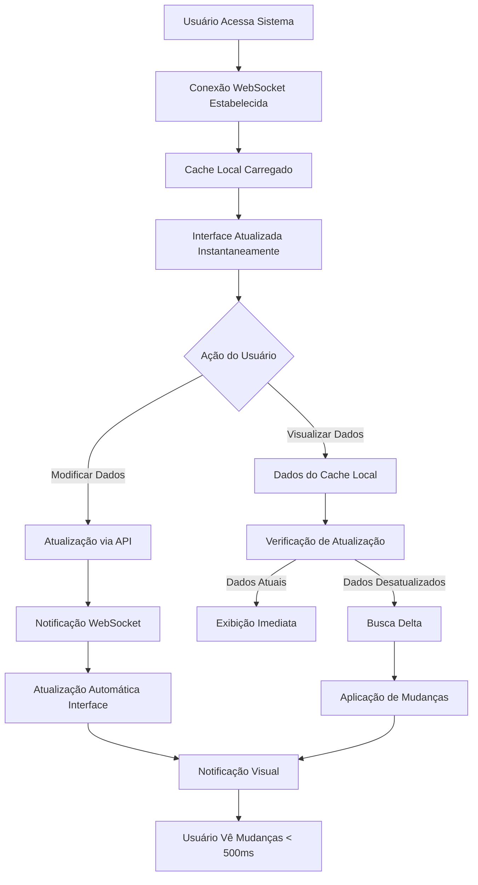

# PRD - Sistema de Atualizações em Tempo Real

## 1. Visão Geral do Produto

O Sistema de Atualizações em Tempo Real é uma solução integrada ao sistema de gestão de compras que otimiza drasticamente a experiência do usuário através de atualizações instantâneas e redução significativa no tráfego de rede. O sistema resolve o problema atual de latência de até 30 segundos para visualizar mudanças e reduz em 60% o número de requisições desnecessárias ao servidor.

**Objetivo Principal**: Transformar a experiência do usuário de reativa para proativa, onde as informações são atualizadas automaticamente sem intervenção manual, mantendo todos os usuários sincronizados em tempo real.

**Valor de Mercado**: Posiciona o sistema como uma solução enterprise moderna, competitiva com sistemas ERP de grande porte, aumentando a produtividade e satisfação dos usuários.

## 2. Funcionalidades Principais

### 2.1 Módulos de Funcionalidade

**Atualizações em Tempo Real**:
1. **Dashboard Principal**: Atualização automática de métricas, gráficos e indicadores
2. **Kanban de Solicitações**: Movimentação instantânea de cards entre fases
3. **Lista de Cotações**: Status atualizado automaticamente quando fornecedores respondem
4. **Aprovações**: Notificações instantâneas para aprovadores quando há pendências
5. **Pedidos de Compra**: Atualizações de status de entrega e recebimento
6. **Relatórios**: Dados sempre atualizados sem necessidade de refresh manual

### 2.2 Detalhamento das Páginas

| Página | Módulo | Descrição da Funcionalidade |
|--------|--------|----------------------------|
| **Dashboard** | Métricas em Tempo Real | Atualização automática de KPIs, gráficos de performance, alertas de pendências. Indicadores visuais de conectividade e status do sistema. |
| **Kanban de Solicitações** | Movimentação Dinâmica | Cards se movem automaticamente entre colunas quando status muda. Notificações visuais para novas solicitações. Contadores atualizados instantaneamente. |
| **Gestão de Cotações** | Status Dinâmico | Atualização automática quando fornecedores enviam propostas. Indicadores de prazo em tempo real. Comparação dinâmica de propostas. |
| **Aprovações** | Notificações Instantâneas | Alertas imediatos para novos itens pendentes. Atualização automática após aprovação/rejeição. Histórico de ações em tempo real. |
| **Pedidos de Compra** | Rastreamento Ativo | Status de entrega atualizado automaticamente. Notificações de recebimento. Alertas de atrasos ou problemas. |
| **Relatórios** | Dados Dinâmicos | Gráficos e tabelas atualizados automaticamente. Exportação com dados sempre atuais. Filtros aplicados em tempo real. |
| **Configurações** | Status de Conectividade | Indicadores de status da conexão WebSocket. Métricas de performance visíveis. Configurações de notificação personalizáveis. |

## 3. Fluxo Principal do Usuário

### 3.1 Fluxo de Experiência Otimizada

### 3.2 Cenários de Uso Principais

**Cenário 1: Aprovador Recebe Nova Solicitação**
1. Sistema detecta nova solicitação no banco de dados
2. WebSocket notifica aprovador instantaneamente
3. Interface atualiza contador de pendências
4. Notificação visual aparece no dashboard
5. Aprovador pode agir imediatamente

**Cenário 2: Fornecedor Envia Cotação**
1. Cotação é recebida via sistema ou email
2. Dados são processados e salvos
3. Todos os usuários interessados são notificados
4. Interface de comparação é atualizada automaticamente
5. Comprador pode analisar proposta imediatamente

**Cenário 3: Status de Pedido Muda**
1. ERP externo atualiza status de entrega
2. Sistema sincroniza mudança
3. WebSocket notifica usuários relevantes
4. Dashboard e relatórios são atualizados
5. Alertas automáticos são disparados se necessário

## 4. Design da Interface do Usuário

### 4.1 Elementos de Design

**Cores Principais**:
- **Verde (#10B981)**: Indicadores de conexão ativa e dados atualizados
- **Azul (#3B82F6)**: Notificações e atualizações em tempo real
- **Amarelo (#F59E0B)**: Alertas de reconexão ou fallback para polling
- **Vermelho (#EF4444)**: Erros de conexão ou dados críticos
- **Cinza (#6B7280)**: Estados inativos ou dados em cache

**Indicadores Visuais**:
- **Ponto Verde Pulsante**: Conexão WebSocket ativa
- **Ícone de Sincronização**: Dados sendo atualizados
- **Badge de Notificação**: Novas atualizações disponíveis
- **Barra de Progresso**: Status de carregamento otimizado

**Animações**:
- **Fade In Suave**: Para novos dados (300ms)
- **Slide Lateral**: Para notificações (200ms)
- **Pulse**: Para indicadores de atividade
- **Bounce**: Para alertas importantes

### 4.2 Componentes de Interface

| Componente | Elemento Visual | Funcionalidade |
|------------|-----------------|----------------|
| **Status de Conexão** | Indicador circular no header | Mostra status da conexão WebSocket (Verde=Ativo, Amarelo=Polling, Vermelho=Offline) |
| **Notificações em Tempo Real** | Toast notifications no canto superior direito | Aparecem automaticamente para mudanças importantes com ações rápidas |
| **Contadores Dinâmicos** | Badges numerados nos cards | Atualizam instantaneamente quando há mudanças nos dados |
| **Indicador de Atualização** | Spinner sutil nos componentes | Mostra quando dados estão sendo sincronizados |
| **Cache Status** | Ícone pequeno nos dados | Indica se dados vêm do cache local ou servidor |
| **Métricas de Performance** | Painel administrativo | Mostra estatísticas de performance e eficiência do sistema |

### 4.3 Responsividade e Acessibilidade

**Design Mobile-First**:
- Notificações otimizadas para telas pequenas
- Indicadores de status sempre visíveis
- Gestos touch para interações rápidas
- Modo offline com cache local

**Acessibilidade**:
- Leitores de tela anunciam atualizações importantes
- Indicadores visuais têm alternativas textuais
- Contraste adequado para todos os estados
- Navegação por teclado mantida

## 5. Requisitos Técnicos do Usuário

### 5.1 Compatibilidade de Navegadores

| Navegador | Versão Mínima | WebSocket | IndexedDB | Suporte |
|-----------|---------------|-----------|-----------|---------|
| Chrome | 80+ | ✅ | ✅ | Completo |
| Firefox | 75+ | ✅ | ✅ | Completo |
| Safari | 13+ | ✅ | ✅ | Completo |
| Edge | 80+ | ✅ | ✅ | Completo |
| IE | 11 | ❌ | ❌ | Não suportado |

### 5.2 Requisitos de Conectividade

**Conexão Mínima**: 1 Mbps para operação básica
**Conexão Recomendada**: 5 Mbps para experiência otimizada
**Latência Máxima**: 200ms para melhor experiência
**Modo Offline**: Funcionalidade limitada com cache local

### 5.3 Configurações do Usuário

**Preferências Personalizáveis**:
- Frequência de notificações (Todas, Importantes, Críticas)
- Tipos de eventos para notificação
- Som de notificação (Ativo/Inativo)
- Modo de conexão (WebSocket + Polling / Apenas Polling)
- Tempo de cache local (1h, 4h, 8h, 24h)

## 6. Critérios de Aceitação

### 6.1 Performance

**Métricas Obrigatórias**:
- ✅ Latência de atualização < 500ms para 95% dos casos
- ✅ Redução de 60% nas requisições HTTP
- ✅ Taxa de transferência < 1MB/min por usuário
- ✅ Taxa de cache hit > 70%
- ✅ Suporte a 100+ usuários simultâneos

**Métricas Desejáveis**:
- 🎯 Latência de atualização < 200ms para 90% dos casos
- 🎯 Redução de 70% nas requisições HTTP
- 🎯 Taxa de cache hit > 80%
- 🎯 Suporte a 200+ usuários simultâneos

### 6.2 Funcionalidade

**Requisitos Críticos**:
- ✅ Atualizações automáticas em todas as telas principais
- ✅ Fallback automático para polling quando WebSocket falha
- ✅ Reconexão automática após perda de conexão
- ✅ Cache local funcional offline por até 4 horas
- ✅ Notificações visuais para todas as mudanças importantes

**Requisitos Importantes**:
- ✅ Sincronização de dados entre múltiplas abas
- ✅ Compressão automática de dados grandes
- ✅ Filtragem de notificações por permissão de usuário
- ✅ Métricas de performance visíveis para administradores

### 6.3 Experiência do Usuário

**Indicadores de Sucesso**:
- 📊 Redução de 80% em reclamações sobre dados desatualizados
- 📊 Aumento de 50% na velocidade de aprovações
- 📊 Redução de 60% no tempo de resposta a cotações
- 📊 Satisfação do usuário > 4.5/5.0
- 📊 Redução de 40% no tempo de treinamento de novos usuários

## 7. Casos de Teste Principais

### 7.1 Testes de Funcionalidade

**Teste 1: Atualização Automática de Status**
- **Cenário**: Solicitação muda de "Pendente A1" para "Aprovado A1"
- **Esperado**: Interface atualiza em < 500ms sem refresh manual
- **Validação**: Contador de pendências diminui, card move no Kanban

**Teste 2: Múltiplos Usuários Simultâneos**
- **Cenário**: 50 usuários visualizando mesma solicitação
- **Ação**: Aprovador rejeita solicitação
- **Esperado**: Todos os usuários veem mudança simultaneamente

**Teste 3: Reconexão Automática**
- **Cenário**: Conexão WebSocket é perdida
- **Esperado**: Sistema volta para polling, reconecta automaticamente
- **Validação**: Usuário continua recebendo atualizações

### 7.2 Testes de Performance

**Teste 4: Carga de 100 Usuários**
- **Cenário**: 100 usuários conectados simultaneamente
- **Ação**: 10 atualizações por minuto no sistema
- **Esperado**: Latência < 500ms, sem perda de conexões

**Teste 5: Dados Grandes**
- **Cenário**: Relatório com 1000+ itens
- **Esperado**: Compressão automática, carregamento < 2s
- **Validação**: Uso de bandwidth < 1MB

### 7.3 Testes de Usabilidade

**Teste 6: Primeiro Uso**
- **Cenário**: Usuário novo acessa sistema
- **Esperado**: Indicadores de status são intuitivos
- **Validação**: Usuário entende estado da conexão sem treinamento

**Teste 7: Modo Offline**
- **Cenário**: Usuário perde conexão com internet
- **Esperado**: Dados em cache permanecem acessíveis
- **Validação**: Funcionalidade de leitura mantida por 4h

## 8. Roadmap de Implementação

### 8.1 Fases de Entrega

**Fase 1 - MVP (Semanas 1-4)**:
- ✅ WebSocket básico para notificações
- ✅ Cache local com IndexedDB
- ✅ Atualizações automáticas no Dashboard
- ✅ Indicadores de status de conexão

**Fase 2 - Otimizações (Semanas 5-6)**:
- ✅ Smart polling com backoff
- ✅ Compressão de dados
- ✅ Delta updates
- ✅ Métricas de performance

**Fase 3 - Experiência Completa (Semanas 7-8)**:
- ✅ Notificações personalizáveis
- ✅ Sincronização entre abas
- ✅ Modo offline robusto
- ✅ Testes de carga completos

**Fase 4 - Produção (Semanas 9-10)**:
- ✅ Deploy gradual
- ✅ Monitoramento em produção
- ✅ Ajustes baseados em feedback
- ✅ Documentação final

### 8.2 Critérios de Go-Live

**Pré-requisitos Técnicos**:
- [ ] Todos os testes automatizados passando
- [ ] Performance validada com 100+ usuários
- [ ] Fallback para polling funcionando
- [ ] Monitoramento configurado

**Pré-requisitos de Negócio**:
- [ ] Treinamento da equipe concluído
- [ ] Documentação do usuário finalizada
- [ ] Plano de rollback definido
- [ ] Aprovação dos stakeholders

## 9. Métricas de Sucesso

### 9.1 KPIs Técnicos

| Métrica | Baseline Atual | Meta 30 dias | Meta 90 dias |
|---------|----------------|--------------|--------------|
| Latência Média | 15-30s | < 1s | < 500ms |
| Requisições/min | 120 | 60 | 48 |
| Cache Hit Rate | 40% | 70% | 80% |
| Uptime WebSocket | N/A | 99% | 99.5% |
| Satisfação Usuário | 3.2/5 | 4.0/5 | 4.5/5 |

### 9.2 KPIs de Negócio

| Processo | Baseline | Meta |
|----------|----------|------|
| Tempo Médio de Aprovação | 4h | 1h |
| Resposta a Cotações | 24h | 4h |
| Erros por Dados Desatualizados | 15/semana | 3/semana |
| Produtividade Geral | 100% | 130% |
| Treinamento Novos Usuários | 8h | 4h |

## 10. Considerações de Segurança e Privacidade

### 10.1 Segurança de Dados

**Proteções Implementadas**:
- 🔒 Autenticação JWT para WebSocket
- 🔒 Criptografia de dados sensíveis no cache
- 🔒 Validação de permissões por recurso
- 🔒 Rate limiting para prevenir abuso
- 🔒 Sanitização de todas as mensagens

**Auditoria e Compliance**:
- 📋 Log de todas as conexões WebSocket
- 📋 Rastreamento de atualizações em tempo real
- 📋 Conformidade com LGPD para dados pessoais
- 📋 Backup automático de configurações

### 10.2 Privacidade do Usuário

**Controles de Privacidade**:
- 👤 Usuário controla quais notificações receber
- 👤 Dados locais podem ser limpos pelo usuário
- 👤 Histórico de atividades é transparente
- 👤 Opt-out disponível para recursos opcionais

## 11. Conclusão

O Sistema de Atualizações em Tempo Real representa uma evolução significativa na experiência do usuário do sistema de gestão de compras. Com foco na redução de latência, otimização de recursos e melhoria da produtividade, esta solução posiciona o sistema como uma ferramenta moderna e competitiva.

**Benefícios Principais**:
- 🚀 **Performance**: 60% menos requisições, < 500ms de latência
- 👥 **Experiência**: Dados sempre atualizados, interface responsiva
- 💰 **Eficiência**: Redução significativa no uso de recursos
- 📈 **Escalabilidade**: Suporte a 100+ usuários simultâneos
- 🔧 **Manutenibilidade**: Arquitetura modular e monitoramento integrado

A implementação seguirá uma abordagem incremental, garantindo estabilidade e permitindo ajustes baseados no feedback dos usuários reais.